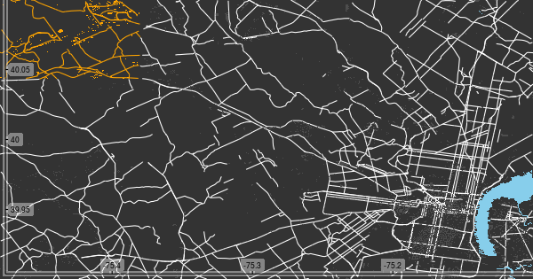

```{r setup, include=FALSE}
knitr::opts_chunk$set(echo = TRUE)
```
```{r echo = F}
map_dpi <- 72 # dpi res for all maps
```
## Intro

Dylan Moriarty [wrote a beautiful piece on foggy spaces](https://dylanmoriarty.github.io/blog/foggy-spaces.html). In it he described something called 'the know world,' or the part of the world a person is actually familiar with. The idea is that a person can be from a city, but only really be familiar with a fraction of it - only know certain routes and certain buildings. Ever since I read the foggy spaces piece I wanted to create something similar.

When I went to useR2017 this year I was lucky enough to see Mark Padgham's [talk on the new `osmplotr` package.](https://channel9.msdn.com/Events/useR-international-R-User-conferences/useR-International-R-User-2017-Conference/Maps-are-data-so-why-plot-data-on-a-map) The `osmplotr` package allows the user to filter features from a map and encode them with different colors. He talked about how plotting points and shapes on a map actually cover the data contained in the map, but if we just use manipulate the features on the map, then we both preserve the map data while also focusing our attention to a desired area.

Both Dylan's piece and Mark's talk inspired me to play around and learn more about mapping. So, as a learning exercise, I created my own foggy map using `osmplotr.` The only packages necessary to follow along are `osmplotr` and  `magrittr`.


```{r}
library(osmplotr)
library(magrittr)
```

## My Neighborhood

I grew up in a subburb of Philadelphia, Pa. It is about 45 minutes away from the Philadelphia Art Museum. I lived in a small neighborhood called 'Main Street Village.' Below is the street map of my neighborhood. Up until I was 6 years old, this was the only place I was really aware of.

```{r, eval = F}
childhood_home <- get_bbox(c(-75.475, 40.078, -75.472,  40.075))

childhood_streets <- extract_osm_objects(key = 'highway', bbox = childhood_home)

osm_basemap(childhood_home, bg = 'grey20') %>%
  add_osm_objects(childhood_streets, 'white') %>%
  add_axes() %>%
  print_osm_map()
```

```{r, echo = F}
childhood_home <- get_bbox(c(-75.475, 40.078, -75.472,  40.075))

childhood_streets <- extract_osm_objects(key = 'highway', bbox = childhood_home)

osm_basemap(childhood_home, bg = 'grey20') %>%
  add_osm_objects(childhood_streets, 'white') %>%
  add_axes() %>%
  print_osm_map(filename = 'childhood_home.png', 
               width = 600,
               units = 'px', 
               dpi = map_dpi)
```


## Locating My Friends

As I got older, my world-view began to grow and I started hanging out in places other than my own neighborhood. I had one really good friend who lived in the same neighborhood as me, but my other friends lived in two other neighborhoods about two or three miles away. My own neighborhood is colored in orange and the neighborhoods where my friends lived ared colored in blue. The blue square is a park my friends and I would hang out at.

I would probably walk from my house to my friends' neighborhoods at least four times a week. For the most part, I never really explored the neighborhoods in between. The colored places in the map represent my 'know world.' It is interesting to see that my 'know world' is just a small fraction of the actual world I lived in.

```{r, eval = F}
near_home <- get_bbox(c(-75.48, 40.08, -75.44, 40.06))

dat_H <- extract_osm_objects(key = 'highway', bbox = near_home)
dat_HT <- extract_osm_objects(key = 'highway', value = 'tertiary', bbox = near_home)
dat_HP <- extract_osm_objects(key = 'highway', value = 'primary', bbox = near_home)
dat_P <- extract_osm_objects(key = 'park', bbox = near_home)
dat_B <- extract_osm_objects(key = 'building', bbox = near_home)

childhood_home <- cbind(c(-75.4745, -75.4745, -75.4730, -75.4730),
               c(40.0775, 40.0755, 40.0755, 40.0775))

friend1 <- cbind(c(-75.46, -75.46, -75.456, -75.456),
                     c(40.077, 40.08, 40.077, 40.08))

friends2 <- cbind(c(-75.445, -75.445, -75.45, -75.45),
                     c(40.074, 40.07, 40.074, 40.07))

shopping <- cbind(c(-75.45, -75.45,-75.46, -75.46),
                      c(40.073, 40.075, 40.073, 40.075));

wilson <- cbind(c(-75.46, -75.44, -75.46, -75.44),
                    c(40.067, 40.067, 40.076, 40.076))


osm_basemap(near_home) %>%
  add_osm_groups(dat_P,
                 groups = wilson,
                 cols = 'blue',
                 bg = 'gray30',
                 boundary = 1) %>%
  add_osm_groups(dat_H,
                 groups = list(child_home, friend1, friends2),
                 cols = c('orange', 'blue', 'blue'),
                 bg = 'white',
                 boundary = 0,
                 make_hull =T) %>%
  add_osm_groups(dat_B,
                 groups = shopping,
                 cols = 'blue',
                 bg = 'gray30',
                 boundary = 0) %>%
  add_osm_objects(dat_HT,
                  col= 'gray80',
                  size = .5) %>%
  add_osm_objects(dat_HP,
                  col = 'gray80',
                  size = 1) %>%
  add_axes() %>%
  print_osm_map()

```
```{r, echo = F}
near_home <- get_bbox(c(-75.48, 40.08, -75.44, 40.06))

dat_H <- extract_osm_objects(key = 'highway', bbox = near_home)
dat_HT <- extract_osm_objects(key = 'highway', value = 'tertiary', bbox = near_home)
dat_HP <- extract_osm_objects(key = 'highway', value = 'primary', bbox = near_home)
dat_P <- extract_osm_objects(key = 'park', bbox = near_home)
dat_B <- extract_osm_objects(key = 'building', bbox = near_home)

childhood_home <- cbind(c(-75.4745, -75.4745, -75.4730, -75.4730),
               c(40.0775, 40.0755, 40.0755, 40.0775))

friend1 <- cbind(c(-75.46, -75.46, -75.456, -75.456),
                     c(40.077, 40.08, 40.077, 40.08))

friends2 <- cbind(c(-75.445, -75.445, -75.45, -75.45),
                     c(40.074, 40.07, 40.074, 40.07))

shopping <- cbind(c(-75.45, -75.45,-75.46, -75.46),
                      c(40.073, 40.075, 40.073, 40.075));

wilson <- cbind(c(-75.46, -75.44, -75.46, -75.44),
                    c(40.067, 40.067, 40.076, 40.076))


osm_basemap(near_home) %>%
  add_osm_groups(dat_P,
                 groups = wilson,
                 cols = 'blue',
                 bg = 'gray30',
                 boundary = 1) %>%
  add_osm_groups(dat_H,
                 groups = list(childhood_home, friend1, friends2),
                 cols = c('orange', 'blue', 'blue'),
                 bg = 'white',
                 boundary = 0,
                 make_hull =T) %>%
  add_osm_groups(dat_B,
                 groups = shopping,
                 cols = 'blue',
                 bg = 'gray30',
                 boundary = 0) %>%
  add_osm_objects(dat_HT,
                  col= 'gray80',
                  size = .5) %>%
  add_osm_objects(dat_HP,
                  col = 'gray80',
                  size = 1) %>%
  add_axes() %>%
  print_osm_map(filename = 'near_home.png', 
               width = 600,
               units = 'px', 
               dpi = map_dpi)
```


## My home

If I zoom out just a little bit to add my schools and the mall (the main hangout spot for teens), then the 'know world'/real world ratio gets even smaller.


```{r, eval = F}
pre_uni <- get_bbox(c(-75.48, 40.0432,-75.38, 40.1))
dat_H <- extract_osm_objects(key = 'highway', bbox = pre_uni)
dat_HT <- extract_osm_objects(key = 'highway', value = 'tertiary', bbox = pre_uni)
dat_HP <- extract_osm_objects(key = 'highway', value = 'primary', bbox = pre_uni)
dat_P <- extract_osm_objects(key = 'park', bbox = pre_uni)
dat_B <- extract_osm_objects(key = 'building', bbox = pre_uni)

other_home <- cbind(c(-75.478, -75.47, -75.478, -75.47),
                        c(40.046, 40.046, 40.054,  40.054))

mall <- cbind(c(-75.395, -75.38, -75.395, -75.38),
             c(40.093, 40.093, 40.085, 40.085));

middle <- cbind(c(-75.44, -75.44, -75.45, -75.45),
                c(40.071, 40.08, 40.071, 40.08))

elementary <- cbind(c(-75.435, -75.44, -75.435, -75.44),
                   c(40.073, 40.073, 40.08, 40.08))

high <- cbind(c(-75.45, -75.45, -75.46, -75.46),
              c(40.04, 40.05, 40.04, 40.05))


osm_basemap(pre_uni) %>%
  add_osm_objects(dat_HT,
                  col= 'gray80',
                  size = .25) %>%
  add_osm_objects(dat_HP,
                  col = 'gray80',
                  size = .25) %>%
  add_osm_groups(dat_P,
                 groups = wilson,
                 cols = 'blue',
                 bg = 'gray30',
                 boundary = 1) %>%
  add_osm_groups(dat_H,
                 groups = list(childhood_home, friend1, friends2, other_home, mall),
                 cols = c('orange', 'blue', 'blue', 'orange', 'blue'),
                 bg = 'white',
                 boundary = 0,
                 make_hull =T) %>%
  add_osm_groups(dat_B,
                 groups = list(shopping, middle, elementary, high),
                 cols = c('blue', 'blue', 'blue', 'blue'),
                 bg = 'gray30',
                 boundary = 0,
                 make_hull = T) %>%
  add_axes() %>%
  print_osm_map()
```
```{r, echo = F}
pre_uni <- get_bbox(c(-75.48, 40.0432,-75.38, 40.1))
dat_H <- extract_osm_objects(key = 'highway', bbox = pre_uni)
dat_HT <- extract_osm_objects(key = 'highway', value = 'tertiary', bbox = pre_uni)
dat_HP <- extract_osm_objects(key = 'highway', value = 'primary', bbox = pre_uni)
dat_P <- extract_osm_objects(key = 'park', bbox = pre_uni)
dat_B <- extract_osm_objects(key = 'building', bbox = pre_uni)

other_home <- cbind(c(-75.478, -75.47, -75.478, -75.47),
                        c(40.046, 40.046, 40.054,  40.054))

mall <- cbind(c(-75.395, -75.38, -75.395, -75.38),
             c(40.093, 40.093, 40.085, 40.085));

middle <- cbind(c(-75.44, -75.44, -75.45, -75.45),
                c(40.071, 40.08, 40.071, 40.08))

elementary <- cbind(c(-75.435, -75.44, -75.435, -75.44),
                   c(40.073, 40.073, 40.08, 40.08))

high <- cbind(c(-75.45, -75.45, -75.46, -75.46),
              c(40.04, 40.05, 40.04, 40.05))


osm_basemap(pre_uni) %>%
  add_osm_objects(dat_HT,
                  col= 'gray80',
                  size = .25) %>%
  add_osm_objects(dat_HP,
                  col = 'gray80',
                  size = .25) %>%
  add_osm_groups(dat_P,
                 groups = wilson,
                 cols = 'blue',
                 bg = 'gray30',
                 boundary = 1) %>%
  add_osm_groups(dat_H,
                 groups = list(childhood_home, friend1, friends2, other_home, mall),
                 cols = c('orange', 'blue', 'blue', 'orange', 'blue'),
                 bg = 'white',
                 boundary = 0,
                 make_hull =T) %>%
  add_osm_groups(dat_B,
                 groups = list(shopping, middle, elementary, high),
                 cols = c('blue', 'blue', 'blue', 'blue'),
                 bg = 'gray30',
                 boundary = 0,
                 make_hull = T) %>%
  add_axes() %>%
  print_osm_map(filename = 'pre_uni.png', 
               width = 600,
               units = 'px', 
               dpi = map_dpi)
```


## The one reason I left home

My world was actually a little bigger than what the previous map showed. My freshman year of high school I joined the rowing team. We would get on a bus everyday and ride 45 minutes to the Schuylkill River. We would get off the bus, get changed, and get in our boats. After we finished practice we would get back on the bus and ride 45 minutes back to our high school. 

There was no exploring between my high school and the river. If I were to pretend that the entirety of the previous map was familiar to me, and resize the map to include the Schuylkill River, than it becomes clear how little my 'know world' was in comparison to my actual world.

```{r eval = F}
#The below code only works with the most recent version of osmplotr
# devtools::install_github ('ropensci/osmplotr')

rowing <- get_bbox(c(-75.48, 40.1,-75.1, 39.9))

dat_B <- extract_osm_objects(key = 'building', bbox = rowing)
dat_H <- extract_osm_objects(key = 'highway', bbox = rowing)
dat_W <- extract_osm_objects(key = 'waterway', bbox = rowing, return_type = 'polygon')

schuylkill <- cbind(c(-75.1, -75.2, -75.1, -75.2),
                    c(39.9, 39.9, 40.1, 40.1))

home <- cbind(c(-75.48, -75.48, -75.38, -75.38),
              c(40.0432, 40.1, 40.0432, 40.1))

osm_basemap(rowing) %>%
  add_osm_groups(dat_H,
                 groups = home,
                 cols = 'orange',
                 bg = 'white',
                 boundary = 0,
                 make_hull =T) %>%
  add_osm_groups(dat_B,
                 groups = home,
                 cols = 'orange',
                 bg = 'gray30',
                 boundary = 0,
                 make_hull = T) %>%
  add_osm_groups(dat_W,
                 groups = schuylkill,
                 cols = 'skyblue',
                 bg = 'gray30',
                 boundary = 0,
                 make_hull = T) %>%
  add_axes() %>%
  print_osm_map()
```

```{r echo = F, eval = F}
#The below code only works with the most recent version of osmplotr
# devtools::install_github ('ropensci/osmplotr')

#this code won't run because of memory issues
#I created the .png independently of the knit

rowing <- get_bbox(c(-75.48, 40.1,-75.1, 39.9))

dat_B <- extract_osm_objects(key = 'building', bbox = rowing)
dat_H <- extract_osm_objects(key = 'highway', bbox = rowing)
dat_W <- extract_osm_objects(key = 'waterway', bbox = rowing, return_type = 'polygon')

schuylkill <- cbind(c(-75.1, -75.2, -75.1, -75.2),
                    c(39.9, 39.9, 40.1, 40.1))

home <- cbind(c(-75.48, -75.48, -75.38, -75.38),
              c(40.0432, 40.1, 40.0432, 40.1))

osm_basemap(rowing) %>%
  add_osm_groups(dat_H,
                 groups = home,
                 cols = 'orange',
                 bg = 'white',
                 boundary = 0,
                 make_hull =T) %>%
  add_osm_groups(dat_B,
                 groups = home,
                 cols = 'orange',
                 bg = 'gray30',
                 boundary = 0,
                 make_hull = T) %>%
  add_osm_groups(dat_W,
                 groups = schuylkill,
                 cols = 'skyblue',
                 bg = 'gray30',
                 boundary = 0,
                 make_hull = T) %>%
  add_axes() %>%
    print_osm_map(filename = 'rowing.png', 
               width = 600,
               units = 'px', 
               dpi = map_dpi)
```


It is strangely therapeutic plotting my childhood on a map and realizing how small my perception of the world actually was. I want to explore mapping a little more and see what I can do. It'd be interesting to see if I can plot my childhood by only focusing on the familiar spaces and getting rid of all the unknown areas.