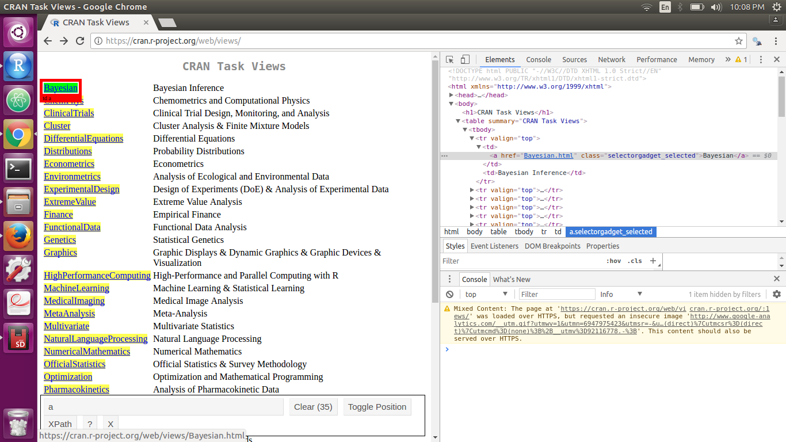
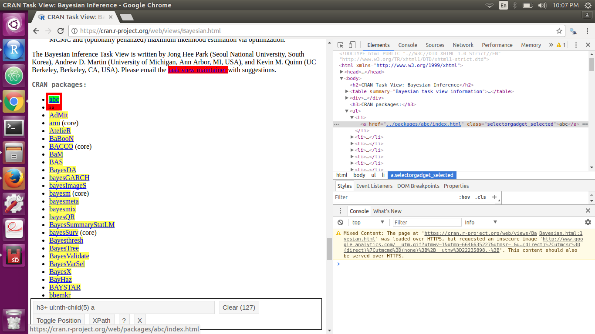

```{r setup, include=FALSE}
knitr::opts_chunk$set(echo = TRUE)
```

## Intro

[There was a talk at useR2017](https://juliasilge.com/blog/navigating-packages/) about how useRs discover packages in CRAN's 11,000+ package ecosystem. The goal was to start a conversation and make the package discovery process easier. The discussed approaches to improving discovery are **Unification** (create wrappers for packages so their are less packages to choose from), **Search** (rely on sites like [RDocumentation](https://www.rdocumentation.org/) and improve their search algorithms), and **Guidance** (read the [task views](https://cran.r-project.org/web/views/) and the [R Journal](https://journal.r-project.org/) or even follow the community on social media and blogs).

After the talk a group lead by [Julia Silge](https://twitter.com/juliasilge) discussed **Guidance**. A few of us within the group talked about how we weren't lucky enough to have an **R** mentor as we were learning the language. Luckily, the **R** community is great and there are a number of wonderful and free resources online, but it still isn't easy. 

Packages get updated while the tutorials stay the same. A person might need multiple examples to understand a concept, but there is just one example provided. 

I want to explore the task views with you. I want to show you how I scrape data and munge it to create a network visuallization. But most importantly, I want to share my thought process with you so you can either learn from me or tell me what I"m doing wrong.

## Research

First we should go to the main page to explore how the `html` is layed out. This is best done by using the [selector gadget](http://selectorgadget.com/). If we check the links to the different task views, then we realize the nodes we want to select are identified simply by `a`. Notice how the node contains `Bayesian.html` - this gets appended to the main site's link to create the link `https://cran.r-project.org/web/views/Bayesian.html` which we can use to acces the task view relating to Bayesian Economics.



We then want to look into a few of these task views and look for any similarities between the task view pages with regards to the packages they promote. For now, the easiest option is `h3+ ul:nth-child(5) a`. Notice how the node contains `/packages/abc/index.html` - every link in the taskview contains the name of a package between `/package/` and `/index.html`.



## Packages

I'm relatively new to web scraping so I don't really know what my options are - one of the more popular packages is **rvest** and so I'll just go with that. In most of my projects I know that I'm going to use `dplyr`, `magrittr`, and `tidyr`. Since I'm just exploring and don't really know what else I'll need, I just load the **tidyverse** package and stop worrying about it. Another must have is **stringr**- html data is text data and **stringr** is my go-to regex tool. **igraph** is how we are going to visualize the network...(and if you're interested I'll share d3 code in the end :heart:)

```{r message = F}
library(tidyverse)
library(rvest)
library(stringr)
library(igraph)
```

## Web Scraping

First, we'll need to scrape the links to all of the different task views. Using the information we gained from the research section, we can easily do this by searching all of the nodes tha contain an `a`. 

```{r}
tv <- 'https://cran.r-project.org/web/views/'

html <- read_html(tv)
topics <- html_nodes(html, 'a') 

head(topics)
```

An example of what we get from **topics** is `r topics[1]`. We want a full link so we will need to extract the link information from `href="link_info"` and then paste it on to the root `r tv` using the **stringr** package.

```{r}
topics <- topics %>%
  str_extract('".+"') %>%
  str_replace_all('"', '')

taskviews <- str_c(tv, topics)

head(taskviews)
```

Now we want to pull the html information from each of the task view pages and extract information to each of the packages they refer to. Again, we will use the information we pulled from the task view to extract information. The information we will extract are the names of the packages and the task views the packages belong to.

```{r}
topic_packages <- function(link){
  html <- read_html(link)

  packages <- html_nodes(html, 'h3+ ul:nth-child(5) a') %>%
    str_extract('packages/.+/index') %>%
    str_replace_all('packages/', '') %>%
    str_replace_all("/index", '')

  topic <- link %>%
    str_extract('views/.+\\.html') %>%
    str_replace_all('views/', '') %>%
    str_replace_all('\\.html', '')

  data.frame(id = packages, topic = topic)
}

nodes <- data.frame()

for(i in 1:length(taskviews)){
  nodes <- rbind(nodes, topic_packages(taskviews[i]))
}

head(nodes)
```

The `nodes` data frame contains `r nrow(nodes)` rows. This is because many packages belong to more than one task view.

## Munging

A network graph needs two data frames. A **nodes** data frame that contains a reference to every package and a **links** data frame that connects a *source* package to a *target* package. We're going to simply create links to any two packages that share a taskview. 

Our first task is to convert the variables of our **nodes** data frame from `factors` to `characters`. This will prevent issues later on with regards to filtering the data frame.

```{r}
str(nodes)

nodes <- nodes %>%
  mutate(
    id = id %>% as.character(),
    topic = topic %>% as.character()
  )

str(nodes)
```

I then want to create a variable that contains all the task views a package belongs to. We can do this by using **tidyr**'s `nest()` function to combine all the task views into a single nested column. We can then use **dplyr**'s `mutate()` to create a new variable using `sapply()` and **stringr**'s `str_c()` function. This will create a variable that is a string combining all of a package's task views. This variable is not tidy, but it will be useful to quickly glance over a package's information in the future.

```{r}
nodes <- nodes %>%
  group_by(id) %>%
  nest() %>%
  mutate(
    topics = sapply(seq_along(.$data), function(i){
      str_c(.$data[[i]]$topic, collapse = ' ')
    })
  ) 

head(nodes)
```

There are a total of `r nrow(nodes)` different packages mentioned in the task views and of those packages `r nrow(nodes %>% filter(str_detect(topics, ' ')))` belong to more than one task view. To make this network graph more manageable, we will only show packages that belong to multiple task views.


```{r}
nodes <- nodes %>% 
  filter(str_detect(topics, ' ')) %>%
  unnest()

head(nodes)
```

We will get rid of the **topic** variable soon, but we will need it in order to identify links between packages. Links are created between any two packages that share a task view topic. So what we will need to do is:

1. Identify all the task view topics a package is mentioned for.
2. Identify all the other packages those task view topics mention.
3. Remove any duplicated links. 

We can do this by creating a function that finds all the connections for a package and by using that function as we iterate through all the packages.


```{r}
related_nodes <- function(df, node){

  #Identify all the task view topics a package is mentioned for
  all_topics <- df %>%
    filter(id == node) %>%
    .$topic

  target <- c()
  
  #Identify all the other packages those task view topics mention
  for(i in 1:length(all_topics)){
    related_packages <- df %>%
      filter(topic == all_topics[i] & id != node) %>%
      .$id

    target <- c(target, related_packages)
  }

  #Remove any duplicated targets
  target <- target %>%
    unique()

  link_table <- data.frame(source = node, target = target)

  link_table
}


#create a list of all the packages
unique_packages <- nodes$id %>% unique


#create a place holder for the for loop
links <- data.frame()


for(i in 1:length(unique_packages)){
  new_links <- related_nodes(nodes, unique_packages[i]) %>%
    #A link between X and Y is the same as a link between Y and X. 
    filter(!(target %in% links$id))

  links <- rbind(links, new_links)
}

head(links)
```

Now we can clean up the **nodes** data frame by removing the **topic** variable.

```{r}
nodes <- nodes %>%
  nest(topic) %>%
  select(-data)

head(nodes)
```

Finally, we can create TSV files so we can use this data for future analysis.

```{r}
write_tsv(nodes, 'task_view_nodes.tsv')
write_tsv(links, 'task_view_links.tsv')
```

## Visualize

We just went through all the hard work of cleaning the data. Now that we have a node list and a link list, we can create network graphs. We will use the `graph_from_data_frame()` function to format the data into a plottable **igraph**. 

The `d` argument takes on a data frame with the first column representing the **source** node and the second column representing the **target** nodes. Any other columns will be saved as a link attribute which we could use to manipulate the links. 

The `vertices` argument takes on a data frame with the first column representing the **nodes**. Any other columns will be saved as a node attribute which we could use to manipulate the nodes. 

If `directed` is set to `TRUE` then the links become directed arrows. We don't want that so we set it to `FALSE`

```{r}
set.seed(203)
net <- graph_from_data_frame(d = links, 
                             vertices = nodes, 
                             directed = F)

plot(net, 
     vertex.label = NA, 
     vertex.size = 5)
```

Another way to represent networks is through an adjacency matrix. We will need to reformat the **igraph** we created before we can do that.

```{r}
netm <- get.adjacency(net, sparse = F)
heatmap(netm)

```

There's a bunch of cool things you can do with `igraph` and it is definitely worth exploring. The best resource I know of for learning `igraph` is [Katherine Ognyanova's tutorial](http://kateto.net/networks-r-igraph). In it she even explains how to create an interactive network graph. 

## D3

I'm not going to lie, the previous section was a surprise to me. The data cleaning I showed you was really so I can visualize the data in `D3.js`, but I figured most people don't know `d3.js` and it would be cruel to walk you through all that data munging without showing you how to make a network graph in `R`. Well, if you're interested, then here is [the code to my network graph in D3.js](https://bl.ocks.org/beemyfriend/e27d2103f6b0264044c2f8a15dd09e10)
