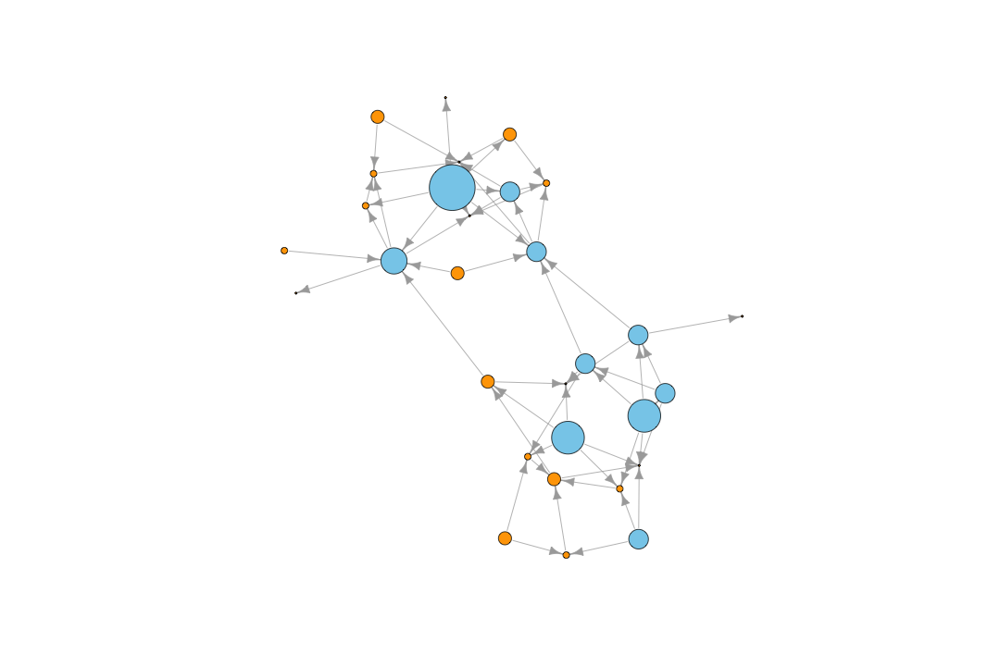
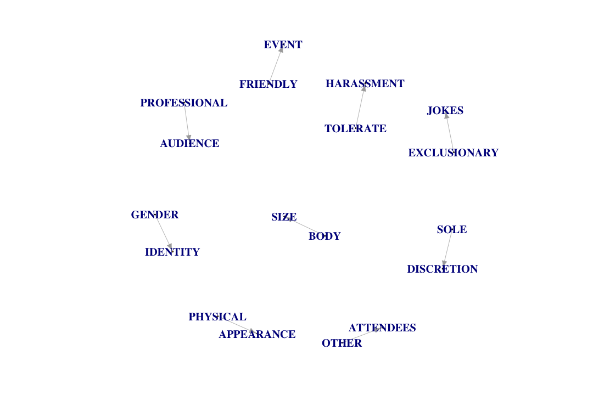
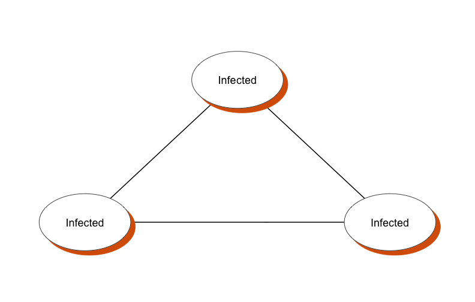

Exploring Graphs with igraph
========================================================
author: Benjamin Ortiz Ulloa
date: 
autosize: true
transition: fade

Exploring Graphs with igraph
=====
<ol>
  <li>What's a Graph?</li>
  <li>Practical Applications: Recommendations</li>
  <li>Measuring Impact/Importance</li>
  <li>Practical Applications: Keyphrases</li>
  <li>Practical Applications: Models</li>
  <li><b>Code:</b> Creating and Exploring a Graph</li>
  <li>Concluding Remarks</li>
</ol>

Exploring Graphs with igraph
=====
<ol>
  <li>What's a Graph?</li>
  <li style='color: lightgrey'>Practical Applications: Recommendations</li>
  <li style='color: lightgrey'>Measuring Impact/Importance</li>
  <li style='color: lightgrey'>Practical Applications: Keyphrases</li>
  <li style='color: lightgrey'>Practical Applications: Models</li>
  <li style='color: lightgrey'><b>Code:</b> Creating and Exploring a Graph</li>
  <li style='color: lightgrey'>Concluding Remarks</li>
</ol>

What's a Graph?
========================================================

What's a Graph?
========================================================

What's a Graph?
========================================================

What's a Graph?
============

What's a Graph?
============

What's a Graph?
============

Relationships can have direction
============

Multiple relationships are possible
============

Everything can have attributes
============

Attributes can be visualized
============

Edge attributes provide context
====

What does this relationship mean?
====

Friend of my friend... 
====

or enemy of my enemy? 
====

What happens if relationships change?
======

What happens if relationships change?
======

What happens if relationships change?
======

Node attributes can also be nodes
======

Connections can be projected
========

These projections enrich our data
==========

Exploring Graphs with igraph
=====
<ol>
  <li style='color: lightgrey'>What's a Graph?</li>
  <li>Practical Applications: Recommendations</li>
  <li style='color: lightgrey'>Measuring Impact/Importance</li>
  <li style='color: lightgrey'>Practical Applications: Keyphrases</li>
  <li style='color: lightgrey'>Practical Applications: Models</li>
  <li style='color: lightgrey'><b>Code:</b> Creating and Exploring a Graph</li>
  <li style='color: lightgrey'>Concluding Remarks</li>
</ol>

Practical Application: Recommendations
======

** <h2>35% of what consumers buy on Amazon and 75% of what users watch on Netflix come from product recommendations</h2>**
 
 

"How retailers can keep up with consumers"  Ian Mackenzie, Chris Meyer, and Steve Noble

Content Based Recommendations
========================================================

Content Based Recommendations
========================================================

Content Based Recommendations
========================================================

Content Based Recommendations
========================================================

Content Based Recommendations 
========================================================

Collaborative Filtering 
========================================================

Collaborative Filtering 
========================================================

Collaborative Filtering 
========================================================

Collaborative Filtering 
========================================================

Exploring Graphs with igraph
=====
<ol>
  <li style='color: lightgrey'>What's a Graph?</li>
  <li style='color: lightgrey'>Practical Applications: Recommendations</li>
  <li>Measuring Impact/Importance</li>
  <li style='color: lightgrey'>Practical Applications: Keyphrases</li>
  <li style='color: lightgrey'>Practical Applications: Models</li>
  <li style='color: lightgrey'><b>Code:</b> Creating and Exploring a Graph</li>
  <li style='color: lightgrey'>Concluding Remarks</li>
</ol>

What nodes are important?
=====

Diameter and Shortest Paths
===

D Betweeness
=======

UD Betweeness
=======

In Degree
=======

Out Degree
=========

Degree
===========

In Closeness
=======

Out Closeness
=======

Closeness
=======

Hub Score
=======

Authority Score
=======

D Page Rank
====

UD Page Rank
====

Exploring Graphs with igraph
=====
<ol>
  <li style='color: lightgrey'>What's a Graph?</li>
  <li style='color: lightgrey'>Practical Applications: Recommendations</li>
  <li style='color: lightgrey'>Measuring Impact/Importance</li>
  <li>Practical Applications: Keyphrases</li>
  <li style='color: lightgrey'>Practical Applications: Models</li>
  <li style='color: lightgrey'><b>Code:</b> Creating and Exploring a Graph</li>
  <li style='color: lightgrey'>Concluding Remarks</li>
</ol>

Practical Application: Keyphrases
=========

**<h5>PyData conferences bring together users and developers of data analysis tools to share ideas and learn from each other. The PyData community gathers to discuss how best to apply Python tools, as well as tools using R and Julia, to meet evolving challenges in data management, processing, analytics, and visualization. We aim to be an accessible, community-driven conference, with tutorials for novices, advanced topical workshops for practitioners, and opportunities for package developers and users to meet in person.</h5>**

TextRank Algorithm
========
<ol>
  <li>Create a text graph</li>
  <li>Keep only words that are nouns and adjectives</li>
  <li>Run the PageRank algorithm</li>
  <li>Keep only the top 1/3 PageRanked vertices</li>
  <li>The remaining connections represent phrases</li>
  <ul><li>Make sure the words actually appear in sequential order before committing to a phrase</li></ul>
</ol>

"TextRank: Bringing Order into Texts" Rada Mihalcea and Paul Tarau

"PositionRank: An Unsupervised Approach to Keyphrase Extraction from Scholarly Documents" Corina Florescu and Cornelia Caragea

Proximity as a connection
=====

Proximity as a connection
=====

D TextRank: PyData
=====

UD TextRank: PyData
====

D TextRank: PyData's CoC
=====

UD TextRank: PyData's CoC
=====

Exploring Graphs with igraph
=======
<ol>
  <li style='color: lightgrey'>What's a Graph?</li>
  <li style='color: lightgrey'>Practical Applications: Recommendations</li>
  <li style='color: lightgrey'>Measuring Impact/Importance</li>
  <li style='color: lightgrey'>Practical Applications: Keyphrases</li>
  <li>Practical Applications: Models</li>
  <li style='color: lightgrey'><b>Code:</b> Creating and Exploring a Graph</li>
  <li style='color: lightgrey'>Concluding Remarks</li>
</ol>

Simple Contagion: Susceptible
===========

System at Time = 0

Simple Contagion: Infected
===========

System at Time = 1

SI Model
=======

SI Model Quantified
======

Simple Contagion: Recovered
===========
System at Time = 2 | Infection Life = 2

SIR Model
=======

SIR Model Quantified
=====

Complex Social Contagion: Agents Matter
===

System at Time = 0 | Resistence = 1 or 2

Complex Social Contagion: Agents Matter
===

System at Time = 1 | Resistence = 1 or 2

Complex Social Contagion: Agents Matter
===

System at Time = 2 | Resistence = 1 or 2

SI Model
=======

SI Model Quantified
======

Exploring Graphs with igraph
=====
<ol>
  <li style='color: lightgrey'>What's a Graph?</li>
  <li style='color: lightgrey'>Practical Applications: Recommendations</li>
  <li style='color: lightgrey'>Measuring Impact/Importance</li>
  <li style='color: lightgrey'>Practical Applications: Keyphrases</li>
  <li style='color: lightgrey'>Practical Applications: Models</li>
  <li><b>Code:</b> Creating and Exploring a Graph</li>
  <li style='color: lightgrey'>Concluding Remarks</li>
</ol>

Code!
===========
<h1>Please check the provided Jupyter Notebook</h1>

Exploring Graphs with igraph
=====
<ol>
  <li style='color: lightgrey'>What's a Graph?</li>
  <li style='color: lightgrey'>Practical Applications: Recommendations</li>
  <li style='color: lightgrey'>Measuring Impact/Importance</li>
  <li style='color: lightgrey'>Practical Applications: Keyphrases</li>
  <li style='color: lightgrey'>Practical Applications: Models</li>
  <li style='color: lightgrey'><b>Code:</b> Creating and Exploring a Graph</li>
  <li>Concluding Remarks</li>
</ol>

dc2018.satrdays.org
======

@r_lgbtq
======

\#TDoRDatathon

Learn More!
======
<ul>
  <li>Katerine Ognyanova</li>
  <ul><li><a href='http://kateto.net/tutorials/'>http://kateto.net/tutorials/</a></li></ul>
  <li>Kelvin R. Lawrence</li>
  <ul><li><a href='http://kelvinlawrence.net/book/Gremlin-Graph-Guide.html'>http://kelvinlawrence.net/book/Gremlin-Graph-Guide.html</a></li></ul>
  <li>Neo4j</li>
  <ul><li><a href='https://neo4j.com/graphacademy/'>https://neo4j.com/graphacademy/</a></li></ul>
