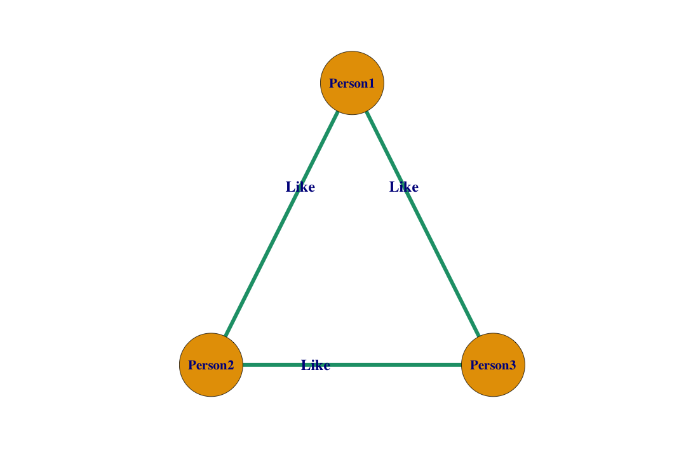
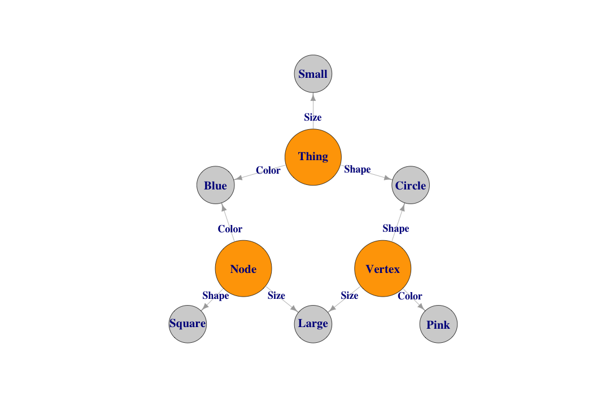
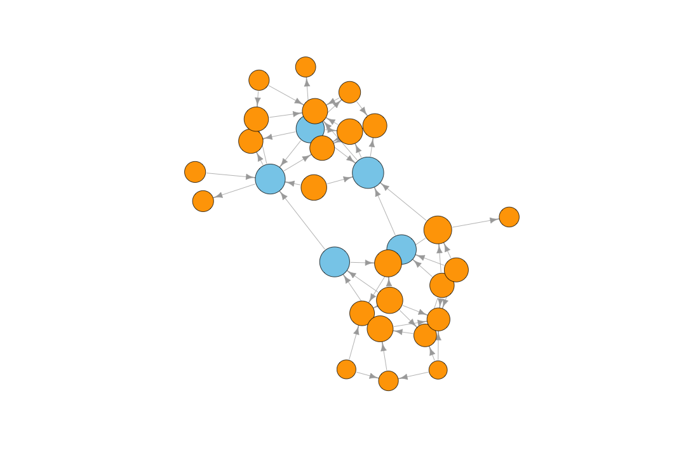
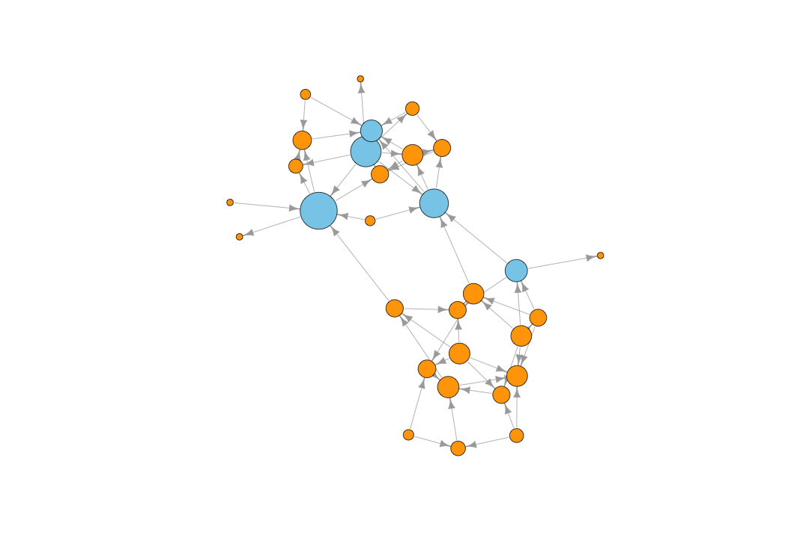
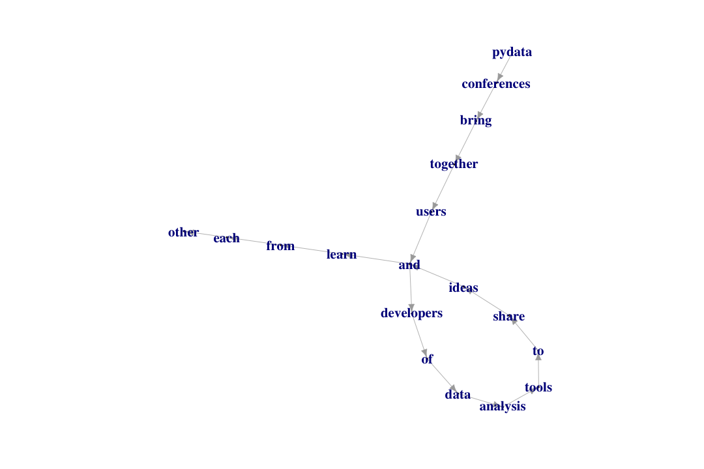
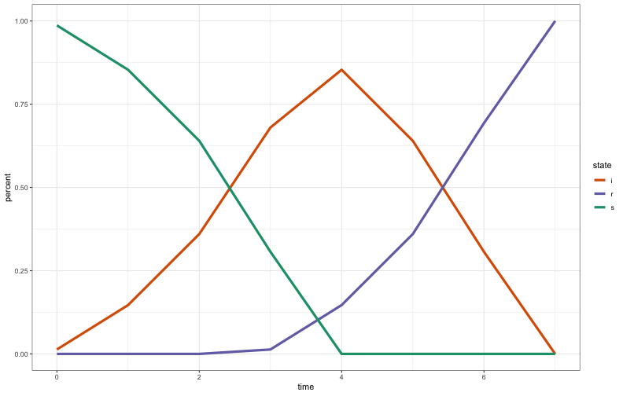
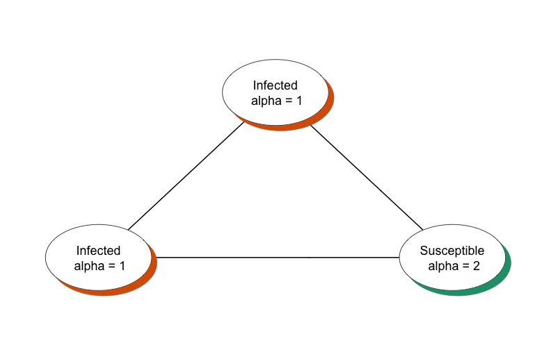
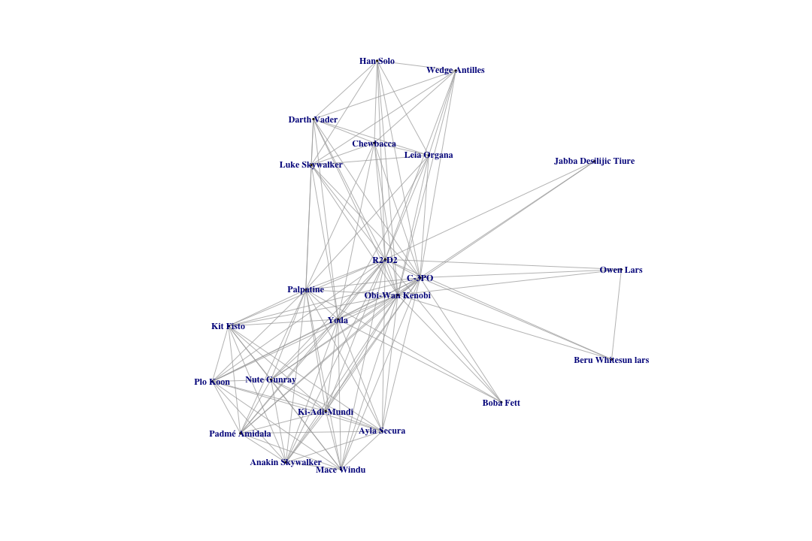
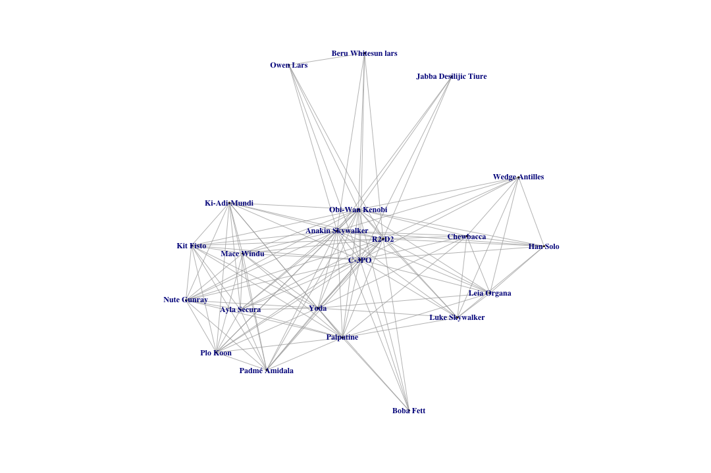

Exploring Graphs with igraph
========================================================
author: Benjamin Ortiz Ulloa
date: 
autosize: true
transition: fade

<style>
.small-code pre code {
  font-size: 1em;
}

.grey-out {
  color: 'lightgrey'
}
</style>

Exploring Graphs with igraph
=====
<ol>
  <li>What's a Graph?</li>
  <li>Practical Applications: Recommendations</li>
  <li>Measuring Impact/Importance</li>
  <li>Practical Applications: Keyphrases</li>
  <li>Practical Applications: Models</li>
  <li><b>Code:</b> Creating a Graph</li>
  <li><b>Code:</b> Exploring a Graph</li>
  <li>Graph Databases</li>
</ol>


Exploring Graphs with igraph
=====
<ol>
  <li>What's a Graph?</li>
  <li style='color: lightgrey'>Practical Applications: Recommendations</li>
  <li style='color: lightgrey'>Measuring Impact/Importance</li>
  <li style='color: lightgrey'>Practical Applications: Keyphrases</li>
  <li style='color: lightgrey'>Practical Applications: Models</li>
  <li style='color: lightgrey'><b>Code:</b> Creating a Graph</li>
  <li style='color: lightgrey'><b>Code:</b> Exploring a Graph</li>
  <li style='color: lightgrey'>Graph Databases</li>
</ol>

What's a Graph?
========================================================


What's a Graph?
========================================================


What's a Graph?
========================================================


What's a Graph?
============


What's a Graph?
============


What's a Graph?
============


Relationships can have direction
============


Multiple relationships are possible
============


Everything can have attributes
============


Attributes can be visualized
============


Edge attributes provide context
====


Friend of my friend... 
====


or enemy of my enemy? 
====


What happens if relationships change?
======


What happens if relationships change?
======


What happens if relationships change?
======


Node attributes can also be nodes
======


Connections can be projected
========


These projections enrich our data
==========


Exploring Graphs with igraph
=====
<ol>
  <li style='color: lightgrey'>What's a Graph?</li>
  <li>Practical Applications: Recommendations</li>
  <li style='color: lightgrey'>Measuring Impact/Importance</li>
  <li style='color: lightgrey'>Practical Applications: Keyphrases</li>
  <li style='color: lightgrey'>Practical Applications: Models</li>
  <li style='color: lightgrey'><b>Code:</b> Creating a Graph</li>
  <li style='color: lightgrey'><b>Code:</b> Exploring a Graph</li>
  <li style='color: lightgrey'>Graph Databases</li>
</ol>

Practical Application: Recommendations
======

**<br><h2>35% of what consumers buy on Amazon and 75% of what users watch on Netflix come from product recommendations</h2>**
<br>
<br>
<p style = 'font-size: 25px'>"How retailers can keep up with consumers"  Ian Mackenzie, Chris Meyer, and Steve Noble</p>

Content Based Recommendations
========================================================


Content Based Recommendations
========================================================


Content Based Recommendations
========================================================


Content Based Recommendations
========================================================


Content Based Recommendations 
========================================================


Collaborative Filtering 
========================================================


Collaborative Filtering 
========================================================


Collaborative Filtering 
========================================================


Collaborative Filtering 
========================================================


Exploring Graphs with igraph
=====
<ol>
  <li style='color: lightgrey'>What's a Graph?</li>
  <li style='color: lightgrey'>Practical Applications: Recommendations</li>
  <li>Measuring Impact/Importance</li>
  <li style='color: lightgrey'>Practical Applications: Keyphrases</li>
  <li style='color: lightgrey'>Practical Applications: Models</li>
  <li style='color: lightgrey'><b>Code:</b> Creating a Graph</li>
  <li style='color: lightgrey'><b>Code:</b> Exploring a Graph</li>
  <li style='color: lightgrey'>Graph Databases</li>
</ol>

What nodes are important?
=====


get_diameter() and shortest_paths()
===


betweenness(g, directed = T)
=======


betweenness(g, directed = F)
=======


degree(g, mode = 'in')
=======


degree(g, mode = 'out')
=========


degree(g, mode = 'all')
===========


closeness(g, mode = 'in')
=======


closeness(g, mode = 'out')
=======


closeness(g, mode = 'all')
=======


hub_score()
=======


authority_score()
=======


page_rank(g, directed = T)
====


page_rank(g, directed = F)
====


Exploring Graphs with igraph
=====
<ol>
  <li style='color: lightgrey'>What's a Graph?</li>
  <li style='color: lightgrey'>Practical Applications: Recommendations</li>
  <li style='color: lightgrey'>Measuring Impact/Importance</li>
  <li>Practical Applications: Keyphrases</li>
  <li style='color: lightgrey'>Practical Applications: Models</li>
  <li style='color: lightgrey'><b>Code:</b> Creating a Graph</li>
  <li style='color: lightgrey'><b>Code:</b> Exploring a Graph</li>
  <li style='color: lightgrey'>Graph Databases</li>
</ol>

Practical Application: Keyphrases
=========

**<h5>When people think of graphs, they often think about mapping out social media connections. While graphs are indeed useful for mapping out social networks, they have many other practical applications. Data in the real world resemble vertices and edges more than they resemble rows and columns. This allows researchers to intuitively grasp the data modeled and stored within a graph. Graph exploration -- also known as graph traversal -- is traditionally done with a traversal language such as Gremlin or Cypher. The functionality of these traversal languages can be duplicated by combining the igraph and magrittr packages. Traversing a graph in R gives useRs access to a myriad of simple, but powerful algorithms to explore their data sets. This talk will show why data should be explored as a graph as well as show how a graph can be traversed in R. I will do this by going through a survey of different graph traversal techniques and by showing the code patterns necessary for each of those techniques.</h5>**


TextRank Algorithm
========
<ol>
  <li>Create a text graph</li>
  <li>Keep only words that are nouns and adjectives</li>
  <li>Run the PageRank algorithm</li>
  <li>Keep only the top 1/3 PageRanked vertices</li>
  <li>The remaining connections represent phrases</li>
  <ul><li>Make sure the words actually appear in sequential order before committing to a phrase</li></ul>
</ol>
<p style = 'font-size: 25px'>"TextRank: Bringing Order into Texts" Rada Mihalcea and Paul Tarau</p>
<p style = 'font-size: 25px'>"PositionRank: An Unsupervised Approach to Keyphrase Extraction from Scholarly Documents" Corina Florescu and Cornelia Caragea</p>

Proximity as a connection
=====



D TextRank: Benjamin Ortiz Ulloa
=====


UD TextRank: Benjamin Ortiz Ulloa
====


D TextRank: Miguel Gonzalez-Fierro
=====


UD TextRank: Miguel Gonzalez-Fierro
=====


D TextRank: Amy Stringer
====


UD TextRank: Amy Stringer
====


D TextRank: Snehalata Huzurbazar
======


UD TextRank: Snehalata Huzurbazar
======


Exploring Graphs with igraph
=======
<ol>
  <li style='color: lightgrey'>What's a Graph?</li>
  <li style='color: lightgrey'>Practical Applications: Recommendations</li>
  <li style='color: lightgrey'>Measuring Impact/Importance</li>
  <li style='color: lightgrey'>Practical Applications: Keyphrases</li>
  <li>Practical Applications: Models</li>
  <li style='color: lightgrey'><b>Code:</b> Creating a Graph</li>
  <li style='color: lightgrey'><b>Code:</b> Exploring a Graph</li>
  <li style='color: lightgrey'>Graph Databases</li>
</ol>


Simple Contagion: Susceptible
===========

System at Time = 0


Simple Contagion: Infected
===========

System at Time = 1


SI Model
=======


SI Model Quantified
======


Simple Contagion: Recovered
===========
System at Time = 2 | Infection Life = 2




SIR Model
=======


SIR Model Quantified
=====


Simple Social Contagion
===========

System at Time = 0


Simple Social Contagion
===========

System at Time = 1


Simple Social Contagion
===========

System at Time = 2


Complex Social Contagion: Agents Matter
===

System at Time = 0 | Resistence = 1 or 2


Complex Social Contagion: Agents Matter
===

System at Time = 1 | Resistence = 1 or 2


Complex Social Contagion: Agents Matter
===

System at Time = 2 | Resistence = 1 or 2


SI Model
=======


SI Model Quantified
======


Exploring Graphs with igraph
=====
<ol>
  <li style='color: lightgrey'>What's a Graph?</li>
  <li style='color: lightgrey'>Practical Applications: Recommendations</li>
  <li style='color: lightgrey'>Measuring Impact/Importance</li>
  <li style='color: lightgrey'>Practical Applications: Keyphrases</li>
  <li style='color: lightgrey'>Practical Applications: Models</li>
  <li><b>Code:</b> Creating a Graph</li>
  <li style='color: lightgrey'><b>Code:</b> Exploring a Graph</li>
  <li style='color: lightgrey'>Graph Databases</li>
</ol>

Creating graphs: Find data
=====

|name                  | height|   mass|hair_color    |skin_color          |eye_color     | birth_year|gender        |homeworld      |species        |
|:---------------------|------:|------:|:-------------|:-------------------|:-------------|----------:|:-------------|:--------------|:--------------|
|Luke Skywalker        |    172|   77.0|blond         |fair                |blue          |       19.0|male          |Tatooine       |Human          |
|C-3PO                 |    167|   75.0|NA            |gold                |yellow        |      112.0|NA            |Tatooine       |Droid          |
|R2-D2                 |     96|   32.0|NA            |white, blue         |red           |       33.0|NA            |Naboo          |Droid          |
|Darth Vader           |    202|  136.0|none          |white               |yellow        |       41.9|male          |Tatooine       |Human          |
|Leia Organa           |    150|   49.0|brown         |light               |brown         |       19.0|female        |Alderaan       |Human          |
|Owen Lars             |    178|  120.0|brown, grey   |light               |blue          |       52.0|male          |Tatooine       |Human          |
|Beru Whitesun lars    |    165|   75.0|brown         |light               |blue          |       47.0|female        |Tatooine       |Human          |
|R5-D4                 |     97|   32.0|NA            |white, red          |red           |         NA|NA            |Tatooine       |Droid          |
|Biggs Darklighter     |    183|   84.0|black         |light               |brown         |       24.0|male          |Tatooine       |Human          |
|Obi-Wan Kenobi        |    182|   77.0|auburn, white |fair                |blue-gray     |       57.0|male          |Stewjon        |Human          |
|Anakin Skywalker      |    188|   84.0|blond         |fair                |blue          |       41.9|male          |Tatooine       |Human          |
|Wilhuff Tarkin        |    180|     NA|auburn, grey  |fair                |blue          |       64.0|male          |Eriadu         |Human          |
|Chewbacca             |    228|  112.0|brown         |unknown             |blue          |      200.0|male          |Kashyyyk       |Wookiee        |
|Han Solo              |    180|   80.0|brown         |fair                |brown         |       29.0|male          |Corellia       |Human          |
|Greedo                |    173|   74.0|NA            |green               |black         |       44.0|male          |Rodia          |Rodian         |
|Jabba Desilijic Tiure |    175| 1358.0|NA            |green-tan, brown    |orange        |      600.0|hermaphrodite |Nal Hutta      |Hutt           |
|Wedge Antilles        |    170|   77.0|brown         |fair                |hazel         |       21.0|male          |Corellia       |Human          |
|Jek Tono Porkins      |    180|  110.0|brown         |fair                |blue          |         NA|male          |Bestine IV     |Human          |
|Yoda                  |     66|   17.0|white         |green               |brown         |      896.0|male          |NA             |Yoda's species |
|Palpatine             |    170|   75.0|grey          |pale                |yellow        |       82.0|male          |Naboo          |Human          |
|Boba Fett             |    183|   78.2|black         |fair                |brown         |       31.5|male          |Kamino         |Human          |
|IG-88                 |    200|  140.0|none          |metal               |red           |       15.0|none          |NA             |Droid          |
|Bossk                 |    190|  113.0|none          |green               |red           |       53.0|male          |Trandosha      |Trandoshan     |
|Lando Calrissian      |    177|   79.0|black         |dark                |brown         |       31.0|male          |Socorro        |Human          |
|Lobot                 |    175|   79.0|none          |light               |blue          |       37.0|male          |Bespin         |Human          |
|Ackbar                |    180|   83.0|none          |brown mottle        |orange        |       41.0|male          |Mon Cala       |Mon Calamari   |
|Mon Mothma            |    150|     NA|auburn        |fair                |blue          |       48.0|female        |Chandrila      |Human          |
|Arvel Crynyd          |     NA|     NA|brown         |fair                |brown         |         NA|male          |NA             |Human          |
|Wicket Systri Warrick |     88|   20.0|brown         |brown               |brown         |        8.0|male          |Endor          |Ewok           |
|Nien Nunb             |    160|   68.0|none          |grey                |black         |         NA|male          |Sullust        |Sullustan      |
|Qui-Gon Jinn          |    193|   89.0|brown         |fair                |blue          |       92.0|male          |NA             |Human          |
|Nute Gunray           |    191|   90.0|none          |mottled green       |red           |         NA|male          |Cato Neimoidia |Neimodian      |
|Finis Valorum         |    170|     NA|blond         |fair                |blue          |       91.0|male          |Coruscant      |Human          |
|Jar Jar Binks         |    196|   66.0|none          |orange              |orange        |       52.0|male          |Naboo          |Gungan         |
|Roos Tarpals          |    224|   82.0|none          |grey                |orange        |         NA|male          |Naboo          |Gungan         |
|Rugor Nass            |    206|     NA|none          |green               |orange        |         NA|male          |Naboo          |Gungan         |
|Ric Olié              |    183|     NA|brown         |fair                |blue          |         NA|male          |Naboo          |NA             |
|Watto                 |    137|     NA|black         |blue, grey          |yellow        |         NA|male          |Toydaria       |Toydarian      |
|Sebulba               |    112|   40.0|none          |grey, red           |orange        |         NA|male          |Malastare      |Dug            |
|Quarsh Panaka         |    183|     NA|black         |dark                |brown         |       62.0|male          |Naboo          |NA             |
|Shmi Skywalker        |    163|     NA|black         |fair                |brown         |       72.0|female        |Tatooine       |Human          |
|Darth Maul            |    175|   80.0|none          |red                 |yellow        |       54.0|male          |Dathomir       |Zabrak         |
|Bib Fortuna           |    180|     NA|none          |pale                |pink          |         NA|male          |Ryloth         |Twi'lek        |
|Ayla Secura           |    178|   55.0|none          |blue                |hazel         |       48.0|female        |Ryloth         |Twi'lek        |
|Dud Bolt              |     94|   45.0|none          |blue, grey          |yellow        |         NA|male          |Vulpter        |Vulptereen     |
|Gasgano               |    122|     NA|none          |white, blue         |black         |         NA|male          |Troiken        |Xexto          |
|Ben Quadinaros        |    163|   65.0|none          |grey, green, yellow |orange        |         NA|male          |Tund           |Toong          |
|Mace Windu            |    188|   84.0|none          |dark                |brown         |       72.0|male          |Haruun Kal     |Human          |
|Ki-Adi-Mundi          |    198|   82.0|white         |pale                |yellow        |       92.0|male          |Cerea          |Cerean         |
|Kit Fisto             |    196|   87.0|none          |green               |black         |         NA|male          |Glee Anselm    |Nautolan       |
|Eeth Koth             |    171|     NA|black         |brown               |brown         |         NA|male          |Iridonia       |Zabrak         |
|Adi Gallia            |    184|   50.0|none          |dark                |blue          |         NA|female        |Coruscant      |Tholothian     |
|Saesee Tiin           |    188|     NA|none          |pale                |orange        |         NA|male          |Iktotch        |Iktotchi       |
|Yarael Poof           |    264|     NA|none          |white               |yellow        |         NA|male          |Quermia        |Quermian       |
|Plo Koon              |    188|   80.0|none          |orange              |black         |       22.0|male          |Dorin          |Kel Dor        |
|Mas Amedda            |    196|     NA|none          |blue                |blue          |         NA|male          |Champala       |Chagrian       |
|Gregar Typho          |    185|   85.0|black         |dark                |brown         |         NA|male          |Naboo          |Human          |
|Cordé                 |    157|     NA|brown         |light               |brown         |         NA|female        |Naboo          |Human          |
|Cliegg Lars           |    183|     NA|brown         |fair                |blue          |       82.0|male          |Tatooine       |Human          |
|Poggle the Lesser     |    183|   80.0|none          |green               |yellow        |         NA|male          |Geonosis       |Geonosian      |
|Luminara Unduli       |    170|   56.2|black         |yellow              |blue          |       58.0|female        |Mirial         |Mirialan       |
|Barriss Offee         |    166|   50.0|black         |yellow              |blue          |       40.0|female        |Mirial         |Mirialan       |
|Dormé                 |    165|     NA|brown         |light               |brown         |         NA|female        |Naboo          |Human          |
|Dooku                 |    193|   80.0|white         |fair                |brown         |      102.0|male          |Serenno        |Human          |
|Bail Prestor Organa   |    191|     NA|black         |tan                 |brown         |       67.0|male          |Alderaan       |Human          |
|Jango Fett            |    183|   79.0|black         |tan                 |brown         |       66.0|male          |Concord Dawn   |Human          |
|Zam Wesell            |    168|   55.0|blonde        |fair, green, yellow |yellow        |         NA|female        |Zolan          |Clawdite       |
|Dexter Jettster       |    198|  102.0|none          |brown               |yellow        |         NA|male          |Ojom           |Besalisk       |
|Lama Su               |    229|   88.0|none          |grey                |black         |         NA|male          |Kamino         |Kaminoan       |
|Taun We               |    213|     NA|none          |grey                |black         |         NA|female        |Kamino         |Kaminoan       |
|Jocasta Nu            |    167|     NA|white         |fair                |blue          |         NA|female        |Coruscant      |Human          |
|Ratts Tyerell         |     79|   15.0|none          |grey, blue          |unknown       |         NA|male          |Aleen Minor    |Aleena         |
|R4-P17                |     96|     NA|none          |silver, red         |red, blue     |         NA|female        |NA             |NA             |
|Wat Tambor            |    193|   48.0|none          |green, grey         |unknown       |         NA|male          |Skako          |Skakoan        |
|San Hill              |    191|     NA|none          |grey                |gold          |         NA|male          |Muunilinst     |Muun           |
|Shaak Ti              |    178|   57.0|none          |red, blue, white    |black         |         NA|female        |Shili          |Togruta        |
|Grievous              |    216|  159.0|none          |brown, white        |green, yellow |         NA|male          |Kalee          |Kaleesh        |
|Tarfful               |    234|  136.0|brown         |brown               |blue          |         NA|male          |Kashyyyk       |Wookiee        |
|Raymus Antilles       |    188|   79.0|brown         |light               |brown         |         NA|male          |Alderaan       |Human          |
|Sly Moore             |    178|   48.0|none          |pale                |white         |         NA|female        |Umbara         |NA             |
|Tion Medon            |    206|   80.0|none          |grey                |black         |         NA|male          |Utapau         |Pau'an         |
|Finn                  |     NA|     NA|black         |dark                |dark          |         NA|male          |NA             |Human          |
|Rey                   |     NA|     NA|brown         |light               |hazel         |         NA|female        |NA             |Human          |
|Poe Dameron           |     NA|     NA|brown         |light               |brown         |         NA|male          |NA             |Human          |
|BB8                   |     NA|     NA|none          |none                |black         |         NA|none          |NA             |Droid          |
|Captain Phasma        |     NA|     NA|unknown       |unknown             |unknown       |         NA|female        |NA             |NA             |
|Padmé Amidala         |    165|   45.0|brown         |light               |brown         |       46.0|female        |Naboo          |Human          |

Creating graphs: Edge List
=======

|from                  |to                   |type           |
|:---------------------|:--------------------|:--------------|
|Bossk                 |113                  |has mass       |
|Quarsh Panaka         |Naboo                |has homeworld  |
|Ackbar                |Mon Cala             |has homeworld  |
|Padmé Amidala         |Naboo star skiff     |has starships  |
|Nute Gunray           |Attack of the Clones |has films      |
|Yarael Poof           |Quermia              |has homeworld  |
|Biggs Darklighter     |183                  |has height     |
|R4-P17                |none                 |has hair_color |
|Shaak Ti              |Shili                |has homeworld  |
|IG-88                 |none                 |has gender     |
|Wedge Antilles        |Human                |has species    |
|Mace Windu            |male                 |has gender     |
|Wicket Systri Warrick |brown                |has skin_color |
|Poggle the Lesser     |Revenge of the Sith  |has films      |
|Ric Olié              |fair                 |has skin_color |

Creating graphs: Optional Node List
====

|name         |type            |
|:------------|:---------------|
|Darth Maul   |a character     |
|31.5         |not a character |
|29           |not a character |
|896          |not a character |
|Vulptereen   |not a character |
|41           |not a character |
|Darth Vader  |a character     |
|Arvel Crynyd |a character     |
|22           |not a character |
|fair         |not a character |
|Naboo        |not a character |
|brown mottle |not a character |
|188          |not a character |
|Kaminoan     |not a character |
|173          |not a character |

Creating graphs: igraph
=====
class:small-code

```r
g <- graph_from_data_frame(d = starwarsEL, 
                           directed = T, 
                           vertices = starwarsNL)
g
```

```
IGRAPH 467f087 DN-B 357 899 -- 
+ attr: name (v/c), type (v/c), type (e/c)
+ edges from 467f087 (vertex names):
 [1] Luke Skywalker       ->172 C-3PO                ->167
 [3] R2-D2                ->96  Darth Vader          ->202
 [5] Leia Organa          ->150 Owen Lars            ->178
 [7] Beru Whitesun lars   ->165 R5-D4                ->97 
 [9] Biggs Darklighter    ->183 Obi-Wan Kenobi       ->182
[11] Anakin Skywalker     ->188 Wilhuff Tarkin       ->180
[13] Chewbacca            ->228 Han Solo             ->180
[15] Greedo               ->173 Jabba Desilijic Tiure->175
+ ... omitted several edges
```

Creating Data Frames from graphs
====
class:small-code

```r
g %>% as_data_frame('edges')
```

```
                     from                          to           type
1          Luke Skywalker                         172     has height
2                   C-3PO                         167     has height
3                   R2-D2                          96     has height
4             Darth Vader                         202     has height
5             Leia Organa                         150     has height
6               Owen Lars                         178     has height
7      Beru Whitesun lars                         165     has height
8                   R5-D4                          97     has height
9       Biggs Darklighter                         183     has height
10         Obi-Wan Kenobi                         182     has height
11       Anakin Skywalker                         188     has height
12         Wilhuff Tarkin                         180     has height
13              Chewbacca                         228     has height
14               Han Solo                         180     has height
15                 Greedo                         173     has height
16  Jabba Desilijic Tiure                         175     has height
17         Wedge Antilles                         170     has height
18       Jek Tono Porkins                         180     has height
19                   Yoda                          66     has height
20              Palpatine                         170     has height
21              Boba Fett                         183     has height
22                  IG-88                         200     has height
23                  Bossk                         190     has height
24       Lando Calrissian                         177     has height
25                  Lobot                         175     has height
26                 Ackbar                         180     has height
27             Mon Mothma                         150     has height
28  Wicket Systri Warrick                          88     has height
29              Nien Nunb                         160     has height
30           Qui-Gon Jinn                         193     has height
31            Nute Gunray                         191     has height
32          Finis Valorum                         170     has height
33          Jar Jar Binks                         196     has height
34           Roos Tarpals                         224     has height
35             Rugor Nass                         206     has height
36               Ric Olié                         183     has height
37                  Watto                         137     has height
38                Sebulba                         112     has height
39          Quarsh Panaka                         183     has height
40         Shmi Skywalker                         163     has height
41             Darth Maul                         175     has height
42            Bib Fortuna                         180     has height
43            Ayla Secura                         178     has height
44               Dud Bolt                          94     has height
45                Gasgano                         122     has height
46         Ben Quadinaros                         163     has height
47             Mace Windu                         188     has height
48           Ki-Adi-Mundi                         198     has height
49              Kit Fisto                         196     has height
50              Eeth Koth                         171     has height
51             Adi Gallia                         184     has height
52            Saesee Tiin                         188     has height
53            Yarael Poof                         264     has height
54               Plo Koon                         188     has height
55             Mas Amedda                         196     has height
56           Gregar Typho                         185     has height
57                  Cordé                         157     has height
58            Cliegg Lars                         183     has height
59      Poggle the Lesser                         183     has height
60        Luminara Unduli                         170     has height
61          Barriss Offee                         166     has height
62                  Dormé                         165     has height
63                  Dooku                         193     has height
64    Bail Prestor Organa                         191     has height
65             Jango Fett                         183     has height
66             Zam Wesell                         168     has height
67        Dexter Jettster                         198     has height
68                Lama Su                         229     has height
69                Taun We                         213     has height
70             Jocasta Nu                         167     has height
71          Ratts Tyerell                          79     has height
72                 R4-P17                          96     has height
73             Wat Tambor                         193     has height
74               San Hill                         191     has height
75               Shaak Ti                         178     has height
76               Grievous                         216     has height
77                Tarfful                         234     has height
78        Raymus Antilles                         188     has height
79              Sly Moore                         178     has height
80             Tion Medon                         206     has height
81          Padmé Amidala                         165     has height
82         Luke Skywalker                          77       has mass
83                  C-3PO                          75       has mass
84                  R2-D2                          32       has mass
85            Darth Vader                         136       has mass
86            Leia Organa                          49       has mass
87              Owen Lars                         120       has mass
88     Beru Whitesun lars                          75       has mass
89                  R5-D4                          32       has mass
90      Biggs Darklighter                          84       has mass
91         Obi-Wan Kenobi                          77       has mass
92       Anakin Skywalker                          84       has mass
93              Chewbacca                         112       has mass
94               Han Solo                          80       has mass
95                 Greedo                          74       has mass
96  Jabba Desilijic Tiure                        1358       has mass
97         Wedge Antilles                          77       has mass
98       Jek Tono Porkins                         110       has mass
99                   Yoda                          17       has mass
100             Palpatine                          75       has mass
101             Boba Fett                        78.2       has mass
102                 IG-88                         140       has mass
103                 Bossk                         113       has mass
104      Lando Calrissian                          79       has mass
105                 Lobot                          79       has mass
106                Ackbar                          83       has mass
107 Wicket Systri Warrick                          20       has mass
108             Nien Nunb                          68       has mass
109          Qui-Gon Jinn                          89       has mass
110           Nute Gunray                          90       has mass
111         Jar Jar Binks                          66       has mass
112          Roos Tarpals                          82       has mass
113               Sebulba                          40       has mass
114            Darth Maul                          80       has mass
115           Ayla Secura                          55       has mass
116              Dud Bolt                          45       has mass
117        Ben Quadinaros                          65       has mass
118            Mace Windu                          84       has mass
119          Ki-Adi-Mundi                          82       has mass
120             Kit Fisto                          87       has mass
121            Adi Gallia                          50       has mass
122              Plo Koon                          80       has mass
123          Gregar Typho                          85       has mass
124     Poggle the Lesser                          80       has mass
125       Luminara Unduli                        56.2       has mass
126         Barriss Offee                          50       has mass
127                 Dooku                          80       has mass
128            Jango Fett                          79       has mass
129            Zam Wesell                          55       has mass
130       Dexter Jettster                         102       has mass
131               Lama Su                          88       has mass
132         Ratts Tyerell                          15       has mass
133            Wat Tambor                          48       has mass
134              Shaak Ti                          57       has mass
135              Grievous                         159       has mass
136               Tarfful                         136       has mass
137       Raymus Antilles                          79       has mass
138             Sly Moore                          48       has mass
139            Tion Medon                          80       has mass
140         Padmé Amidala                          45       has mass
141        Luke Skywalker                       blond has hair_color
142           Darth Vader                        none has hair_color
143           Leia Organa                       brown has hair_color
144             Owen Lars                 brown, grey has hair_color
145    Beru Whitesun lars                       brown has hair_color
146     Biggs Darklighter                       black has hair_color
147        Obi-Wan Kenobi               auburn, white has hair_color
148      Anakin Skywalker                       blond has hair_color
149        Wilhuff Tarkin                auburn, grey has hair_color
150             Chewbacca                       brown has hair_color
151              Han Solo                       brown has hair_color
152        Wedge Antilles                       brown has hair_color
153      Jek Tono Porkins                       brown has hair_color
154                  Yoda                       white has hair_color
155             Palpatine                        grey has hair_color
156             Boba Fett                       black has hair_color
157                 IG-88                        none has hair_color
158                 Bossk                        none has hair_color
159      Lando Calrissian                       black has hair_color
160                 Lobot                        none has hair_color
161                Ackbar                        none has hair_color
162            Mon Mothma                      auburn has hair_color
163          Arvel Crynyd                       brown has hair_color
164 Wicket Systri Warrick                       brown has hair_color
165             Nien Nunb                        none has hair_color
166          Qui-Gon Jinn                       brown has hair_color
167           Nute Gunray                        none has hair_color
168         Finis Valorum                       blond has hair_color
169         Jar Jar Binks                        none has hair_color
170          Roos Tarpals                        none has hair_color
171            Rugor Nass                        none has hair_color
172              Ric Olié                       brown has hair_color
173                 Watto                       black has hair_color
174               Sebulba                        none has hair_color
175         Quarsh Panaka                       black has hair_color
176        Shmi Skywalker                       black has hair_color
177            Darth Maul                        none has hair_color
178           Bib Fortuna                        none has hair_color
179           Ayla Secura                        none has hair_color
180              Dud Bolt                        none has hair_color
181               Gasgano                        none has hair_color
182        Ben Quadinaros                        none has hair_color
183            Mace Windu                        none has hair_color
184          Ki-Adi-Mundi                       white has hair_color
185             Kit Fisto                        none has hair_color
186             Eeth Koth                       black has hair_color
187            Adi Gallia                        none has hair_color
188           Saesee Tiin                        none has hair_color
189           Yarael Poof                        none has hair_color
190              Plo Koon                        none has hair_color
191            Mas Amedda                        none has hair_color
192          Gregar Typho                       black has hair_color
193                 Cordé                       brown has hair_color
194           Cliegg Lars                       brown has hair_color
195     Poggle the Lesser                        none has hair_color
196       Luminara Unduli                       black has hair_color
197         Barriss Offee                       black has hair_color
198                 Dormé                       brown has hair_color
199                 Dooku                       white has hair_color
200   Bail Prestor Organa                       black has hair_color
201            Jango Fett                       black has hair_color
202            Zam Wesell                      blonde has hair_color
203       Dexter Jettster                        none has hair_color
204               Lama Su                        none has hair_color
205               Taun We                        none has hair_color
206            Jocasta Nu                       white has hair_color
207         Ratts Tyerell                        none has hair_color
208                R4-P17                        none has hair_color
209            Wat Tambor                        none has hair_color
210              San Hill                        none has hair_color
211              Shaak Ti                        none has hair_color
212              Grievous                        none has hair_color
213               Tarfful                       brown has hair_color
214       Raymus Antilles                       brown has hair_color
215             Sly Moore                        none has hair_color
216            Tion Medon                        none has hair_color
217                  Finn                       black has hair_color
218                   Rey                       brown has hair_color
219           Poe Dameron                       brown has hair_color
220                   BB8                        none has hair_color
221        Captain Phasma                     unknown has hair_color
222         Padmé Amidala                       brown has hair_color
223        Luke Skywalker                        fair has skin_color
224                 C-3PO                        gold has skin_color
225                 R2-D2                 white, blue has skin_color
226           Darth Vader                       white has skin_color
227           Leia Organa                       light has skin_color
228             Owen Lars                       light has skin_color
229    Beru Whitesun lars                       light has skin_color
230                 R5-D4                  white, red has skin_color
231     Biggs Darklighter                       light has skin_color
232        Obi-Wan Kenobi                        fair has skin_color
233      Anakin Skywalker                        fair has skin_color
234        Wilhuff Tarkin                        fair has skin_color
235             Chewbacca                     unknown has skin_color
236              Han Solo                        fair has skin_color
237                Greedo                       green has skin_color
238 Jabba Desilijic Tiure            green-tan, brown has skin_color
239        Wedge Antilles                        fair has skin_color
240      Jek Tono Porkins                        fair has skin_color
241                  Yoda                       green has skin_color
242             Palpatine                        pale has skin_color
243             Boba Fett                        fair has skin_color
244                 IG-88                       metal has skin_color
245                 Bossk                       green has skin_color
246      Lando Calrissian                        dark has skin_color
247                 Lobot                       light has skin_color
248                Ackbar                brown mottle has skin_color
249            Mon Mothma                        fair has skin_color
250          Arvel Crynyd                        fair has skin_color
251 Wicket Systri Warrick                       brown has skin_color
252             Nien Nunb                        grey has skin_color
253          Qui-Gon Jinn                        fair has skin_color
254           Nute Gunray               mottled green has skin_color
255         Finis Valorum                        fair has skin_color
256         Jar Jar Binks                      orange has skin_color
257          Roos Tarpals                        grey has skin_color
258            Rugor Nass                       green has skin_color
259              Ric Olié                        fair has skin_color
260                 Watto                  blue, grey has skin_color
261               Sebulba                   grey, red has skin_color
262         Quarsh Panaka                        dark has skin_color
263        Shmi Skywalker                        fair has skin_color
264            Darth Maul                         red has skin_color
265           Bib Fortuna                        pale has skin_color
266           Ayla Secura                        blue has skin_color
267              Dud Bolt                  blue, grey has skin_color
268               Gasgano                 white, blue has skin_color
269        Ben Quadinaros         grey, green, yellow has skin_color
270            Mace Windu                        dark has skin_color
271          Ki-Adi-Mundi                        pale has skin_color
272             Kit Fisto                       green has skin_color
273             Eeth Koth                       brown has skin_color
274            Adi Gallia                        dark has skin_color
275           Saesee Tiin                        pale has skin_color
276           Yarael Poof                       white has skin_color
277              Plo Koon                      orange has skin_color
278            Mas Amedda                        blue has skin_color
279          Gregar Typho                        dark has skin_color
280                 Cordé                       light has skin_color
281           Cliegg Lars                        fair has skin_color
282     Poggle the Lesser                       green has skin_color
283       Luminara Unduli                      yellow has skin_color
284         Barriss Offee                      yellow has skin_color
285                 Dormé                       light has skin_color
286                 Dooku                        fair has skin_color
287   Bail Prestor Organa                         tan has skin_color
288            Jango Fett                         tan has skin_color
289            Zam Wesell         fair, green, yellow has skin_color
290       Dexter Jettster                       brown has skin_color
291               Lama Su                        grey has skin_color
292               Taun We                        grey has skin_color
293            Jocasta Nu                        fair has skin_color
294         Ratts Tyerell                  grey, blue has skin_color
295                R4-P17                 silver, red has skin_color
296            Wat Tambor                 green, grey has skin_color
297              San Hill                        grey has skin_color
298              Shaak Ti            red, blue, white has skin_color
299              Grievous                brown, white has skin_color
300               Tarfful                       brown has skin_color
301       Raymus Antilles                       light has skin_color
302             Sly Moore                        pale has skin_color
303            Tion Medon                        grey has skin_color
304                  Finn                        dark has skin_color
305                   Rey                       light has skin_color
306           Poe Dameron                       light has skin_color
307                   BB8                        none has skin_color
308        Captain Phasma                     unknown has skin_color
309         Padmé Amidala                       light has skin_color
310        Luke Skywalker                        blue  has eye_color
311                 C-3PO                      yellow  has eye_color
312                 R2-D2                         red  has eye_color
313           Darth Vader                      yellow  has eye_color
314           Leia Organa                       brown  has eye_color
315             Owen Lars                        blue  has eye_color
316    Beru Whitesun lars                        blue  has eye_color
317                 R5-D4                         red  has eye_color
318     Biggs Darklighter                       brown  has eye_color
319        Obi-Wan Kenobi                   blue-gray  has eye_color
320      Anakin Skywalker                        blue  has eye_color
321        Wilhuff Tarkin                        blue  has eye_color
322             Chewbacca                        blue  has eye_color
323              Han Solo                       brown  has eye_color
324                Greedo                       black  has eye_color
325 Jabba Desilijic Tiure                      orange  has eye_color
326        Wedge Antilles                       hazel  has eye_color
327      Jek Tono Porkins                        blue  has eye_color
328                  Yoda                       brown  has eye_color
329             Palpatine                      yellow  has eye_color
330             Boba Fett                       brown  has eye_color
331                 IG-88                         red  has eye_color
332                 Bossk                         red  has eye_color
333      Lando Calrissian                       brown  has eye_color
334                 Lobot                        blue  has eye_color
335                Ackbar                      orange  has eye_color
336            Mon Mothma                        blue  has eye_color
337          Arvel Crynyd                       brown  has eye_color
338 Wicket Systri Warrick                       brown  has eye_color
339             Nien Nunb                       black  has eye_color
340          Qui-Gon Jinn                        blue  has eye_color
341           Nute Gunray                         red  has eye_color
342         Finis Valorum                        blue  has eye_color
343         Jar Jar Binks                      orange  has eye_color
344          Roos Tarpals                      orange  has eye_color
345            Rugor Nass                      orange  has eye_color
346              Ric Olié                        blue  has eye_color
347                 Watto                      yellow  has eye_color
348               Sebulba                      orange  has eye_color
349         Quarsh Panaka                       brown  has eye_color
350        Shmi Skywalker                       brown  has eye_color
351            Darth Maul                      yellow  has eye_color
352           Bib Fortuna                        pink  has eye_color
353           Ayla Secura                       hazel  has eye_color
354              Dud Bolt                      yellow  has eye_color
355               Gasgano                       black  has eye_color
356        Ben Quadinaros                      orange  has eye_color
357            Mace Windu                       brown  has eye_color
358          Ki-Adi-Mundi                      yellow  has eye_color
359             Kit Fisto                       black  has eye_color
360             Eeth Koth                       brown  has eye_color
361            Adi Gallia                        blue  has eye_color
362           Saesee Tiin                      orange  has eye_color
363           Yarael Poof                      yellow  has eye_color
364              Plo Koon                       black  has eye_color
365            Mas Amedda                        blue  has eye_color
366          Gregar Typho                       brown  has eye_color
367                 Cordé                       brown  has eye_color
368           Cliegg Lars                        blue  has eye_color
369     Poggle the Lesser                      yellow  has eye_color
370       Luminara Unduli                        blue  has eye_color
371         Barriss Offee                        blue  has eye_color
372                 Dormé                       brown  has eye_color
373                 Dooku                       brown  has eye_color
374   Bail Prestor Organa                       brown  has eye_color
375            Jango Fett                       brown  has eye_color
376            Zam Wesell                      yellow  has eye_color
377       Dexter Jettster                      yellow  has eye_color
378               Lama Su                       black  has eye_color
379               Taun We                       black  has eye_color
380            Jocasta Nu                        blue  has eye_color
381         Ratts Tyerell                     unknown  has eye_color
382                R4-P17                   red, blue  has eye_color
383            Wat Tambor                     unknown  has eye_color
384              San Hill                        gold  has eye_color
385              Shaak Ti                       black  has eye_color
386              Grievous               green, yellow  has eye_color
387               Tarfful                        blue  has eye_color
388       Raymus Antilles                       brown  has eye_color
389             Sly Moore                       white  has eye_color
390            Tion Medon                       black  has eye_color
391                  Finn                        dark  has eye_color
392                   Rey                       hazel  has eye_color
393           Poe Dameron                       brown  has eye_color
394                   BB8                       black  has eye_color
395        Captain Phasma                     unknown  has eye_color
396         Padmé Amidala                       brown  has eye_color
397        Luke Skywalker                          19 has birth_year
398                 C-3PO                         112 has birth_year
399                 R2-D2                          33 has birth_year
400           Darth Vader                        41.9 has birth_year
401           Leia Organa                          19 has birth_year
402             Owen Lars                          52 has birth_year
403    Beru Whitesun lars                          47 has birth_year
404     Biggs Darklighter                          24 has birth_year
405        Obi-Wan Kenobi                          57 has birth_year
406      Anakin Skywalker                        41.9 has birth_year
407        Wilhuff Tarkin                          64 has birth_year
408             Chewbacca                         200 has birth_year
409              Han Solo                          29 has birth_year
410                Greedo                          44 has birth_year
411 Jabba Desilijic Tiure                         600 has birth_year
412        Wedge Antilles                          21 has birth_year
413                  Yoda                         896 has birth_year
414             Palpatine                          82 has birth_year
415             Boba Fett                        31.5 has birth_year
416                 IG-88                          15 has birth_year
417                 Bossk                          53 has birth_year
418      Lando Calrissian                          31 has birth_year
419                 Lobot                          37 has birth_year
420                Ackbar                          41 has birth_year
421            Mon Mothma                          48 has birth_year
422 Wicket Systri Warrick                           8 has birth_year
423          Qui-Gon Jinn                          92 has birth_year
424         Finis Valorum                          91 has birth_year
425         Jar Jar Binks                          52 has birth_year
426         Quarsh Panaka                          62 has birth_year
427        Shmi Skywalker                          72 has birth_year
428            Darth Maul                          54 has birth_year
429           Ayla Secura                          48 has birth_year
430            Mace Windu                          72 has birth_year
431          Ki-Adi-Mundi                          92 has birth_year
432              Plo Koon                          22 has birth_year
433           Cliegg Lars                          82 has birth_year
434       Luminara Unduli                          58 has birth_year
435         Barriss Offee                          40 has birth_year
436                 Dooku                         102 has birth_year
437   Bail Prestor Organa                          67 has birth_year
438            Jango Fett                          66 has birth_year
439         Padmé Amidala                          46 has birth_year
440        Luke Skywalker                        male     has gender
441           Darth Vader                        male     has gender
442           Leia Organa                      female     has gender
443             Owen Lars                        male     has gender
444    Beru Whitesun lars                      female     has gender
445     Biggs Darklighter                        male     has gender
446        Obi-Wan Kenobi                        male     has gender
447      Anakin Skywalker                        male     has gender
448        Wilhuff Tarkin                        male     has gender
449             Chewbacca                        male     has gender
450              Han Solo                        male     has gender
451                Greedo                        male     has gender
452 Jabba Desilijic Tiure               hermaphrodite     has gender
453        Wedge Antilles                        male     has gender
454      Jek Tono Porkins                        male     has gender
455                  Yoda                        male     has gender
456             Palpatine                        male     has gender
457             Boba Fett                        male     has gender
458                 IG-88                        none     has gender
459                 Bossk                        male     has gender
460      Lando Calrissian                        male     has gender
461                 Lobot                        male     has gender
462                Ackbar                        male     has gender
463            Mon Mothma                      female     has gender
464          Arvel Crynyd                        male     has gender
465 Wicket Systri Warrick                        male     has gender
466             Nien Nunb                        male     has gender
467          Qui-Gon Jinn                        male     has gender
468           Nute Gunray                        male     has gender
469         Finis Valorum                        male     has gender
470         Jar Jar Binks                        male     has gender
471          Roos Tarpals                        male     has gender
472            Rugor Nass                        male     has gender
473              Ric Olié                        male     has gender
474                 Watto                        male     has gender
475               Sebulba                        male     has gender
476         Quarsh Panaka                        male     has gender
477        Shmi Skywalker                      female     has gender
478            Darth Maul                        male     has gender
479           Bib Fortuna                        male     has gender
480           Ayla Secura                      female     has gender
481              Dud Bolt                        male     has gender
482               Gasgano                        male     has gender
483        Ben Quadinaros                        male     has gender
484            Mace Windu                        male     has gender
485          Ki-Adi-Mundi                        male     has gender
486             Kit Fisto                        male     has gender
487             Eeth Koth                        male     has gender
488            Adi Gallia                      female     has gender
489           Saesee Tiin                        male     has gender
490           Yarael Poof                        male     has gender
491              Plo Koon                        male     has gender
492            Mas Amedda                        male     has gender
493          Gregar Typho                        male     has gender
494                 Cordé                      female     has gender
495           Cliegg Lars                        male     has gender
496     Poggle the Lesser                        male     has gender
497       Luminara Unduli                      female     has gender
498         Barriss Offee                      female     has gender
499                 Dormé                      female     has gender
500                 Dooku                        male     has gender
501   Bail Prestor Organa                        male     has gender
502            Jango Fett                        male     has gender
503            Zam Wesell                      female     has gender
504       Dexter Jettster                        male     has gender
505               Lama Su                        male     has gender
506               Taun We                      female     has gender
507            Jocasta Nu                      female     has gender
508         Ratts Tyerell                        male     has gender
509                R4-P17                      female     has gender
510            Wat Tambor                        male     has gender
511              San Hill                        male     has gender
512              Shaak Ti                      female     has gender
513              Grievous                        male     has gender
514               Tarfful                        male     has gender
515       Raymus Antilles                        male     has gender
516             Sly Moore                      female     has gender
517            Tion Medon                        male     has gender
518                  Finn                        male     has gender
519                   Rey                      female     has gender
520           Poe Dameron                        male     has gender
521                   BB8                        none     has gender
522        Captain Phasma                      female     has gender
523         Padmé Amidala                      female     has gender
524        Luke Skywalker                    Tatooine  has homeworld
525                 C-3PO                    Tatooine  has homeworld
526                 R2-D2                       Naboo  has homeworld
527           Darth Vader                    Tatooine  has homeworld
528           Leia Organa                    Alderaan  has homeworld
529             Owen Lars                    Tatooine  has homeworld
530    Beru Whitesun lars                    Tatooine  has homeworld
531                 R5-D4                    Tatooine  has homeworld
532     Biggs Darklighter                    Tatooine  has homeworld
533        Obi-Wan Kenobi                     Stewjon  has homeworld
534      Anakin Skywalker                    Tatooine  has homeworld
535        Wilhuff Tarkin                      Eriadu  has homeworld
536             Chewbacca                    Kashyyyk  has homeworld
537              Han Solo                    Corellia  has homeworld
538                Greedo                       Rodia  has homeworld
539 Jabba Desilijic Tiure                   Nal Hutta  has homeworld
540        Wedge Antilles                    Corellia  has homeworld
541      Jek Tono Porkins                  Bestine IV  has homeworld
542             Palpatine                       Naboo  has homeworld
543             Boba Fett                      Kamino  has homeworld
544                 Bossk                   Trandosha  has homeworld
545      Lando Calrissian                     Socorro  has homeworld
546                 Lobot                      Bespin  has homeworld
547                Ackbar                    Mon Cala  has homeworld
548            Mon Mothma                   Chandrila  has homeworld
549 Wicket Systri Warrick                       Endor  has homeworld
550             Nien Nunb                     Sullust  has homeworld
551           Nute Gunray              Cato Neimoidia  has homeworld
552         Finis Valorum                   Coruscant  has homeworld
553         Jar Jar Binks                       Naboo  has homeworld
554          Roos Tarpals                       Naboo  has homeworld
555            Rugor Nass                       Naboo  has homeworld
556              Ric Olié                       Naboo  has homeworld
557                 Watto                    Toydaria  has homeworld
558               Sebulba                   Malastare  has homeworld
559         Quarsh Panaka                       Naboo  has homeworld
560        Shmi Skywalker                    Tatooine  has homeworld
561            Darth Maul                    Dathomir  has homeworld
562           Bib Fortuna                      Ryloth  has homeworld
563           Ayla Secura                      Ryloth  has homeworld
564              Dud Bolt                     Vulpter  has homeworld
565               Gasgano                     Troiken  has homeworld
566        Ben Quadinaros                        Tund  has homeworld
567            Mace Windu                  Haruun Kal  has homeworld
568          Ki-Adi-Mundi                       Cerea  has homeworld
569             Kit Fisto                 Glee Anselm  has homeworld
570             Eeth Koth                    Iridonia  has homeworld
571            Adi Gallia                   Coruscant  has homeworld
572           Saesee Tiin                     Iktotch  has homeworld
573           Yarael Poof                     Quermia  has homeworld
574              Plo Koon                       Dorin  has homeworld
575            Mas Amedda                    Champala  has homeworld
576          Gregar Typho                       Naboo  has homeworld
577                 Cordé                       Naboo  has homeworld
578           Cliegg Lars                    Tatooine  has homeworld
579     Poggle the Lesser                    Geonosis  has homeworld
580       Luminara Unduli                      Mirial  has homeworld
581         Barriss Offee                      Mirial  has homeworld
582                 Dormé                       Naboo  has homeworld
583                 Dooku                     Serenno  has homeworld
584   Bail Prestor Organa                    Alderaan  has homeworld
585            Jango Fett                Concord Dawn  has homeworld
586            Zam Wesell                       Zolan  has homeworld
587       Dexter Jettster                        Ojom  has homeworld
588               Lama Su                      Kamino  has homeworld
589               Taun We                      Kamino  has homeworld
590            Jocasta Nu                   Coruscant  has homeworld
591         Ratts Tyerell                 Aleen Minor  has homeworld
592            Wat Tambor                       Skako  has homeworld
593              San Hill                  Muunilinst  has homeworld
594              Shaak Ti                       Shili  has homeworld
595              Grievous                       Kalee  has homeworld
596               Tarfful                    Kashyyyk  has homeworld
597       Raymus Antilles                    Alderaan  has homeworld
598             Sly Moore                      Umbara  has homeworld
599            Tion Medon                      Utapau  has homeworld
600         Padmé Amidala                       Naboo  has homeworld
601        Luke Skywalker                       Human    has species
602                 C-3PO                       Droid    has species
603                 R2-D2                       Droid    has species
604           Darth Vader                       Human    has species
605           Leia Organa                       Human    has species
606             Owen Lars                       Human    has species
607    Beru Whitesun lars                       Human    has species
608                 R5-D4                       Droid    has species
609     Biggs Darklighter                       Human    has species
610        Obi-Wan Kenobi                       Human    has species
611      Anakin Skywalker                       Human    has species
612        Wilhuff Tarkin                       Human    has species
613             Chewbacca                     Wookiee    has species
614              Han Solo                       Human    has species
615                Greedo                      Rodian    has species
616 Jabba Desilijic Tiure                        Hutt    has species
617        Wedge Antilles                       Human    has species
618      Jek Tono Porkins                       Human    has species
619                  Yoda              Yoda's species    has species
620             Palpatine                       Human    has species
621             Boba Fett                       Human    has species
622                 IG-88                       Droid    has species
623                 Bossk                  Trandoshan    has species
624      Lando Calrissian                       Human    has species
625                 Lobot                       Human    has species
626                Ackbar                Mon Calamari    has species
627            Mon Mothma                       Human    has species
628          Arvel Crynyd                       Human    has species
629 Wicket Systri Warrick                        Ewok    has species
630             Nien Nunb                   Sullustan    has species
631          Qui-Gon Jinn                       Human    has species
632           Nute Gunray                   Neimodian    has species
633         Finis Valorum                       Human    has species
634         Jar Jar Binks                      Gungan    has species
635          Roos Tarpals                      Gungan    has species
636            Rugor Nass                      Gungan    has species
637                 Watto                   Toydarian    has species
638               Sebulba                         Dug    has species
639        Shmi Skywalker                       Human    has species
640            Darth Maul                      Zabrak    has species
641           Bib Fortuna                     Twi'lek    has species
642           Ayla Secura                     Twi'lek    has species
643              Dud Bolt                  Vulptereen    has species
644               Gasgano                       Xexto    has species
645        Ben Quadinaros                       Toong    has species
646            Mace Windu                       Human    has species
647          Ki-Adi-Mundi                      Cerean    has species
648             Kit Fisto                    Nautolan    has species
649             Eeth Koth                      Zabrak    has species
650            Adi Gallia                  Tholothian    has species
651           Saesee Tiin                    Iktotchi    has species
652           Yarael Poof                    Quermian    has species
653              Plo Koon                     Kel Dor    has species
654            Mas Amedda                    Chagrian    has species
655          Gregar Typho                       Human    has species
656                 Cordé                       Human    has species
657           Cliegg Lars                       Human    has species
658     Poggle the Lesser                   Geonosian    has species
659       Luminara Unduli                    Mirialan    has species
660         Barriss Offee                    Mirialan    has species
661                 Dormé                       Human    has species
662                 Dooku                       Human    has species
663   Bail Prestor Organa                       Human    has species
664            Jango Fett                       Human    has species
665            Zam Wesell                    Clawdite    has species
666       Dexter Jettster                    Besalisk    has species
667               Lama Su                    Kaminoan    has species
668               Taun We                    Kaminoan    has species
669            Jocasta Nu                       Human    has species
670         Ratts Tyerell                      Aleena    has species
671            Wat Tambor                     Skakoan    has species
672              San Hill                        Muun    has species
673              Shaak Ti                     Togruta    has species
674              Grievous                     Kaleesh    has species
675               Tarfful                     Wookiee    has species
676       Raymus Antilles                       Human    has species
677            Tion Medon                      Pau'an    has species
678                  Finn                       Human    has species
679                   Rey                       Human    has species
680           Poe Dameron                       Human    has species
681                   BB8                       Droid    has species
682         Padmé Amidala                       Human    has species
683        Luke Skywalker         Revenge of the Sith      has films
684        Luke Skywalker          Return of the Jedi      has films
685        Luke Skywalker     The Empire Strikes Back      has films
686        Luke Skywalker                  A New Hope      has films
687        Luke Skywalker           The Force Awakens      has films
688                 C-3PO        Attack of the Clones      has films
689                 C-3PO          The Phantom Menace      has films
690                 C-3PO         Revenge of the Sith      has films
691                 C-3PO          Return of the Jedi      has films
692                 C-3PO     The Empire Strikes Back      has films
693                 C-3PO                  A New Hope      has films
694                 R2-D2        Attack of the Clones      has films
695                 R2-D2          The Phantom Menace      has films
696                 R2-D2         Revenge of the Sith      has films
697                 R2-D2          Return of the Jedi      has films
698                 R2-D2     The Empire Strikes Back      has films
699                 R2-D2                  A New Hope      has films
700                 R2-D2           The Force Awakens      has films
701           Darth Vader         Revenge of the Sith      has films
702           Darth Vader          Return of the Jedi      has films
703           Darth Vader     The Empire Strikes Back      has films
704           Darth Vader                  A New Hope      has films
705           Leia Organa         Revenge of the Sith      has films
706           Leia Organa          Return of the Jedi      has films
707           Leia Organa     The Empire Strikes Back      has films
708           Leia Organa                  A New Hope      has films
709           Leia Organa           The Force Awakens      has films
710             Owen Lars        Attack of the Clones      has films
711             Owen Lars         Revenge of the Sith      has films
712             Owen Lars                  A New Hope      has films
713    Beru Whitesun lars        Attack of the Clones      has films
714    Beru Whitesun lars         Revenge of the Sith      has films
715    Beru Whitesun lars                  A New Hope      has films
716                 R5-D4                  A New Hope      has films
717     Biggs Darklighter                  A New Hope      has films
718        Obi-Wan Kenobi        Attack of the Clones      has films
719        Obi-Wan Kenobi          The Phantom Menace      has films
720        Obi-Wan Kenobi         Revenge of the Sith      has films
721        Obi-Wan Kenobi          Return of the Jedi      has films
722        Obi-Wan Kenobi     The Empire Strikes Back      has films
723        Obi-Wan Kenobi                  A New Hope      has films
724      Anakin Skywalker        Attack of the Clones      has films
725      Anakin Skywalker          The Phantom Menace      has films
726      Anakin Skywalker         Revenge of the Sith      has films
727        Wilhuff Tarkin         Revenge of the Sith      has films
728        Wilhuff Tarkin                  A New Hope      has films
729             Chewbacca         Revenge of the Sith      has films
730             Chewbacca          Return of the Jedi      has films
731             Chewbacca     The Empire Strikes Back      has films
732             Chewbacca                  A New Hope      has films
733             Chewbacca           The Force Awakens      has films
734              Han Solo          Return of the Jedi      has films
735              Han Solo     The Empire Strikes Back      has films
736              Han Solo                  A New Hope      has films
737              Han Solo           The Force Awakens      has films
738                Greedo                  A New Hope      has films
739 Jabba Desilijic Tiure          The Phantom Menace      has films
740 Jabba Desilijic Tiure          Return of the Jedi      has films
741 Jabba Desilijic Tiure                  A New Hope      has films
742        Wedge Antilles          Return of the Jedi      has films
743        Wedge Antilles     The Empire Strikes Back      has films
744        Wedge Antilles                  A New Hope      has films
745      Jek Tono Porkins                  A New Hope      has films
746                  Yoda        Attack of the Clones      has films
747                  Yoda          The Phantom Menace      has films
748                  Yoda         Revenge of the Sith      has films
749                  Yoda          Return of the Jedi      has films
750                  Yoda     The Empire Strikes Back      has films
751             Palpatine        Attack of the Clones      has films
752             Palpatine          The Phantom Menace      has films
753             Palpatine         Revenge of the Sith      has films
754             Palpatine          Return of the Jedi      has films
755             Palpatine     The Empire Strikes Back      has films
756             Boba Fett        Attack of the Clones      has films
757             Boba Fett          Return of the Jedi      has films
758             Boba Fett     The Empire Strikes Back      has films
759                 IG-88     The Empire Strikes Back      has films
760                 Bossk     The Empire Strikes Back      has films
761      Lando Calrissian          Return of the Jedi      has films
762      Lando Calrissian     The Empire Strikes Back      has films
763                 Lobot     The Empire Strikes Back      has films
764                Ackbar          Return of the Jedi      has films
765                Ackbar           The Force Awakens      has films
766            Mon Mothma          Return of the Jedi      has films
767          Arvel Crynyd          Return of the Jedi      has films
768 Wicket Systri Warrick          Return of the Jedi      has films
769             Nien Nunb          Return of the Jedi      has films
770          Qui-Gon Jinn          The Phantom Menace      has films
771           Nute Gunray        Attack of the Clones      has films
772           Nute Gunray          The Phantom Menace      has films
773           Nute Gunray         Revenge of the Sith      has films
774         Finis Valorum          The Phantom Menace      has films
775         Jar Jar Binks        Attack of the Clones      has films
776         Jar Jar Binks          The Phantom Menace      has films
777          Roos Tarpals          The Phantom Menace      has films
778            Rugor Nass          The Phantom Menace      has films
779              Ric Olié          The Phantom Menace      has films
780                 Watto        Attack of the Clones      has films
781                 Watto          The Phantom Menace      has films
782               Sebulba          The Phantom Menace      has films
783         Quarsh Panaka          The Phantom Menace      has films
784        Shmi Skywalker        Attack of the Clones      has films
785        Shmi Skywalker          The Phantom Menace      has films
786            Darth Maul          The Phantom Menace      has films
787           Bib Fortuna          Return of the Jedi      has films
788           Ayla Secura        Attack of the Clones      has films
789           Ayla Secura          The Phantom Menace      has films
790           Ayla Secura         Revenge of the Sith      has films
791              Dud Bolt          The Phantom Menace      has films
792               Gasgano          The Phantom Menace      has films
793        Ben Quadinaros          The Phantom Menace      has films
794            Mace Windu        Attack of the Clones      has films
795            Mace Windu          The Phantom Menace      has films
796            Mace Windu         Revenge of the Sith      has films
797          Ki-Adi-Mundi        Attack of the Clones      has films
798          Ki-Adi-Mundi          The Phantom Menace      has films
799          Ki-Adi-Mundi         Revenge of the Sith      has films
800             Kit Fisto        Attack of the Clones      has films
801             Kit Fisto          The Phantom Menace      has films
802             Kit Fisto         Revenge of the Sith      has films
803             Eeth Koth          The Phantom Menace      has films
804             Eeth Koth         Revenge of the Sith      has films
805            Adi Gallia          The Phantom Menace      has films
806            Adi Gallia         Revenge of the Sith      has films
807           Saesee Tiin          The Phantom Menace      has films
808           Saesee Tiin         Revenge of the Sith      has films
809           Yarael Poof          The Phantom Menace      has films
810              Plo Koon        Attack of the Clones      has films
811              Plo Koon          The Phantom Menace      has films
812              Plo Koon         Revenge of the Sith      has films
813            Mas Amedda        Attack of the Clones      has films
814            Mas Amedda          The Phantom Menace      has films
815          Gregar Typho        Attack of the Clones      has films
816                 Cordé        Attack of the Clones      has films
817           Cliegg Lars        Attack of the Clones      has films
818     Poggle the Lesser        Attack of the Clones      has films
819     Poggle the Lesser         Revenge of the Sith      has films
820       Luminara Unduli        Attack of the Clones      has films
821       Luminara Unduli         Revenge of the Sith      has films
822         Barriss Offee        Attack of the Clones      has films
823                 Dormé        Attack of the Clones      has films
824                 Dooku        Attack of the Clones      has films
825                 Dooku         Revenge of the Sith      has films
826   Bail Prestor Organa        Attack of the Clones      has films
827   Bail Prestor Organa         Revenge of the Sith      has films
828            Jango Fett        Attack of the Clones      has films
829            Zam Wesell        Attack of the Clones      has films
830       Dexter Jettster        Attack of the Clones      has films
831               Lama Su        Attack of the Clones      has films
832               Taun We        Attack of the Clones      has films
833            Jocasta Nu        Attack of the Clones      has films
834         Ratts Tyerell          The Phantom Menace      has films
835                R4-P17        Attack of the Clones      has films
836                R4-P17         Revenge of the Sith      has films
837            Wat Tambor        Attack of the Clones      has films
838              San Hill        Attack of the Clones      has films
839              Shaak Ti        Attack of the Clones      has films
840              Shaak Ti         Revenge of the Sith      has films
841              Grievous         Revenge of the Sith      has films
842               Tarfful         Revenge of the Sith      has films
843       Raymus Antilles         Revenge of the Sith      has films
844       Raymus Antilles                  A New Hope      has films
845             Sly Moore        Attack of the Clones      has films
846             Sly Moore         Revenge of the Sith      has films
847            Tion Medon         Revenge of the Sith      has films
848                  Finn           The Force Awakens      has films
849                   Rey           The Force Awakens      has films
850           Poe Dameron           The Force Awakens      has films
851                   BB8           The Force Awakens      has films
852        Captain Phasma           The Force Awakens      has films
853         Padmé Amidala        Attack of the Clones      has films
854         Padmé Amidala          The Phantom Menace      has films
855         Padmé Amidala         Revenge of the Sith      has films
856        Luke Skywalker                 Snowspeeder   has vehicles
857        Luke Skywalker       Imperial Speeder Bike   has vehicles
858           Leia Organa       Imperial Speeder Bike   has vehicles
859        Obi-Wan Kenobi             Tribubble bongo   has vehicles
860      Anakin Skywalker         Zephyr-G swoop bike   has vehicles
861      Anakin Skywalker             XJ-6 airspeeder   has vehicles
862             Chewbacca                       AT-ST   has vehicles
863        Wedge Antilles                 Snowspeeder   has vehicles
864          Qui-Gon Jinn             Tribubble bongo   has vehicles
865            Darth Maul                Sith speeder   has vehicles
866                 Dooku            Flitknot speeder   has vehicles
867            Zam Wesell  Koro-2 Exodrive airspeeder   has vehicles
868              Grievous Tsmeu-6 personal wheel bike   has vehicles
869        Luke Skywalker                      X-wing  has starships
870        Luke Skywalker            Imperial shuttle  has starships
871           Darth Vader             TIE Advanced x1  has starships
872     Biggs Darklighter                      X-wing  has starships
873        Obi-Wan Kenobi            Jedi starfighter  has starships
874        Obi-Wan Kenobi    Trade Federation cruiser  has starships
875        Obi-Wan Kenobi            Naboo star skiff  has starships
876        Obi-Wan Kenobi            Jedi Interceptor  has starships
877        Obi-Wan Kenobi    Belbullab-22 starfighter  has starships
878      Anakin Skywalker    Trade Federation cruiser  has starships
879      Anakin Skywalker            Jedi Interceptor  has starships
880      Anakin Skywalker               Naboo fighter  has starships
881             Chewbacca           Millennium Falcon  has starships
882             Chewbacca            Imperial shuttle  has starships
883              Han Solo           Millennium Falcon  has starships
884              Han Solo            Imperial shuttle  has starships
885        Wedge Antilles                      X-wing  has starships
886      Jek Tono Porkins                      X-wing  has starships
887             Boba Fett                     Slave 1  has starships
888      Lando Calrissian           Millennium Falcon  has starships
889          Arvel Crynyd                      A-wing  has starships
890             Nien Nunb           Millennium Falcon  has starships
891              Ric Olié        Naboo Royal Starship  has starships
892            Darth Maul                    Scimitar  has starships
893              Plo Koon            Jedi starfighter  has starships
894          Gregar Typho               Naboo fighter  has starships
895              Grievous    Belbullab-22 starfighter  has starships
896           Poe Dameron         T-70 X-wing fighter  has starships
897         Padmé Amidala         H-type Nubian yacht  has starships
898         Padmé Amidala            Naboo star skiff  has starships
899         Padmé Amidala               Naboo fighter  has starships
```

Creating Data Frames from graphs
====
class:small-code

```r
g %>% as_data_frame('vertices')
```

```
                                                   name            type
Luke Skywalker                           Luke Skywalker     a character
C-3PO                                             C-3PO     a character
R2-D2                                             R2-D2     a character
Darth Vader                                 Darth Vader     a character
Leia Organa                                 Leia Organa     a character
Owen Lars                                     Owen Lars     a character
Beru Whitesun lars                   Beru Whitesun lars     a character
R5-D4                                             R5-D4     a character
Biggs Darklighter                     Biggs Darklighter     a character
Obi-Wan Kenobi                           Obi-Wan Kenobi     a character
Anakin Skywalker                       Anakin Skywalker     a character
Wilhuff Tarkin                           Wilhuff Tarkin     a character
Chewbacca                                     Chewbacca     a character
Han Solo                                       Han Solo     a character
Greedo                                           Greedo     a character
Jabba Desilijic Tiure             Jabba Desilijic Tiure     a character
Wedge Antilles                           Wedge Antilles     a character
Jek Tono Porkins                       Jek Tono Porkins     a character
Yoda                                               Yoda     a character
Palpatine                                     Palpatine     a character
Boba Fett                                     Boba Fett     a character
IG-88                                             IG-88     a character
Bossk                                             Bossk     a character
Lando Calrissian                       Lando Calrissian     a character
Lobot                                             Lobot     a character
Ackbar                                           Ackbar     a character
Mon Mothma                                   Mon Mothma     a character
Wicket Systri Warrick             Wicket Systri Warrick     a character
Nien Nunb                                     Nien Nunb     a character
Qui-Gon Jinn                               Qui-Gon Jinn     a character
Nute Gunray                                 Nute Gunray     a character
Finis Valorum                             Finis Valorum     a character
Jar Jar Binks                             Jar Jar Binks     a character
Roos Tarpals                               Roos Tarpals     a character
Rugor Nass                                   Rugor Nass     a character
Ric Olié                                       Ric Olié     a character
Watto                                             Watto     a character
Sebulba                                         Sebulba     a character
Quarsh Panaka                             Quarsh Panaka     a character
Shmi Skywalker                           Shmi Skywalker     a character
Darth Maul                                   Darth Maul     a character
Bib Fortuna                                 Bib Fortuna     a character
Ayla Secura                                 Ayla Secura     a character
Dud Bolt                                       Dud Bolt     a character
Gasgano                                         Gasgano     a character
Ben Quadinaros                           Ben Quadinaros     a character
Mace Windu                                   Mace Windu     a character
Ki-Adi-Mundi                               Ki-Adi-Mundi     a character
Kit Fisto                                     Kit Fisto     a character
Eeth Koth                                     Eeth Koth     a character
Adi Gallia                                   Adi Gallia     a character
Saesee Tiin                                 Saesee Tiin     a character
Yarael Poof                                 Yarael Poof     a character
Plo Koon                                       Plo Koon     a character
Mas Amedda                                   Mas Amedda     a character
Gregar Typho                               Gregar Typho     a character
Cordé                                             Cordé     a character
Cliegg Lars                                 Cliegg Lars     a character
Poggle the Lesser                     Poggle the Lesser     a character
Luminara Unduli                         Luminara Unduli     a character
Barriss Offee                             Barriss Offee     a character
Dormé                                             Dormé     a character
Dooku                                             Dooku     a character
Bail Prestor Organa                 Bail Prestor Organa     a character
Jango Fett                                   Jango Fett     a character
Zam Wesell                                   Zam Wesell     a character
Dexter Jettster                         Dexter Jettster     a character
Lama Su                                         Lama Su     a character
Taun We                                         Taun We     a character
Jocasta Nu                                   Jocasta Nu     a character
Ratts Tyerell                             Ratts Tyerell     a character
R4-P17                                           R4-P17     a character
Wat Tambor                                   Wat Tambor     a character
San Hill                                       San Hill     a character
Shaak Ti                                       Shaak Ti     a character
Grievous                                       Grievous     a character
Tarfful                                         Tarfful     a character
Raymus Antilles                         Raymus Antilles     a character
Sly Moore                                     Sly Moore     a character
Tion Medon                                   Tion Medon     a character
Padmé Amidala                             Padmé Amidala     a character
Arvel Crynyd                               Arvel Crynyd     a character
Finn                                               Finn     a character
Rey                                                 Rey     a character
Poe Dameron                                 Poe Dameron     a character
BB8                                                 BB8     a character
Captain Phasma                           Captain Phasma     a character
172                                                 172 not a character
167                                                 167 not a character
96                                                   96 not a character
202                                                 202 not a character
150                                                 150 not a character
178                                                 178 not a character
165                                                 165 not a character
97                                                   97 not a character
183                                                 183 not a character
182                                                 182 not a character
188                                                 188 not a character
180                                                 180 not a character
228                                                 228 not a character
173                                                 173 not a character
175                                                 175 not a character
170                                                 170 not a character
66                                                   66 not a character
200                                                 200 not a character
190                                                 190 not a character
177                                                 177 not a character
88                                                   88 not a character
160                                                 160 not a character
193                                                 193 not a character
191                                                 191 not a character
196                                                 196 not a character
224                                                 224 not a character
206                                                 206 not a character
137                                                 137 not a character
112                                                 112 not a character
163                                                 163 not a character
94                                                   94 not a character
122                                                 122 not a character
198                                                 198 not a character
171                                                 171 not a character
184                                                 184 not a character
264                                                 264 not a character
185                                                 185 not a character
157                                                 157 not a character
166                                                 166 not a character
168                                                 168 not a character
229                                                 229 not a character
213                                                 213 not a character
79                                                   79 not a character
216                                                 216 not a character
234                                                 234 not a character
77                                                   77 not a character
75                                                   75 not a character
32                                                   32 not a character
136                                                 136 not a character
49                                                   49 not a character
120                                                 120 not a character
84                                                   84 not a character
80                                                   80 not a character
74                                                   74 not a character
1358                                               1358 not a character
110                                                 110 not a character
17                                                   17 not a character
78.2                                               78.2 not a character
140                                                 140 not a character
113                                                 113 not a character
83                                                   83 not a character
20                                                   20 not a character
68                                                   68 not a character
89                                                   89 not a character
90                                                   90 not a character
82                                                   82 not a character
40                                                   40 not a character
55                                                   55 not a character
45                                                   45 not a character
65                                                   65 not a character
87                                                   87 not a character
50                                                   50 not a character
85                                                   85 not a character
56.2                                               56.2 not a character
102                                                 102 not a character
15                                                   15 not a character
48                                                   48 not a character
57                                                   57 not a character
159                                                 159 not a character
blond                                             blond not a character
none                                               none not a character
brown                                             brown not a character
brown, grey                                 brown, grey not a character
black                                             black not a character
auburn, white                             auburn, white not a character
auburn, grey                               auburn, grey not a character
white                                             white not a character
grey                                               grey not a character
auburn                                           auburn not a character
blonde                                           blonde not a character
unknown                                         unknown not a character
fair                                               fair not a character
gold                                               gold not a character
white, blue                                 white, blue not a character
light                                             light not a character
white, red                                   white, red not a character
green                                             green not a character
green-tan, brown                       green-tan, brown not a character
pale                                               pale not a character
metal                                             metal not a character
dark                                               dark not a character
brown mottle                               brown mottle not a character
mottled green                             mottled green not a character
orange                                           orange not a character
blue, grey                                   blue, grey not a character
grey, red                                     grey, red not a character
red                                                 red not a character
blue                                               blue not a character
grey, green, yellow                 grey, green, yellow not a character
yellow                                           yellow not a character
tan                                                 tan not a character
fair, green, yellow                 fair, green, yellow not a character
grey, blue                                   grey, blue not a character
silver, red                                 silver, red not a character
green, grey                                 green, grey not a character
red, blue, white                       red, blue, white not a character
brown, white                               brown, white not a character
blue-gray                                     blue-gray not a character
hazel                                             hazel not a character
pink                                               pink not a character
red, blue                                     red, blue not a character
green, yellow                             green, yellow not a character
19                                                   19 not a character
33                                                   33 not a character
41.9                                               41.9 not a character
52                                                   52 not a character
47                                                   47 not a character
24                                                   24 not a character
64                                                   64 not a character
29                                                   29 not a character
44                                                   44 not a character
600                                                 600 not a character
21                                                   21 not a character
896                                                 896 not a character
31.5                                               31.5 not a character
53                                                   53 not a character
31                                                   31 not a character
37                                                   37 not a character
41                                                   41 not a character
8                                                     8 not a character
92                                                   92 not a character
91                                                   91 not a character
62                                                   62 not a character
72                                                   72 not a character
54                                                   54 not a character
22                                                   22 not a character
58                                                   58 not a character
67                                                   67 not a character
46                                                   46 not a character
male                                               male not a character
female                                           female not a character
hermaphrodite                             hermaphrodite not a character
Tatooine                                       Tatooine not a character
Naboo                                             Naboo not a character
Alderaan                                       Alderaan not a character
Stewjon                                         Stewjon not a character
Eriadu                                           Eriadu not a character
Kashyyyk                                       Kashyyyk not a character
Corellia                                       Corellia not a character
Rodia                                             Rodia not a character
Nal Hutta                                     Nal Hutta not a character
Bestine IV                                   Bestine IV not a character
Kamino                                           Kamino not a character
Trandosha                                     Trandosha not a character
Socorro                                         Socorro not a character
Bespin                                           Bespin not a character
Mon Cala                                       Mon Cala not a character
Chandrila                                     Chandrila not a character
Endor                                             Endor not a character
Sullust                                         Sullust not a character
Cato Neimoidia                           Cato Neimoidia not a character
Coruscant                                     Coruscant not a character
Toydaria                                       Toydaria not a character
Malastare                                     Malastare not a character
Dathomir                                       Dathomir not a character
Ryloth                                           Ryloth not a character
Vulpter                                         Vulpter not a character
Troiken                                         Troiken not a character
Tund                                               Tund not a character
Haruun Kal                                   Haruun Kal not a character
Cerea                                             Cerea not a character
Glee Anselm                                 Glee Anselm not a character
Iridonia                                       Iridonia not a character
Iktotch                                         Iktotch not a character
Quermia                                         Quermia not a character
Dorin                                             Dorin not a character
Champala                                       Champala not a character
Geonosis                                       Geonosis not a character
Mirial                                           Mirial not a character
Serenno                                         Serenno not a character
Concord Dawn                               Concord Dawn not a character
Zolan                                             Zolan not a character
Ojom                                               Ojom not a character
Aleen Minor                                 Aleen Minor not a character
Skako                                             Skako not a character
Muunilinst                                   Muunilinst not a character
Shili                                             Shili not a character
Kalee                                             Kalee not a character
Umbara                                           Umbara not a character
Utapau                                           Utapau not a character
Human                                             Human not a character
Droid                                             Droid not a character
Wookiee                                         Wookiee not a character
Rodian                                           Rodian not a character
Hutt                                               Hutt not a character
Yoda's species                           Yoda's species not a character
Trandoshan                                   Trandoshan not a character
Mon Calamari                               Mon Calamari not a character
Ewok                                               Ewok not a character
Sullustan                                     Sullustan not a character
Neimodian                                     Neimodian not a character
Gungan                                           Gungan not a character
Toydarian                                     Toydarian not a character
Dug                                                 Dug not a character
Zabrak                                           Zabrak not a character
Twi'lek                                         Twi'lek not a character
Vulptereen                                   Vulptereen not a character
Xexto                                             Xexto not a character
Toong                                             Toong not a character
Cerean                                           Cerean not a character
Nautolan                                       Nautolan not a character
Tholothian                                   Tholothian not a character
Iktotchi                                       Iktotchi not a character
Quermian                                       Quermian not a character
Kel Dor                                         Kel Dor not a character
Chagrian                                       Chagrian not a character
Geonosian                                     Geonosian not a character
Mirialan                                       Mirialan not a character
Clawdite                                       Clawdite not a character
Besalisk                                       Besalisk not a character
Kaminoan                                       Kaminoan not a character
Aleena                                           Aleena not a character
Skakoan                                         Skakoan not a character
Muun                                               Muun not a character
Togruta                                         Togruta not a character
Kaleesh                                         Kaleesh not a character
Pau'an                                           Pau'an not a character
Revenge of the Sith                 Revenge of the Sith not a character
Return of the Jedi                   Return of the Jedi not a character
The Empire Strikes Back         The Empire Strikes Back not a character
A New Hope                                   A New Hope not a character
The Force Awakens                     The Force Awakens not a character
Attack of the Clones               Attack of the Clones not a character
The Phantom Menace                   The Phantom Menace not a character
Snowspeeder                                 Snowspeeder not a character
Imperial Speeder Bike             Imperial Speeder Bike not a character
Tribubble bongo                         Tribubble bongo not a character
Zephyr-G swoop bike                 Zephyr-G swoop bike not a character
XJ-6 airspeeder                         XJ-6 airspeeder not a character
AT-ST                                             AT-ST not a character
Sith speeder                               Sith speeder not a character
Flitknot speeder                       Flitknot speeder not a character
Koro-2 Exodrive airspeeder   Koro-2 Exodrive airspeeder not a character
Tsmeu-6 personal wheel bike Tsmeu-6 personal wheel bike not a character
X-wing                                           X-wing not a character
Imperial shuttle                       Imperial shuttle not a character
TIE Advanced x1                         TIE Advanced x1 not a character
Jedi starfighter                       Jedi starfighter not a character
Trade Federation cruiser       Trade Federation cruiser not a character
Naboo star skiff                       Naboo star skiff not a character
Jedi Interceptor                       Jedi Interceptor not a character
Belbullab-22 starfighter       Belbullab-22 starfighter not a character
Naboo fighter                             Naboo fighter not a character
Millennium Falcon                     Millennium Falcon not a character
Slave 1                                         Slave 1 not a character
A-wing                                           A-wing not a character
Naboo Royal Starship               Naboo Royal Starship not a character
Scimitar                                       Scimitar not a character
T-70 X-wing fighter                 T-70 X-wing fighter not a character
H-type Nubian yacht                 H-type Nubian yacht not a character
```


Exploring Graphs with igraph
==========
<ol>
  <li style='color: lightgrey'>What's a Graph?</li>
  <li style='color: lightgrey'>Practical Applications: Recommendations</li>
  <li style='color: lightgrey'>Measuring Impact/Importance</li>
  <li style='color: lightgrey'>Practical Applications: Keyphrases</li>
  <li style='color: lightgrey'>Practical Applications: Models</li>
  <li style='color: lightgrey'><b>Code:</b> Creating a Graph</li>
  <li><b>Code:</b> Exploring a Graph</li>
  <li style='color: lightgrey'>Graph Databases</li>
</ol>


Searching Vertices: V(g) is just a vector
======
class:small-code

```r
V(g)[name == "Luke Skywalker"]
```

```
+ 1/357 vertex, named, from 467f087:
[1] Luke Skywalker
```

```r
V(g)[[type == 'a character']]
```

```
+ 87/357 vertices, named, from 467f087:
                    name        type
1         Luke Skywalker a character
2                  C-3PO a character
3                  R2-D2 a character
4            Darth Vader a character
5            Leia Organa a character
6              Owen Lars a character
7     Beru Whitesun lars a character
8                  R5-D4 a character
9      Biggs Darklighter a character
10        Obi-Wan Kenobi a character
11      Anakin Skywalker a character
12        Wilhuff Tarkin a character
13             Chewbacca a character
14              Han Solo a character
15                Greedo a character
16 Jabba Desilijic Tiure a character
17        Wedge Antilles a character
18      Jek Tono Porkins a character
19                  Yoda a character
20             Palpatine a character
21             Boba Fett a character
22                 IG-88 a character
23                 Bossk a character
24      Lando Calrissian a character
25                 Lobot a character
26                Ackbar a character
27            Mon Mothma a character
28 Wicket Systri Warrick a character
29             Nien Nunb a character
30          Qui-Gon Jinn a character
31           Nute Gunray a character
32         Finis Valorum a character
33         Jar Jar Binks a character
34          Roos Tarpals a character
35            Rugor Nass a character
36              Ric Olié a character
37                 Watto a character
38               Sebulba a character
39         Quarsh Panaka a character
40        Shmi Skywalker a character
41            Darth Maul a character
42           Bib Fortuna a character
43           Ayla Secura a character
44              Dud Bolt a character
45               Gasgano a character
46        Ben Quadinaros a character
47            Mace Windu a character
48          Ki-Adi-Mundi a character
49             Kit Fisto a character
50             Eeth Koth a character
51            Adi Gallia a character
52           Saesee Tiin a character
53           Yarael Poof a character
54              Plo Koon a character
55            Mas Amedda a character
56          Gregar Typho a character
57                 Cordé a character
58           Cliegg Lars a character
59     Poggle the Lesser a character
60       Luminara Unduli a character
61         Barriss Offee a character
62                 Dormé a character
63                 Dooku a character
64   Bail Prestor Organa a character
65            Jango Fett a character
66            Zam Wesell a character
67       Dexter Jettster a character
68               Lama Su a character
69               Taun We a character
70            Jocasta Nu a character
71         Ratts Tyerell a character
72                R4-P17 a character
73            Wat Tambor a character
74              San Hill a character
75              Shaak Ti a character
76              Grievous a character
77               Tarfful a character
78       Raymus Antilles a character
79             Sly Moore a character
80            Tion Medon a character
81         Padmé Amidala a character
82          Arvel Crynyd a character
83                  Finn a character
84                   Rey a character
85           Poe Dameron a character
86                   BB8 a character
87        Captain Phasma a character
```


Searching Edges: E(g) is just a vector
=====
class:small-code

```r
E(g)[type == 'has films']
```

```
+ 173/899 edges from 467f087 (vertex names):
 [1] Luke Skywalker->Revenge of the Sith    
 [2] Luke Skywalker->Return of the Jedi     
 [3] Luke Skywalker->The Empire Strikes Back
 [4] Luke Skywalker->A New Hope             
 [5] Luke Skywalker->The Force Awakens      
 [6] C-3PO         ->Attack of the Clones   
 [7] C-3PO         ->The Phantom Menace     
 [8] C-3PO         ->Revenge of the Sith    
 [9] C-3PO         ->Return of the Jedi     
[10] C-3PO         ->The Empire Strikes Back
+ ... omitted several edges
```

```r
E(g)[['Luke Skywalker' %--% V(g)]]
```

```
+ 18/899 edges from 467f087 (vertex names):
              tail                    head tid hid           type
1   Luke Skywalker                     172   1  88     has height
82  Luke Skywalker                      77   1 133       has mass
141 Luke Skywalker                   blond   1 167 has hair_color
223 Luke Skywalker                    fair   1 179 has skin_color
310 Luke Skywalker                    blue   1 195  has eye_color
397 Luke Skywalker                      19   1 210 has birth_year
440 Luke Skywalker                    male   1 237     has gender
524 Luke Skywalker                Tatooine   1 240  has homeworld
601 Luke Skywalker                   Human   1 288    has species
683 Luke Skywalker     Revenge of the Sith   1 325      has films
684 Luke Skywalker      Return of the Jedi   1 326      has films
685 Luke Skywalker The Empire Strikes Back   1 327      has films
686 Luke Skywalker              A New Hope   1 328      has films
687 Luke Skywalker       The Force Awakens   1 329      has films
856 Luke Skywalker             Snowspeeder   1 332   has vehicles
857 Luke Skywalker   Imperial Speeder Bike   1 333   has vehicles
869 Luke Skywalker                  X-wing   1 342  has starships
870 Luke Skywalker        Imperial shuttle   1 343  has starships
```

Accessing Nodes from E(g)
====
class:small-code

```r
#edge is leaving from
tail_of(g, E(g))
```

```
+ 899/357 vertices, named, from 467f087:
  [1] Luke Skywalker        C-3PO                 R2-D2                
  [4] Darth Vader           Leia Organa           Owen Lars            
  [7] Beru Whitesun lars    R5-D4                 Biggs Darklighter    
 [10] Obi-Wan Kenobi        Anakin Skywalker      Wilhuff Tarkin       
 [13] Chewbacca             Han Solo              Greedo               
 [16] Jabba Desilijic Tiure Wedge Antilles        Jek Tono Porkins     
 [19] Yoda                  Palpatine             Boba Fett            
 [22] IG-88                 Bossk                 Lando Calrissian     
 [25] Lobot                 Ackbar                Mon Mothma           
 [28] Wicket Systri Warrick Nien Nunb             Qui-Gon Jinn         
+ ... omitted several vertices
```

```r
#edge points to
head_of(g, E(g))
```

```
+ 899/357 vertices, named, from 467f087:
  [1] 172                         167                        
  [3] 96                          202                        
  [5] 150                         178                        
  [7] 165                         97                         
  [9] 183                         182                        
 [11] 188                         180                        
 [13] 228                         180                        
 [15] 173                         175                        
 [17] 170                         180                        
 [19] 66                          170                        
+ ... omitted several vertices
```

Filter Graphs: - and !
======
class:small-code

```r
#Get rid of all edges NOT connected to LUKE SKYWALKER
g - E(g)[!'Luke Skywalker' %--% V(g)]
```

```
IGRAPH 5c198dc DN-B 357 18 -- 
+ attr: name (v/c), type (v/c), type (e/c)
+ edges from 5c198dc (vertex names):
 [1] Luke Skywalker->172                    
 [2] Luke Skywalker->77                     
 [3] Luke Skywalker->blond                  
 [4] Luke Skywalker->fair                   
 [5] Luke Skywalker->blue                   
 [6] Luke Skywalker->19                     
 [7] Luke Skywalker->male                   
 [8] Luke Skywalker->Tatooine               
+ ... omitted several edges
```

Chain Filters: %>%, {}, and .
====
class:small-code

```r
g %>%
  #get rid of all edges that DON'T have the type 'has films'
  {. - E(.)[type != 'has films']} %>%
  #get rid of all edges that are NOT connected FROM a SKYWALKER
  {. - E(.)[V(.)[!str_detect(name, 'Skywalker')] %->% V(.)]} %>%
  #get rid of all vertices that are NOT connected to other nodes
  #getting rid of the edges does not get rid of the nodes
  {. - V(.)[degree(.) == 0]}
```

```
IGRAPH faded93 DN-B 10 10 -- 
+ attr: name (v/c), type (v/c), type (e/c)
+ edges from faded93 (vertex names):
 [1] Luke Skywalker  ->Revenge of the Sith    
 [2] Luke Skywalker  ->Return of the Jedi     
 [3] Luke Skywalker  ->The Empire Strikes Back
 [4] Luke Skywalker  ->A New Hope             
 [5] Luke Skywalker  ->The Force Awakens      
 [6] Anakin Skywalker->Attack of the Clones   
 [7] Anakin Skywalker->The Phantom Menace     
 [8] Anakin Skywalker->Revenge of the Sith    
+ ... omitted several edges
```

Assigning Data to Vertices
====
class:small-code

```r
V(g)$degree <- degree(g)

V(g)[[]]
```

```
+ 357/357 vertices, named, from 467f087:
                           name            type degree
1                Luke Skywalker     a character     18
2                         C-3PO     a character     13
3                         R2-D2     a character     14
4                   Darth Vader     a character     14
5                   Leia Organa     a character     15
6                     Owen Lars     a character     12
7            Beru Whitesun lars     a character     12
8                         R5-D4     a character      7
9             Biggs Darklighter     a character     11
10               Obi-Wan Kenobi     a character     21
11             Anakin Skywalker     a character     17
12               Wilhuff Tarkin     a character     10
13                    Chewbacca     a character     17
14                     Han Solo     a character     15
15                       Greedo     a character      9
16        Jabba Desilijic Tiure     a character     11
17               Wedge Antilles     a character     14
18             Jek Tono Porkins     a character     10
19                         Yoda     a character     13
20                    Palpatine     a character     14
21                    Boba Fett     a character     13
22                        IG-88     a character      9
23                        Bossk     a character     10
24             Lando Calrissian     a character     12
25                        Lobot     a character     10
26                       Ackbar     a character     11
27                   Mon Mothma     a character      9
28        Wicket Systri Warrick     a character     10
29                    Nien Nunb     a character     10
30                 Qui-Gon Jinn     a character     10
31                  Nute Gunray     a character     11
32                Finis Valorum     a character      9
33                Jar Jar Binks     a character     11
34                 Roos Tarpals     a character      9
35                   Rugor Nass     a character      8
36                     Ric Olié     a character      8
37                        Watto     a character      9
38                      Sebulba     a character      9
39                Quarsh Panaka     a character      8
40               Shmi Skywalker     a character     10
41                   Darth Maul     a character     12
42                  Bib Fortuna     a character      8
43                  Ayla Secura     a character     12
44                     Dud Bolt     a character      9
45                      Gasgano     a character      8
46               Ben Quadinaros     a character      9
47                   Mace Windu     a character     12
48                 Ki-Adi-Mundi     a character     12
49                    Kit Fisto     a character     11
50                    Eeth Koth     a character      9
51                   Adi Gallia     a character     10
52                  Saesee Tiin     a character      9
53                  Yarael Poof     a character      8
54                     Plo Koon     a character     13
55                   Mas Amedda     a character      9
56                 Gregar Typho     a character     10
57                        Cordé     a character      8
58                  Cliegg Lars     a character      9
59            Poggle the Lesser     a character     10
60              Luminara Unduli     a character     11
61                Barriss Offee     a character     10
62                        Dormé     a character      8
63                        Dooku     a character     12
64          Bail Prestor Organa     a character     10
65                   Jango Fett     a character     10
66                   Zam Wesell     a character     10
67              Dexter Jettster     a character      9
68                      Lama Su     a character      9
69                      Taun We     a character      8
70                   Jocasta Nu     a character      8
71                Ratts Tyerell     a character      9
72                       R4-P17     a character      7
73                   Wat Tambor     a character      9
74                     San Hill     a character      8
75                     Shaak Ti     a character     10
76                     Grievous     a character     11
77                      Tarfful     a character      9
78              Raymus Antilles     a character     10
79                    Sly Moore     a character      9
80                   Tion Medon     a character      9
81                Padmé Amidala     a character     15
82                 Arvel Crynyd     a character      7
83                         Finn     a character      6
84                          Rey     a character      6
85                  Poe Dameron     a character      7
86                          BB8     a character      6
87               Captain Phasma     a character      5
88                          172 not a character      1
89                          167 not a character      2
90                           96 not a character      2
91                          202 not a character      1
92                          150 not a character      2
93                          178 not a character      4
94                          165 not a character      3
95                           97 not a character      1
96                          183 not a character      7
97                          182 not a character      1
98                          188 not a character      5
99                          180 not a character      5
100                         228 not a character      1
101                         173 not a character      1
102                         175 not a character      3
103                         170 not a character      4
104                          66 not a character      3
105                         200 not a character      2
106                         190 not a character      1
107                         177 not a character      1
108                          88 not a character      2
109                         160 not a character      1
110                         193 not a character      3
111                         191 not a character      3
112                         196 not a character      3
113                         224 not a character      1
114                         206 not a character      2
115                         137 not a character      1
116                         112 not a character      3
117                         163 not a character      2
118                          94 not a character      1
119                         122 not a character      1
120                         198 not a character      2
121                         171 not a character      1
122                         184 not a character      1
123                         264 not a character      1
124                         185 not a character      1
125                         157 not a character      1
126                         166 not a character      1
127                         168 not a character      1
128                         229 not a character      1
129                         213 not a character      1
130                          79 not a character      5
131                         216 not a character      1
132                         234 not a character      1
133                          77 not a character      3
134                          75 not a character      3
135                          32 not a character      2
136                         136 not a character      2
137                          49 not a character      1
138                         120 not a character      1
139                          84 not a character      3
140                          80 not a character      6
141                          74 not a character      1
142                        1358 not a character      1
143                         110 not a character      1
144                          17 not a character      1
145                        78.2 not a character      1
146                         140 not a character      1
147                         113 not a character      1
148                          83 not a character      1
149                          20 not a character      1
150                          68 not a character      1
151                          89 not a character      1
152                          90 not a character      1
153                          82 not a character      4
154                          40 not a character      2
155                          55 not a character      2
156                          45 not a character      2
157                          65 not a character      1
158                          87 not a character      1
159                          50 not a character      2
160                          85 not a character      1
161                        56.2 not a character      1
162                         102 not a character      2
163                          15 not a character      2
164                          48 not a character      4
165                          57 not a character      2
166                         159 not a character      1
167                       blond not a character      3
168                        none not a character     40
169                       brown not a character     43
170                 brown, grey not a character      1
171                       black not a character     23
172               auburn, white not a character      1
173                auburn, grey not a character      1
174                       white not a character      7
175                        grey not a character      7
176                      auburn not a character      1
177                      blonde not a character      1
178                     unknown not a character      6
179                        fair not a character     17
180                        gold not a character      2
181                 white, blue not a character      2
182                       light not a character     11
183                  white, red not a character      1
184                       green not a character      6
185            green-tan, brown not a character      1
186                        pale not a character      5
187                       metal not a character      1
188                        dark not a character      7
189                brown mottle not a character      1
190               mottled green not a character      1
191                      orange not a character     10
192                  blue, grey not a character      2
193                   grey, red not a character      1
194                         red not a character      6
195                        blue not a character     21
196         grey, green, yellow not a character      1
197                      yellow not a character     13
198                         tan not a character      2
199         fair, green, yellow not a character      1
200                  grey, blue not a character      1
201                 silver, red not a character      1
202                 green, grey not a character      1
203            red, blue, white not a character      1
204                brown, white not a character      1
205                   blue-gray not a character      1
206                       hazel not a character      3
207                        pink not a character      1
208                   red, blue not a character      1
209               green, yellow not a character      1
210                          19 not a character      2
211                          33 not a character      1
212                        41.9 not a character      2
213                          52 not a character      2
214                          47 not a character      1
215                          24 not a character      1
216                          64 not a character      1
217                          29 not a character      1
218                          44 not a character      1
219                         600 not a character      1
220                          21 not a character      1
221                         896 not a character      1
222                        31.5 not a character      1
223                          53 not a character      1
224                          31 not a character      1
225                          37 not a character      1
226                          41 not a character      1
227                           8 not a character      1
228                          92 not a character      2
229                          91 not a character      1
230                          62 not a character      1
231                          72 not a character      2
232                          54 not a character      1
233                          22 not a character      1
234                          58 not a character      1
235                          67 not a character      1
236                          46 not a character      1
237                        male not a character     62
238                      female not a character     19
239               hermaphrodite not a character      1
240                    Tatooine not a character     10
241                       Naboo not a character     11
242                    Alderaan not a character      3
243                     Stewjon not a character      1
244                      Eriadu not a character      1
245                    Kashyyyk not a character      2
246                    Corellia not a character      2
247                       Rodia not a character      1
248                   Nal Hutta not a character      1
249                  Bestine IV not a character      1
250                      Kamino not a character      3
251                   Trandosha not a character      1
252                     Socorro not a character      1
253                      Bespin not a character      1
254                    Mon Cala not a character      1
255                   Chandrila not a character      1
256                       Endor not a character      1
257                     Sullust not a character      1
258              Cato Neimoidia not a character      1
259                   Coruscant not a character      3
260                    Toydaria not a character      1
261                   Malastare not a character      1
262                    Dathomir not a character      1
263                      Ryloth not a character      2
264                     Vulpter not a character      1
265                     Troiken not a character      1
266                        Tund not a character      1
267                  Haruun Kal not a character      1
268                       Cerea not a character      1
269                 Glee Anselm not a character      1
270                    Iridonia not a character      1
271                     Iktotch not a character      1
272                     Quermia not a character      1
273                       Dorin not a character      1
274                    Champala not a character      1
275                    Geonosis not a character      1
276                      Mirial not a character      2
277                     Serenno not a character      1
278                Concord Dawn not a character      1
279                       Zolan not a character      1
280                        Ojom not a character      1
281                 Aleen Minor not a character      1
282                       Skako not a character      1
283                  Muunilinst not a character      1
284                       Shili not a character      1
285                       Kalee not a character      1
286                      Umbara not a character      1
287                      Utapau not a character      1
288                       Human not a character     35
289                       Droid not a character      5
290                     Wookiee not a character      2
291                      Rodian not a character      1
292                        Hutt not a character      1
293              Yoda's species not a character      1
294                  Trandoshan not a character      1
295                Mon Calamari not a character      1
296                        Ewok not a character      1
297                   Sullustan not a character      1
298                   Neimodian not a character      1
299                      Gungan not a character      3
300                   Toydarian not a character      1
301                         Dug not a character      1
302                      Zabrak not a character      2
303                     Twi'lek not a character      2
304                  Vulptereen not a character      1
305                       Xexto not a character      1
306                       Toong not a character      1
307                      Cerean not a character      1
308                    Nautolan not a character      1
309                  Tholothian not a character      1
310                    Iktotchi not a character      1
311                    Quermian not a character      1
312                     Kel Dor not a character      1
313                    Chagrian not a character      1
314                   Geonosian not a character      1
315                    Mirialan not a character      2
316                    Clawdite not a character      1
317                    Besalisk not a character      1
318                    Kaminoan not a character      2
319                      Aleena not a character      1
320                     Skakoan not a character      1
321                        Muun not a character      1
322                     Togruta not a character      1
323                     Kaleesh not a character      1
324                      Pau'an not a character      1
325         Revenge of the Sith not a character     34
326          Return of the Jedi not a character     20
327     The Empire Strikes Back not a character     16
328                  A New Hope not a character     18
329           The Force Awakens not a character     11
330        Attack of the Clones not a character     40
331          The Phantom Menace not a character     34
332                 Snowspeeder not a character      2
333       Imperial Speeder Bike not a character      2
334             Tribubble bongo not a character      2
335         Zephyr-G swoop bike not a character      1
336             XJ-6 airspeeder not a character      1
337                       AT-ST not a character      1
338                Sith speeder not a character      1
339            Flitknot speeder not a character      1
340  Koro-2 Exodrive airspeeder not a character      1
341 Tsmeu-6 personal wheel bike not a character      1
342                      X-wing not a character      4
343            Imperial shuttle not a character      3
344             TIE Advanced x1 not a character      1
345            Jedi starfighter not a character      2
346    Trade Federation cruiser not a character      2
347            Naboo star skiff not a character      2
348            Jedi Interceptor not a character      2
349    Belbullab-22 starfighter not a character      2
350               Naboo fighter not a character      3
351           Millennium Falcon not a character      4
352                     Slave 1 not a character      1
353                      A-wing not a character      1
354        Naboo Royal Starship not a character      1
355                    Scimitar not a character      1
356         T-70 X-wing fighter not a character      1
357         H-type Nubian yacht not a character      1
```

Projections
=====
class:small-code

```r
movieCharProj <- g %>%
  {. - E(.)[type != 'has films']} %>%
  {. - V(.)[degree(.) == 0]} %>%
  #type has to be a boolean for projections to work
  {
    V(.)$type <- V(.)$type == 'a character'
    .
  } %>%
  bipartite_projection()

movieCharProj
```

```
$proj1
IGRAPH 74ec878 UNW- 7 21 -- 
+ attr: name (v/c), degree (v/n), weight (e/n)
+ edges from 74ec878 (vertex names):
 [1] Revenge of the Sith--Return of the Jedi     
 [2] Revenge of the Sith--The Empire Strikes Back
 [3] Revenge of the Sith--A New Hope             
 [4] Revenge of the Sith--The Force Awakens      
 [5] Revenge of the Sith--Attack of the Clones   
 [6] Revenge of the Sith--The Phantom Menace     
 [7] Return of the Jedi --The Empire Strikes Back
 [8] Return of the Jedi --A New Hope             
+ ... omitted several edges

$proj2
IGRAPH 06e5729 UNW- 87 1793 -- 
+ attr: name (v/c), degree (v/n), weight (e/n)
+ edges from 06e5729 (vertex names):
 [1] Luke Skywalker--C-3PO              Luke Skywalker--R2-D2             
 [3] Luke Skywalker--Darth Vader        Luke Skywalker--Leia Organa       
 [5] Luke Skywalker--Owen Lars          Luke Skywalker--Beru Whitesun lars
 [7] Luke Skywalker--Obi-Wan Kenobi     Luke Skywalker--Anakin Skywalker  
 [9] Luke Skywalker--Wilhuff Tarkin     Luke Skywalker--Chewbacca         
[11] Luke Skywalker--Yoda               Luke Skywalker--Palpatine         
[13] Luke Skywalker--Nute Gunray        Luke Skywalker--Ayla Secura       
[15] Luke Skywalker--Mace Windu         Luke Skywalker--Ki-Adi-Mundi      
+ ... omitted several edges
```

Projections
====


Projections: All Character Connections
====


Untangle the hairball
===
class:small-code

```r
movieCharProj[[2]] %>%
  {E(.)$weight} %>%
  summary
```

```
   Min. 1st Qu.  Median    Mean 3rd Qu.    Max. 
   1.00    1.00    1.00    1.35    1.00    6.00 
```

Untangle the hairball
===
class:small-code


```r
movieCharProj[[2]] %>%
  {. - E(.)[weight < 3]} %>%
  {. - V(.)[degree(.) == 0]}
```

```
IGRAPH 7dd13ce UNW- 23 134 -- 
+ attr: name (v/c), degree (v/n), weight (e/n)
+ edges from 7dd13ce (vertex names):
 [1] Luke Skywalker--C-3PO              Luke Skywalker--R2-D2             
 [3] Luke Skywalker--Darth Vader        Luke Skywalker--Leia Organa       
 [5] Luke Skywalker--Obi-Wan Kenobi     Luke Skywalker--Chewbacca         
 [7] Luke Skywalker--Yoda               Luke Skywalker--Palpatine         
 [9] Luke Skywalker--Han Solo           Luke Skywalker--Wedge Antilles    
[11] C-3PO         --R2-D2              C-3PO         --Darth Vader       
[13] C-3PO         --Leia Organa        C-3PO         --Owen Lars         
[15] C-3PO         --Beru Whitesun lars C-3PO         --Obi-Wan Kenobi    
+ ... omitted several edges
```

Untangle the hairball
=====
class:small-code


Untangle the hairball: PageRank
====
class:small-code


Changing the data changes the network
=====
class:small-code

```r
anakinIsLukesFather <- g %>%
  as_data_frame('both') %>%
  {
    .[[1]] <- .[[1]] %>% filter(name != 'Darth Vader')
    .[[2]] <- .[[2]] %>% mutate(from = sapply(from, function(x){ifelse(x == 'Darth Vader', 'Anakin Skywalker', x)})) %>% distinct
    .
  } %>%
  {graph_from_data_frame(.[[2]], T, .[[1]])} %>%
  {. - E(.)[type != 'has films']} %>%
  {. - V(.)[degree(.) == 0]} %>%
  {
    V(.)$degree <- degree(.)
    .
  } %>%
  {
    V(.)$type <- V(.)$type == 'a character'
    .
  } %>%
  bipartite_projection() %>%
  .[[2]] %>%
  {. - E(.)[weight < 3]} %>%
  {. - V(.)[degree(.) == 0]}
```

Changing the data changes the network
=====
class:small-code


Changing the network changes PageRank
==== 
class:small-code


Assigning Data to Edges
====
class:small-code

```r
E(anakinIsLukesFather)$tailPercMovies <- anakinIsLukesFather %>%
  {E(.)$weight/tail_of(., E(.))$degree}

E(anakinIsLukesFather)$headPercMovies <- anakinIsLukesFather %>%
  {E(.)$weight/head_of(., E(.))$degree}

anakinIsLukesFather %>%
  as_data_frame('edges') %>%
  knitr::kable()
```


|from               |to                    | weight| tailPercMovies| headPercMovies|
|:------------------|:---------------------|------:|--------------:|--------------:|
|Luke Skywalker     |C-3PO                 |      4|      0.8000000|      0.6666667|
|Luke Skywalker     |R2-D2                 |      5|      1.0000000|      0.7142857|
|Luke Skywalker     |Leia Organa           |      5|      1.0000000|      1.0000000|
|Luke Skywalker     |Obi-Wan Kenobi        |      4|      0.8000000|      0.6666667|
|Luke Skywalker     |Anakin Skywalker      |      4|      0.8000000|      0.6666667|
|Luke Skywalker     |Chewbacca             |      5|      1.0000000|      1.0000000|
|Luke Skywalker     |Yoda                  |      3|      0.6000000|      0.6000000|
|Luke Skywalker     |Palpatine             |      3|      0.6000000|      0.6000000|
|Luke Skywalker     |Han Solo              |      4|      0.8000000|      1.0000000|
|Luke Skywalker     |Wedge Antilles        |      3|      0.6000000|      1.0000000|
|C-3PO              |R2-D2                 |      6|      1.0000000|      0.8571429|
|C-3PO              |Leia Organa           |      4|      0.6666667|      0.8000000|
|C-3PO              |Owen Lars             |      3|      0.5000000|      1.0000000|
|C-3PO              |Beru Whitesun lars    |      3|      0.5000000|      1.0000000|
|C-3PO              |Obi-Wan Kenobi        |      6|      1.0000000|      1.0000000|
|C-3PO              |Anakin Skywalker      |      6|      1.0000000|      1.0000000|
|C-3PO              |Chewbacca             |      4|      0.6666667|      0.8000000|
|C-3PO              |Yoda                  |      5|      0.8333333|      1.0000000|
|C-3PO              |Palpatine             |      5|      0.8333333|      1.0000000|
|C-3PO              |Nute Gunray           |      3|      0.5000000|      1.0000000|
|C-3PO              |Ayla Secura           |      3|      0.5000000|      1.0000000|
|C-3PO              |Mace Windu            |      3|      0.5000000|      1.0000000|
|C-3PO              |Ki-Adi-Mundi          |      3|      0.5000000|      1.0000000|
|C-3PO              |Kit Fisto             |      3|      0.5000000|      1.0000000|
|C-3PO              |Plo Koon              |      3|      0.5000000|      1.0000000|
|C-3PO              |Padmé Amidala         |      3|      0.5000000|      1.0000000|
|C-3PO              |Han Solo              |      3|      0.5000000|      0.7500000|
|C-3PO              |Jabba Desilijic Tiure |      3|      0.5000000|      1.0000000|
|C-3PO              |Wedge Antilles        |      3|      0.5000000|      1.0000000|
|C-3PO              |Boba Fett             |      3|      0.5000000|      1.0000000|
|R2-D2              |Leia Organa           |      5|      0.7142857|      1.0000000|
|R2-D2              |Owen Lars             |      3|      0.4285714|      1.0000000|
|R2-D2              |Beru Whitesun lars    |      3|      0.4285714|      1.0000000|
|R2-D2              |Obi-Wan Kenobi        |      6|      0.8571429|      1.0000000|
|R2-D2              |Anakin Skywalker      |      6|      0.8571429|      1.0000000|
|R2-D2              |Chewbacca             |      5|      0.7142857|      1.0000000|
|R2-D2              |Yoda                  |      5|      0.7142857|      1.0000000|
|R2-D2              |Palpatine             |      5|      0.7142857|      1.0000000|
|R2-D2              |Nute Gunray           |      3|      0.4285714|      1.0000000|
|R2-D2              |Ayla Secura           |      3|      0.4285714|      1.0000000|
|R2-D2              |Mace Windu            |      3|      0.4285714|      1.0000000|
|R2-D2              |Ki-Adi-Mundi          |      3|      0.4285714|      1.0000000|
|R2-D2              |Kit Fisto             |      3|      0.4285714|      1.0000000|
|R2-D2              |Plo Koon              |      3|      0.4285714|      1.0000000|
|R2-D2              |Padmé Amidala         |      3|      0.4285714|      1.0000000|
|R2-D2              |Han Solo              |      4|      0.5714286|      1.0000000|
|R2-D2              |Jabba Desilijic Tiure |      3|      0.4285714|      1.0000000|
|R2-D2              |Wedge Antilles        |      3|      0.4285714|      1.0000000|
|R2-D2              |Boba Fett             |      3|      0.4285714|      1.0000000|
|Leia Organa        |Obi-Wan Kenobi        |      4|      0.8000000|      0.6666667|
|Leia Organa        |Anakin Skywalker      |      4|      0.8000000|      0.6666667|
|Leia Organa        |Chewbacca             |      5|      1.0000000|      1.0000000|
|Leia Organa        |Yoda                  |      3|      0.6000000|      0.6000000|
|Leia Organa        |Palpatine             |      3|      0.6000000|      0.6000000|
|Leia Organa        |Han Solo              |      4|      0.8000000|      1.0000000|
|Leia Organa        |Wedge Antilles        |      3|      0.6000000|      1.0000000|
|Owen Lars          |Beru Whitesun lars    |      3|      1.0000000|      1.0000000|
|Owen Lars          |Obi-Wan Kenobi        |      3|      1.0000000|      0.5000000|
|Owen Lars          |Anakin Skywalker      |      3|      1.0000000|      0.5000000|
|Beru Whitesun lars |Obi-Wan Kenobi        |      3|      1.0000000|      0.5000000|
|Beru Whitesun lars |Anakin Skywalker      |      3|      1.0000000|      0.5000000|
|Obi-Wan Kenobi     |Anakin Skywalker      |      6|      1.0000000|      1.0000000|
|Obi-Wan Kenobi     |Chewbacca             |      4|      0.6666667|      0.8000000|
|Obi-Wan Kenobi     |Yoda                  |      5|      0.8333333|      1.0000000|
|Obi-Wan Kenobi     |Palpatine             |      5|      0.8333333|      1.0000000|
|Obi-Wan Kenobi     |Nute Gunray           |      3|      0.5000000|      1.0000000|
|Obi-Wan Kenobi     |Ayla Secura           |      3|      0.5000000|      1.0000000|
|Obi-Wan Kenobi     |Mace Windu            |      3|      0.5000000|      1.0000000|
|Obi-Wan Kenobi     |Ki-Adi-Mundi          |      3|      0.5000000|      1.0000000|
|Obi-Wan Kenobi     |Kit Fisto             |      3|      0.5000000|      1.0000000|
|Obi-Wan Kenobi     |Plo Koon              |      3|      0.5000000|      1.0000000|
|Obi-Wan Kenobi     |Padmé Amidala         |      3|      0.5000000|      1.0000000|
|Obi-Wan Kenobi     |Han Solo              |      3|      0.5000000|      0.7500000|
|Obi-Wan Kenobi     |Jabba Desilijic Tiure |      3|      0.5000000|      1.0000000|
|Obi-Wan Kenobi     |Wedge Antilles        |      3|      0.5000000|      1.0000000|
|Obi-Wan Kenobi     |Boba Fett             |      3|      0.5000000|      1.0000000|
|Anakin Skywalker   |Chewbacca             |      4|      0.6666667|      0.8000000|
|Anakin Skywalker   |Yoda                  |      5|      0.8333333|      1.0000000|
|Anakin Skywalker   |Palpatine             |      5|      0.8333333|      1.0000000|
|Anakin Skywalker   |Nute Gunray           |      3|      0.5000000|      1.0000000|
|Anakin Skywalker   |Ayla Secura           |      3|      0.5000000|      1.0000000|
|Anakin Skywalker   |Mace Windu            |      3|      0.5000000|      1.0000000|
|Anakin Skywalker   |Ki-Adi-Mundi          |      3|      0.5000000|      1.0000000|
|Anakin Skywalker   |Kit Fisto             |      3|      0.5000000|      1.0000000|
|Anakin Skywalker   |Plo Koon              |      3|      0.5000000|      1.0000000|
|Anakin Skywalker   |Padmé Amidala         |      3|      0.5000000|      1.0000000|
|Anakin Skywalker   |Han Solo              |      3|      0.5000000|      0.7500000|
|Anakin Skywalker   |Jabba Desilijic Tiure |      3|      0.5000000|      1.0000000|
|Anakin Skywalker   |Wedge Antilles        |      3|      0.5000000|      1.0000000|
|Anakin Skywalker   |Boba Fett             |      3|      0.5000000|      1.0000000|
|Chewbacca          |Yoda                  |      3|      0.6000000|      0.6000000|
|Chewbacca          |Palpatine             |      3|      0.6000000|      0.6000000|
|Chewbacca          |Han Solo              |      4|      0.8000000|      1.0000000|
|Chewbacca          |Wedge Antilles        |      3|      0.6000000|      1.0000000|
|Han Solo           |Wedge Antilles        |      3|      0.7500000|      1.0000000|
|Yoda               |Palpatine             |      5|      1.0000000|      1.0000000|
|Yoda               |Nute Gunray           |      3|      0.6000000|      1.0000000|
|Yoda               |Ayla Secura           |      3|      0.6000000|      1.0000000|
|Yoda               |Mace Windu            |      3|      0.6000000|      1.0000000|
|Yoda               |Ki-Adi-Mundi          |      3|      0.6000000|      1.0000000|
|Yoda               |Kit Fisto             |      3|      0.6000000|      1.0000000|
|Yoda               |Plo Koon              |      3|      0.6000000|      1.0000000|
|Yoda               |Padmé Amidala         |      3|      0.6000000|      1.0000000|
|Yoda               |Boba Fett             |      3|      0.6000000|      1.0000000|
|Palpatine          |Nute Gunray           |      3|      0.6000000|      1.0000000|
|Palpatine          |Ayla Secura           |      3|      0.6000000|      1.0000000|
|Palpatine          |Mace Windu            |      3|      0.6000000|      1.0000000|
|Palpatine          |Ki-Adi-Mundi          |      3|      0.6000000|      1.0000000|
|Palpatine          |Kit Fisto             |      3|      0.6000000|      1.0000000|
|Palpatine          |Plo Koon              |      3|      0.6000000|      1.0000000|
|Palpatine          |Padmé Amidala         |      3|      0.6000000|      1.0000000|
|Palpatine          |Boba Fett             |      3|      0.6000000|      1.0000000|
|Nute Gunray        |Ayla Secura           |      3|      1.0000000|      1.0000000|
|Nute Gunray        |Mace Windu            |      3|      1.0000000|      1.0000000|
|Nute Gunray        |Ki-Adi-Mundi          |      3|      1.0000000|      1.0000000|
|Nute Gunray        |Kit Fisto             |      3|      1.0000000|      1.0000000|
|Nute Gunray        |Plo Koon              |      3|      1.0000000|      1.0000000|
|Nute Gunray        |Padmé Amidala         |      3|      1.0000000|      1.0000000|
|Ayla Secura        |Mace Windu            |      3|      1.0000000|      1.0000000|
|Ayla Secura        |Ki-Adi-Mundi          |      3|      1.0000000|      1.0000000|
|Ayla Secura        |Kit Fisto             |      3|      1.0000000|      1.0000000|
|Ayla Secura        |Plo Koon              |      3|      1.0000000|      1.0000000|
|Ayla Secura        |Padmé Amidala         |      3|      1.0000000|      1.0000000|
|Mace Windu         |Ki-Adi-Mundi          |      3|      1.0000000|      1.0000000|
|Mace Windu         |Kit Fisto             |      3|      1.0000000|      1.0000000|
|Mace Windu         |Plo Koon              |      3|      1.0000000|      1.0000000|
|Mace Windu         |Padmé Amidala         |      3|      1.0000000|      1.0000000|
|Ki-Adi-Mundi       |Kit Fisto             |      3|      1.0000000|      1.0000000|
|Ki-Adi-Mundi       |Plo Koon              |      3|      1.0000000|      1.0000000|
|Ki-Adi-Mundi       |Padmé Amidala         |      3|      1.0000000|      1.0000000|
|Kit Fisto          |Plo Koon              |      3|      1.0000000|      1.0000000|
|Kit Fisto          |Padmé Amidala         |      3|      1.0000000|      1.0000000|
|Plo Koon           |Padmé Amidala         |      3|      1.0000000|      1.0000000|

Exploring Graphs with igraph
=====
<ol>
  <li style='color: lightgrey'>What's a Graph?</li>
  <li style='color: lightgrey'>Practical Applications: Recommendations</li>
  <li style='color: lightgrey'>Measuring Impact/Importance</li>
  <li style='color: lightgrey'>Practical Applications: Keyphrases</li>
  <li style='color: lightgrey'>Practical Applications: Models</li>
  <li style='color: lightgrey'><b>Code:</b> Creating a Graph</li>
  <li><b>Code:</b> Exploring a Graph</li>
  <li style='color: lightgrey'>Graph Databases</li>
</ol>

Learn More!
======
<ul>
  <li>Katerine Ognyanova</li>
  <ul><li><a href='http://kateto.net/tutorials/'>http://kateto.net/tutorials/</a></li></ul>
  <li>Kelvin R. Lawrence</li>
  <ul><li><a href='http://kelvinlawrence.net/book/Gremlin-Graph-Guide.html'>http://kelvinlawrence.net/book/Gremlin-Graph-Guide.html</a></li></ul>
  <li>Neo4j</li>
  <ul><li><a href='https://neo4j.com/graphacademy/'>https://neo4j.com/graphacademy/</a></li></ul>
