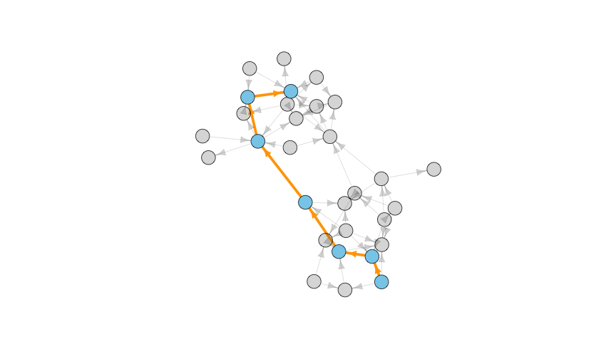
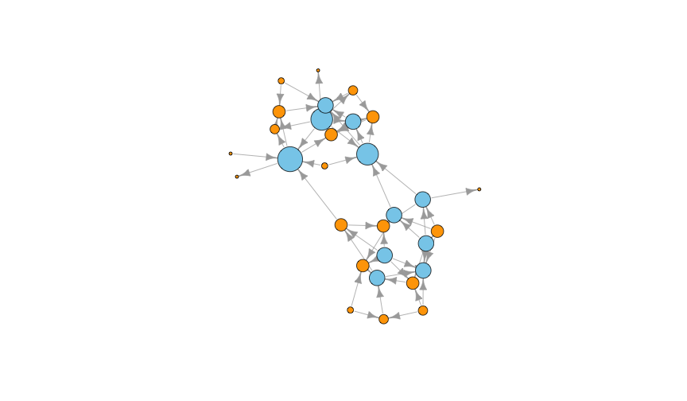
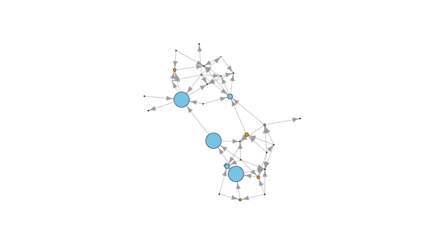
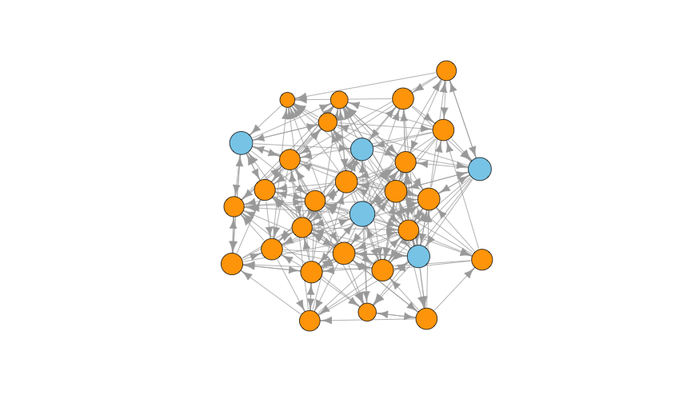

Exploring Graphs
========================================================
author: Benjamin Ortiz Ulloa
date: 
autosize: true
transition: fade


What's a Graph?
========================================================


What's a Graph?
========================================================


What's a Graph?
========================================================


What's a Graph?
============


What's a Graph?
============


What's a Graph?
============


Relationships can have direction
============


Multiple relationships are possible
============


Everything can have attributes
============


Attributes can be visualized
============


Node attributes can also be nodes
======


Connections can be projected
========


These projections enrich our data
==========


Practical Application: Recommendations
======

**<br><h2>35% of what consumers buy on Amazon and 75% of what users watch on Netflix come from product recommendations</h2>**

Content Based Recommendations
========================================================


Content Based Recommendations
========================================================


Content Based Recommendations
========================================================


Content Based Recommendations
========================================================


Content Based Recommendations 
========================================================


Collaborative Filtering 
========================================================


Collaborative Filtering 
========================================================


Collaborative Filtering 
========================================================


Collaborative Filtering 
========================================================


What nodes are important?
=====


Diameter and Shortest Paths
===


Degree
=======



Betweenness
=======


Closeness
=======


Hub Score
=======


Authority Score
=======


PageRank
====


Practical Application: Keyphrases
=========

**<h5>When people think of graphs, they often think about mapping out social media connections. While graphs are indeed useful for mapping out social networks, they have many other practical applications. Data in the real world resemble vertices and edges more than they resemble rows and columns. This allows researchers to intuitively grasp the data modeled and stored within a graph. Graph exploration -- also known as graph traversal -- is traditionally done with a traversal language such as Gremlin or Cypher. The functionality of these traversal languages can be duplicated by combining the igraph and magrittr packages. Traversing a graph in R gives useRs access to a myriad of simple, but powerful algorithms to explore their data sets. This talk will show why data should be explored as a graph as well as show how a graph can be traversed in R. I will do this by going through a survey of different graph traversal techniques and by showing the code patterns necessary for each of those techniques.</h5>**

Proximity as a connection
=====


Text Rank: Benjamin Ortiz Ulloa
=====


TextRank: Miguel Gonzalez-Fierro
=====


TextRank: Amy Stringer
====


TextRank: Snehalata Huzurbazar
======


Creating graphs: Find data
=====

|name                  | height|   mass|hair_color    |skin_color          |eye_color     | birth_year|gender        |homeworld      |species        |
|:---------------------|------:|------:|:-------------|:-------------------|:-------------|----------:|:-------------|:--------------|:--------------|
|Luke Skywalker        |    172|   77.0|blond         |fair                |blue          |       19.0|male          |Tatooine       |Human          |
|C-3PO                 |    167|   75.0|NA            |gold                |yellow        |      112.0|NA            |Tatooine       |Droid          |
|R2-D2                 |     96|   32.0|NA            |white, blue         |red           |       33.0|NA            |Naboo          |Droid          |
|Darth Vader           |    202|  136.0|none          |white               |yellow        |       41.9|male          |Tatooine       |Human          |
|Leia Organa           |    150|   49.0|brown         |light               |brown         |       19.0|female        |Alderaan       |Human          |
|Owen Lars             |    178|  120.0|brown, grey   |light               |blue          |       52.0|male          |Tatooine       |Human          |
|Beru Whitesun lars    |    165|   75.0|brown         |light               |blue          |       47.0|female        |Tatooine       |Human          |
|R5-D4                 |     97|   32.0|NA            |white, red          |red           |         NA|NA            |Tatooine       |Droid          |
|Biggs Darklighter     |    183|   84.0|black         |light               |brown         |       24.0|male          |Tatooine       |Human          |
|Obi-Wan Kenobi        |    182|   77.0|auburn, white |fair                |blue-gray     |       57.0|male          |Stewjon        |Human          |
|Anakin Skywalker      |    188|   84.0|blond         |fair                |blue          |       41.9|male          |Tatooine       |Human          |
|Wilhuff Tarkin        |    180|     NA|auburn, grey  |fair                |blue          |       64.0|male          |Eriadu         |Human          |
|Chewbacca             |    228|  112.0|brown         |unknown             |blue          |      200.0|male          |Kashyyyk       |Wookiee        |
|Han Solo              |    180|   80.0|brown         |fair                |brown         |       29.0|male          |Corellia       |Human          |
|Greedo                |    173|   74.0|NA            |green               |black         |       44.0|male          |Rodia          |Rodian         |
|Jabba Desilijic Tiure |    175| 1358.0|NA            |green-tan, brown    |orange        |      600.0|hermaphrodite |Nal Hutta      |Hutt           |
|Wedge Antilles        |    170|   77.0|brown         |fair                |hazel         |       21.0|male          |Corellia       |Human          |
|Jek Tono Porkins      |    180|  110.0|brown         |fair                |blue          |         NA|male          |Bestine IV     |Human          |
|Yoda                  |     66|   17.0|white         |green               |brown         |      896.0|male          |NA             |Yoda's species |
|Palpatine             |    170|   75.0|grey          |pale                |yellow        |       82.0|male          |Naboo          |Human          |
|Boba Fett             |    183|   78.2|black         |fair                |brown         |       31.5|male          |Kamino         |Human          |
|IG-88                 |    200|  140.0|none          |metal               |red           |       15.0|none          |NA             |Droid          |
|Bossk                 |    190|  113.0|none          |green               |red           |       53.0|male          |Trandosha      |Trandoshan     |
|Lando Calrissian      |    177|   79.0|black         |dark                |brown         |       31.0|male          |Socorro        |Human          |
|Lobot                 |    175|   79.0|none          |light               |blue          |       37.0|male          |Bespin         |Human          |
|Ackbar                |    180|   83.0|none          |brown mottle        |orange        |       41.0|male          |Mon Cala       |Mon Calamari   |
|Mon Mothma            |    150|     NA|auburn        |fair                |blue          |       48.0|female        |Chandrila      |Human          |
|Arvel Crynyd          |     NA|     NA|brown         |fair                |brown         |         NA|male          |NA             |Human          |
|Wicket Systri Warrick |     88|   20.0|brown         |brown               |brown         |        8.0|male          |Endor          |Ewok           |
|Nien Nunb             |    160|   68.0|none          |grey                |black         |         NA|male          |Sullust        |Sullustan      |
|Qui-Gon Jinn          |    193|   89.0|brown         |fair                |blue          |       92.0|male          |NA             |Human          |
|Nute Gunray           |    191|   90.0|none          |mottled green       |red           |         NA|male          |Cato Neimoidia |Neimodian      |
|Finis Valorum         |    170|     NA|blond         |fair                |blue          |       91.0|male          |Coruscant      |Human          |
|Jar Jar Binks         |    196|   66.0|none          |orange              |orange        |       52.0|male          |Naboo          |Gungan         |
|Roos Tarpals          |    224|   82.0|none          |grey                |orange        |         NA|male          |Naboo          |Gungan         |
|Rugor Nass            |    206|     NA|none          |green               |orange        |         NA|male          |Naboo          |Gungan         |
|Ric Olié              |    183|     NA|brown         |fair                |blue          |         NA|male          |Naboo          |NA             |
|Watto                 |    137|     NA|black         |blue, grey          |yellow        |         NA|male          |Toydaria       |Toydarian      |
|Sebulba               |    112|   40.0|none          |grey, red           |orange        |         NA|male          |Malastare      |Dug            |
|Quarsh Panaka         |    183|     NA|black         |dark                |brown         |       62.0|male          |Naboo          |NA             |
|Shmi Skywalker        |    163|     NA|black         |fair                |brown         |       72.0|female        |Tatooine       |Human          |
|Darth Maul            |    175|   80.0|none          |red                 |yellow        |       54.0|male          |Dathomir       |Zabrak         |
|Bib Fortuna           |    180|     NA|none          |pale                |pink          |         NA|male          |Ryloth         |Twi'lek        |
|Ayla Secura           |    178|   55.0|none          |blue                |hazel         |       48.0|female        |Ryloth         |Twi'lek        |
|Dud Bolt              |     94|   45.0|none          |blue, grey          |yellow        |         NA|male          |Vulpter        |Vulptereen     |
|Gasgano               |    122|     NA|none          |white, blue         |black         |         NA|male          |Troiken        |Xexto          |
|Ben Quadinaros        |    163|   65.0|none          |grey, green, yellow |orange        |         NA|male          |Tund           |Toong          |
|Mace Windu            |    188|   84.0|none          |dark                |brown         |       72.0|male          |Haruun Kal     |Human          |
|Ki-Adi-Mundi          |    198|   82.0|white         |pale                |yellow        |       92.0|male          |Cerea          |Cerean         |
|Kit Fisto             |    196|   87.0|none          |green               |black         |         NA|male          |Glee Anselm    |Nautolan       |
|Eeth Koth             |    171|     NA|black         |brown               |brown         |         NA|male          |Iridonia       |Zabrak         |
|Adi Gallia            |    184|   50.0|none          |dark                |blue          |         NA|female        |Coruscant      |Tholothian     |
|Saesee Tiin           |    188|     NA|none          |pale                |orange        |         NA|male          |Iktotch        |Iktotchi       |
|Yarael Poof           |    264|     NA|none          |white               |yellow        |         NA|male          |Quermia        |Quermian       |
|Plo Koon              |    188|   80.0|none          |orange              |black         |       22.0|male          |Dorin          |Kel Dor        |
|Mas Amedda            |    196|     NA|none          |blue                |blue          |         NA|male          |Champala       |Chagrian       |
|Gregar Typho          |    185|   85.0|black         |dark                |brown         |         NA|male          |Naboo          |Human          |
|Cordé                 |    157|     NA|brown         |light               |brown         |         NA|female        |Naboo          |Human          |
|Cliegg Lars           |    183|     NA|brown         |fair                |blue          |       82.0|male          |Tatooine       |Human          |
|Poggle the Lesser     |    183|   80.0|none          |green               |yellow        |         NA|male          |Geonosis       |Geonosian      |
|Luminara Unduli       |    170|   56.2|black         |yellow              |blue          |       58.0|female        |Mirial         |Mirialan       |
|Barriss Offee         |    166|   50.0|black         |yellow              |blue          |       40.0|female        |Mirial         |Mirialan       |
|Dormé                 |    165|     NA|brown         |light               |brown         |         NA|female        |Naboo          |Human          |
|Dooku                 |    193|   80.0|white         |fair                |brown         |      102.0|male          |Serenno        |Human          |
|Bail Prestor Organa   |    191|     NA|black         |tan                 |brown         |       67.0|male          |Alderaan       |Human          |
|Jango Fett            |    183|   79.0|black         |tan                 |brown         |       66.0|male          |Concord Dawn   |Human          |
|Zam Wesell            |    168|   55.0|blonde        |fair, green, yellow |yellow        |         NA|female        |Zolan          |Clawdite       |
|Dexter Jettster       |    198|  102.0|none          |brown               |yellow        |         NA|male          |Ojom           |Besalisk       |
|Lama Su               |    229|   88.0|none          |grey                |black         |         NA|male          |Kamino         |Kaminoan       |
|Taun We               |    213|     NA|none          |grey                |black         |         NA|female        |Kamino         |Kaminoan       |
|Jocasta Nu            |    167|     NA|white         |fair                |blue          |         NA|female        |Coruscant      |Human          |
|Ratts Tyerell         |     79|   15.0|none          |grey, blue          |unknown       |         NA|male          |Aleen Minor    |Aleena         |
|R4-P17                |     96|     NA|none          |silver, red         |red, blue     |         NA|female        |NA             |NA             |
|Wat Tambor            |    193|   48.0|none          |green, grey         |unknown       |         NA|male          |Skako          |Skakoan        |
|San Hill              |    191|     NA|none          |grey                |gold          |         NA|male          |Muunilinst     |Muun           |
|Shaak Ti              |    178|   57.0|none          |red, blue, white    |black         |         NA|female        |Shili          |Togruta        |
|Grievous              |    216|  159.0|none          |brown, white        |green, yellow |         NA|male          |Kalee          |Kaleesh        |
|Tarfful               |    234|  136.0|brown         |brown               |blue          |         NA|male          |Kashyyyk       |Wookiee        |
|Raymus Antilles       |    188|   79.0|brown         |light               |brown         |         NA|male          |Alderaan       |Human          |
|Sly Moore             |    178|   48.0|none          |pale                |white         |         NA|female        |Umbara         |NA             |
|Tion Medon            |    206|   80.0|none          |grey                |black         |         NA|male          |Utapau         |Pau'an         |
|Finn                  |     NA|     NA|black         |dark                |dark          |         NA|male          |NA             |Human          |
|Rey                   |     NA|     NA|brown         |light               |hazel         |         NA|female        |NA             |Human          |
|Poe Dameron           |     NA|     NA|brown         |light               |brown         |         NA|male          |NA             |Human          |
|BB8                   |     NA|     NA|none          |none                |black         |         NA|none          |NA             |Droid          |
|Captain Phasma        |     NA|     NA|unknown       |unknown             |unknown       |         NA|female        |NA             |NA             |
|Padmé Amidala         |    165|   45.0|brown         |light               |brown         |       46.0|female        |Naboo          |Human          |

Creating graphs: Edge List
=======

|from                  |to                   |type           |
|:---------------------|:--------------------|:--------------|
|Bossk                 |113                  |has mass       |
|Quarsh Panaka         |Naboo                |has homeworld  |
|Ackbar                |Mon Cala             |has homeworld  |
|Padmé Amidala         |Naboo star skiff     |has starships  |
|Nute Gunray           |Attack of the Clones |has films      |
|Yarael Poof           |Quermia              |has homeworld  |
|Biggs Darklighter     |183                  |has height     |
|R4-P17                |none                 |has hair_color |
|Shaak Ti              |Shili                |has homeworld  |
|IG-88                 |none                 |has gender     |
|Wedge Antilles        |Human                |has species    |
|Mace Windu            |male                 |has gender     |
|Wicket Systri Warrick |brown                |has skin_color |
|Poggle the Lesser     |Revenge of the Sith  |has films      |
|Ric Olié              |fair                 |has skin_color |

Creating graphs: Optional Node List
====

|name         |type            |
|:------------|:---------------|
|Darth Maul   |character       |
|31.5         |not a character |
|29           |not a character |
|896          |not a character |
|Vulptereen   |not a character |
|41           |not a character |
|Darth Vader  |character       |
|Arvel Crynyd |character       |
|22           |not a character |
|fair         |not a character |
|Naboo        |not a character |
|brown mottle |not a character |
|188          |not a character |
|Kaminoan     |not a character |
|173          |not a character |

Creating graphs: igraph
=====

```r
g <- graph_from_data_frame(d = starwarsEL, 
                           directed = F, 
                           vertices = starwarsNL)
g
```

```
IGRAPH 9e876ec UN-B 357 899 -- 
+ attr: name (v/c), type (v/c), type (e/c)
+ edges from 9e876ec (vertex names):
 [1] Luke Skywalker       --172 C-3PO                --167
 [3] R2-D2                --96  Darth Vader          --202
 [5] Leia Organa          --150 Owen Lars            --178
 [7] Beru Whitesun lars   --165 R5-D4                --97 
 [9] Biggs Darklighter    --183 Obi-Wan Kenobi       --182
[11] Anakin Skywalker     --188 Wilhuff Tarkin       --180
[13] Chewbacca            --228 Han Solo             --180
[15] Greedo               --173 Jabba Desilijic Tiure--175
+ ... omitted several edges
```

Searching Vertices: It's just a vector
======

```r
V(g)[name == "Luke Skywalker"]
```

```
+ 1/357 vertex, named, from 9e876ec:
[1] Luke Skywalker
```

```r
V(g)[type == 'character']
```

```
+ 87/357 vertices, named, from 9e876ec:
 [1] Luke Skywalker        C-3PO                 R2-D2                
 [4] Darth Vader           Leia Organa           Owen Lars            
 [7] Beru Whitesun lars    R5-D4                 Biggs Darklighter    
[10] Obi-Wan Kenobi        Anakin Skywalker      Wilhuff Tarkin       
[13] Chewbacca             Han Solo              Greedo               
[16] Jabba Desilijic Tiure Wedge Antilles        Jek Tono Porkins     
[19] Yoda                  Palpatine             Boba Fett            
[22] IG-88                 Bossk                 Lando Calrissian     
[25] Lobot                 Ackbar                Mon Mothma           
[28] Wicket Systri Warrick Nien Nunb             Qui-Gon Jinn         
+ ... omitted several vertices
```


Searching Edges: It's just a vector
=====

```r
E(g)[type == 'has starships']
```

```
+ 31/899 edges from 9e876ec (vertex names):
 [1] Luke Skywalker   --X-wing                  
 [2] Luke Skywalker   --Imperial shuttle        
 [3] Darth Vader      --TIE Advanced x1         
 [4] Biggs Darklighter--X-wing                  
 [5] Obi-Wan Kenobi   --Jedi starfighter        
 [6] Obi-Wan Kenobi   --Trade Federation cruiser
 [7] Obi-Wan Kenobi   --Naboo star skiff        
 [8] Obi-Wan Kenobi   --Jedi Interceptor        
 [9] Obi-Wan Kenobi   --Belbullab-22 starfighter
[10] Anakin Skywalker --Trade Federation cruiser
+ ... omitted several edges
```

```r
E(g)['Luke Skywalker' %--% V(g)]
```

```
+ 18/899 edges from 9e876ec (vertex names):
 [1] Luke Skywalker--172                    
 [2] Luke Skywalker--77                     
 [3] Luke Skywalker--blond                  
 [4] Luke Skywalker--fair                   
 [5] Luke Skywalker--blue                   
 [6] Luke Skywalker--19                     
 [7] Luke Skywalker--male                   
 [8] Luke Skywalker--Tatooine               
 [9] Luke Skywalker--Human                  
[10] Luke Skywalker--Revenge of the Sith    
+ ... omitted several edges
```
