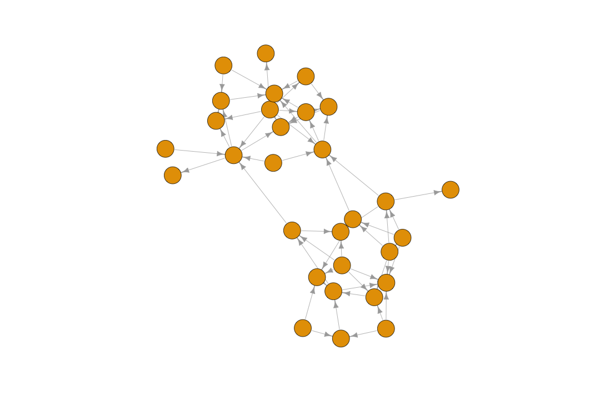
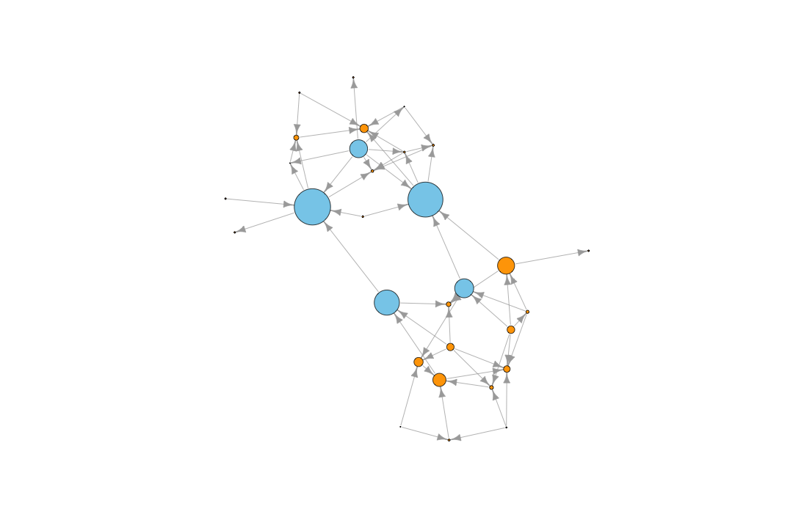
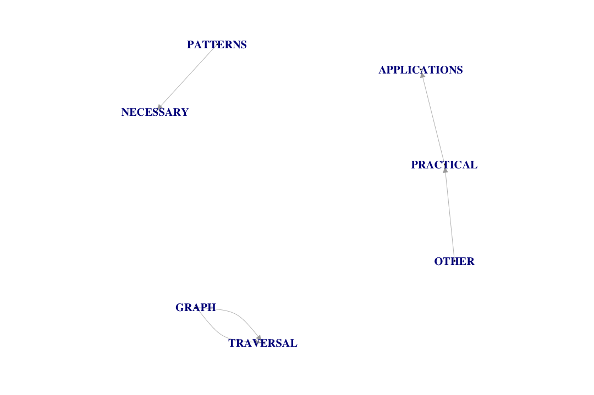
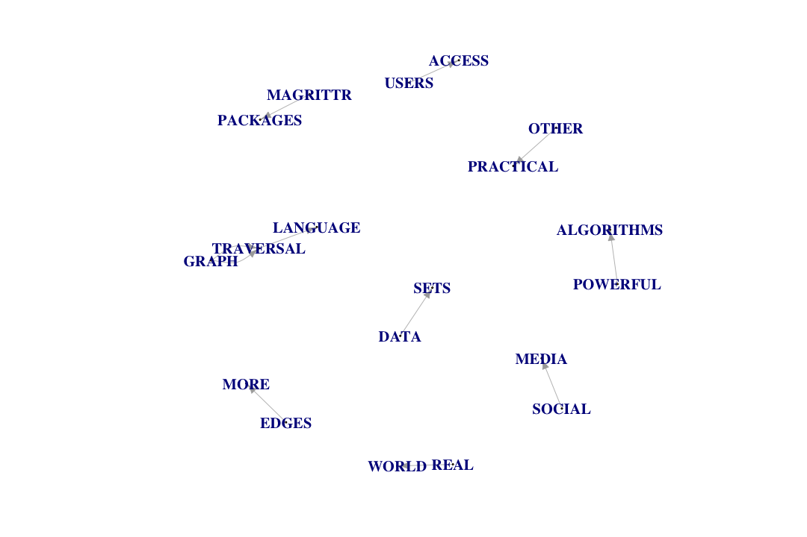
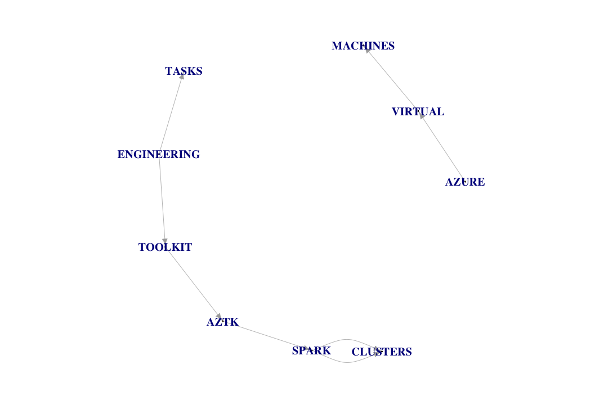
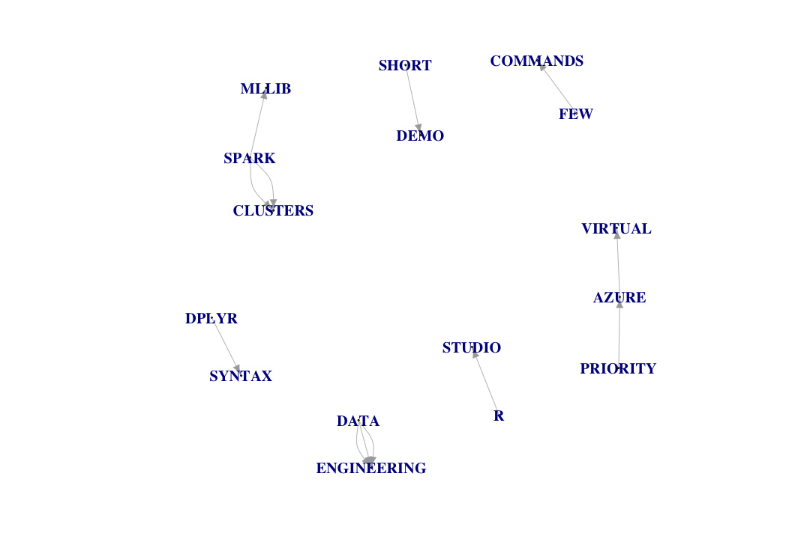
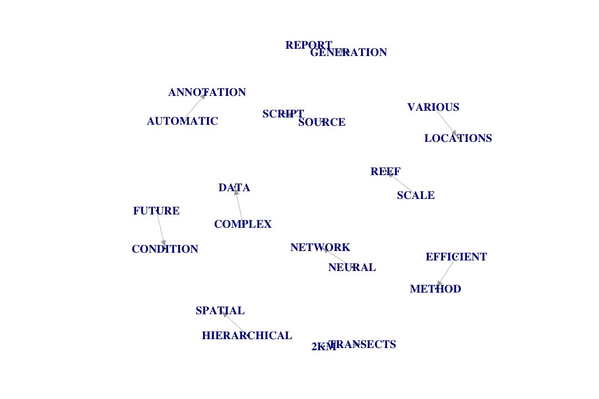
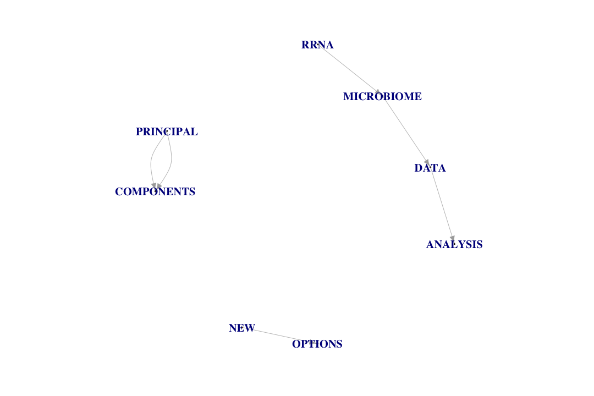
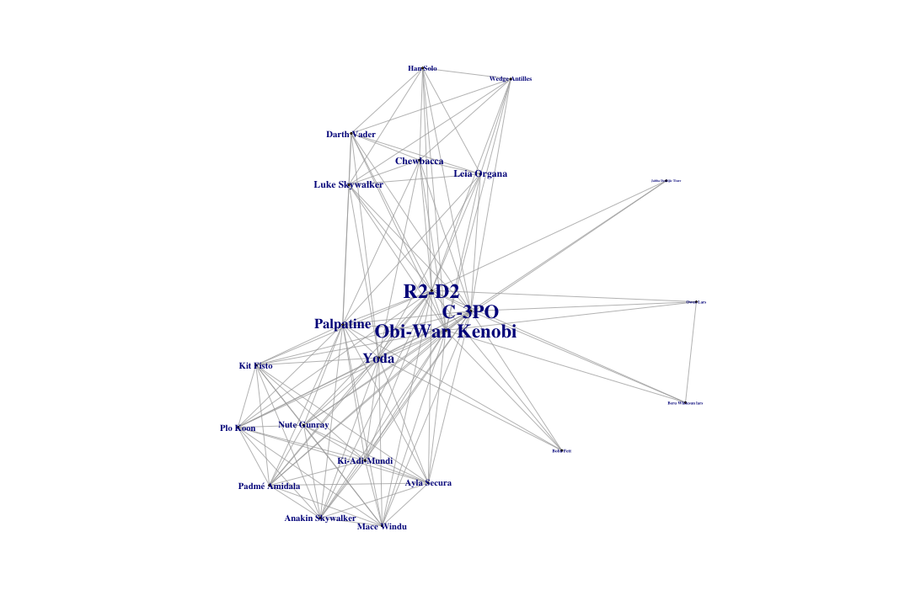

Exploring Graphs with igraph
========================================================
author: Benjamin Ortiz Ulloa
date: 
autosize: true
transition: fade

<style>
.small-code pre code {
  font-size: 1em;
}

.grey-out {
  color: 'lightgrey'
}
</style>

Exploring Graphs with igraph
=====
<ol>
  <li>What's a Graph?</li>
  <li>Practical Applications: Recommendations</li>
  <li>Measuring Impact/Importance</li>
  <li>Practical Applications: Keyphrases</li>
  <li><b>Code:</b> Creating a Graph</li>
  <li><b>Code:</b> Exploring a Graph</li>
</ol>


Exploring Graphs with igraph
=====
<ol>
  <li>What's a Graph?</li>
  <li style='color: lightgrey'>Practical Applications: Recommendations</li>
  <li style='color: lightgrey'>Measuring Impact/Importance</li>
  <li style='color: lightgrey'>Practical Applications: Keyphrases</li>
  <li style='color: lightgrey'><b>Code:</b> Creating a Graph</li>
  <li style='color: lightgrey'><b>Code:</b> Exploring a Graph</li>
</ol>

What's a Graph?
========================================================


What's a Graph?
========================================================


What's a Graph?
========================================================


What's a Graph?
============


What's a Graph?
============


What's a Graph?
============


Relationships can have direction
============


Multiple relationships are possible
============


Everything can have attributes
============


Attributes can be visualized
============


Edge attributes provide context
====


Friend of my friend... 
====


or enemy of my enemy? 
====


What happens if relationships change?
======


What happens if relationships change?
======


Node attributes can also be nodes
======


Connections can be projected
========


These projections enrich our data
==========


Exploring Graphs with igraph
=====
<ol>
  <li style='color: lightgrey'>What's a Graph?</li>
  <li>Practical Applications: Recommendations</li>
  <li style='color: lightgrey'>Measuring Impact/Importance</li>
  <li style='color: lightgrey'>Practical Applications: Keyphrases</li>
  <li style='color: lightgrey'><b>Code:</b> Creating a Graph</li>
  <li style='color: lightgrey'><b>Code:</b> Exploring a Graph</li>
</ol>

Practical Application: Recommendations
======

**<br><h2>35% of what consumers buy on Amazon and 75% of what users watch on Netflix come from product recommendations</h2>**

Content Based Recommendations
========================================================


Content Based Recommendations
========================================================


Content Based Recommendations
========================================================


Content Based Recommendations
========================================================


Content Based Recommendations 
========================================================


Collaborative Filtering 
========================================================


Collaborative Filtering 
========================================================


Collaborative Filtering 
========================================================


Collaborative Filtering 
========================================================


Exploring Graphs with igraph
=====
<ol>
  <li style='color: lightgrey'>What's a Graph?</li>
  <li style='color: lightgrey'>Practical Applications: Recommendations</li>
  <li>Measuring Impact/Importance</li>
  <li style='color: lightgrey'>Practical Applications: Keyphrases</li>
  <li style='color: lightgrey'><b>Code:</b> Creating a Graph</li>
  <li style='color: lightgrey'><b>Code:</b> Exploring a Graph</li>
</ol>

What nodes are important?
=====



get_diameter() and shortest_paths()
===


betweenness(g, directed = T)
=======


betweenness(g, directed = F)
=======


degree(g, mode = 'in')
=======


degree(g, mode = 'out')
=========


degree(g, mode = 'all')
===========


closeness(g, mode = 'in')
=======


closeness(g, mode = 'out')
=======


closeness(g, mode = 'all')
=======


hub_score()
=======


authority_score()
=======


page_rank(g, directed = T)
====


page_rank(g, directed = F)
====


Exploring Graphs with igraph
=====
<ol>
  <li style='color: lightgrey'>What's a Graph?</li>
  <li style='color: lightgrey'>Practical Applications: Recommendations</li>
  <li style='color: lightgrey'>Measuring Impact/Importance</li>
  <li>Practical Applications: Keyphrases</li>
  <li style='color: lightgrey'><b>Code:</b> Creating a Graph</li>
  <li style='color: lightgrey'><b>Code:</b> Exploring a Graph</li>
</ol>

Practical Application: Keyphrases
=========

**<h5>When people think of graphs, they often think about mapping out social media connections. While graphs are indeed useful for mapping out social networks, they have many other practical applications. Data in the real world resemble vertices and edges more than they resemble rows and columns. This allows researchers to intuitively grasp the data modeled and stored within a graph. Graph exploration -- also known as graph traversal -- is traditionally done with a traversal language such as Gremlin or Cypher. The functionality of these traversal languages can be duplicated by combining the igraph and magrittr packages. Traversing a graph in R gives useRs access to a myriad of simple, but powerful algorithms to explore their data sets. This talk will show why data should be explored as a graph as well as show how a graph can be traversed in R. I will do this by going through a survey of different graph traversal techniques and by showing the code patterns necessary for each of those techniques.</h5>**


TextRank Algorithm
========
<ol>
  <li>Create a text graph</li>
  <li>Keep only words that are nouns and adjectives</li>
  <li>Run the PageRank algorithm</li>
  <li>Keep only the top 1/3 PageRanked vertices</li>
  <li>The remaining connections represent phrases</li>
  <ul><li>Make sure the words actually appear in sequential order before committing to a phrase</li></ul>
</ol>

Proximity as a connection
=====


D TextRank: Benjamin Ortiz Ulloa
=====


UD TextRank: Benjamin Ortiz Ulloa
====


D TextRank: Miguel Gonzalez-Fierro
=====


UD TextRank: Miguel Gonzalez-Fierro
=====


D TextRank: Amy Stringer
====


UD TextRank: Amy Stringer
====


D TextRank: Snehalata Huzurbazar
======


UD TextRank: Snehalata Huzurbazar
======

Exploring Graphs with igraph
=====
<ol>
  <li style='color: lightgrey'>What's a Graph?</li>
  <li style='color: lightgrey'>Practical Applications: Recommendations</li>
  <li style='color: lightgrey'>Measuring Impact/Importance</li>
  <li style='color: lightgrey'>Practical Applications: Keyphrases</li>
  <li><b>Code:</b> Creating a Graph</li>
  <li style='color: lightgrey'><b>Code:</b> Exploring a Graph</li>
</ol>

Creating graphs: Find data
=====

|name                  | height|   mass|hair_color    |skin_color          |eye_color     | birth_year|gender        |homeworld      |species        |
|:---------------------|------:|------:|:-------------|:-------------------|:-------------|----------:|:-------------|:--------------|:--------------|
|Luke Skywalker        |    172|   77.0|blond         |fair                |blue          |       19.0|male          |Tatooine       |Human          |
|C-3PO                 |    167|   75.0|NA            |gold                |yellow        |      112.0|NA            |Tatooine       |Droid          |
|R2-D2                 |     96|   32.0|NA            |white, blue         |red           |       33.0|NA            |Naboo          |Droid          |
|Darth Vader           |    202|  136.0|none          |white               |yellow        |       41.9|male          |Tatooine       |Human          |
|Leia Organa           |    150|   49.0|brown         |light               |brown         |       19.0|female        |Alderaan       |Human          |
|Owen Lars             |    178|  120.0|brown, grey   |light               |blue          |       52.0|male          |Tatooine       |Human          |
|Beru Whitesun lars    |    165|   75.0|brown         |light               |blue          |       47.0|female        |Tatooine       |Human          |
|R5-D4                 |     97|   32.0|NA            |white, red          |red           |         NA|NA            |Tatooine       |Droid          |
|Biggs Darklighter     |    183|   84.0|black         |light               |brown         |       24.0|male          |Tatooine       |Human          |
|Obi-Wan Kenobi        |    182|   77.0|auburn, white |fair                |blue-gray     |       57.0|male          |Stewjon        |Human          |
|Anakin Skywalker      |    188|   84.0|blond         |fair                |blue          |       41.9|male          |Tatooine       |Human          |
|Wilhuff Tarkin        |    180|     NA|auburn, grey  |fair                |blue          |       64.0|male          |Eriadu         |Human          |
|Chewbacca             |    228|  112.0|brown         |unknown             |blue          |      200.0|male          |Kashyyyk       |Wookiee        |
|Han Solo              |    180|   80.0|brown         |fair                |brown         |       29.0|male          |Corellia       |Human          |
|Greedo                |    173|   74.0|NA            |green               |black         |       44.0|male          |Rodia          |Rodian         |
|Jabba Desilijic Tiure |    175| 1358.0|NA            |green-tan, brown    |orange        |      600.0|hermaphrodite |Nal Hutta      |Hutt           |
|Wedge Antilles        |    170|   77.0|brown         |fair                |hazel         |       21.0|male          |Corellia       |Human          |
|Jek Tono Porkins      |    180|  110.0|brown         |fair                |blue          |         NA|male          |Bestine IV     |Human          |
|Yoda                  |     66|   17.0|white         |green               |brown         |      896.0|male          |NA             |Yoda's species |
|Palpatine             |    170|   75.0|grey          |pale                |yellow        |       82.0|male          |Naboo          |Human          |
|Boba Fett             |    183|   78.2|black         |fair                |brown         |       31.5|male          |Kamino         |Human          |
|IG-88                 |    200|  140.0|none          |metal               |red           |       15.0|none          |NA             |Droid          |
|Bossk                 |    190|  113.0|none          |green               |red           |       53.0|male          |Trandosha      |Trandoshan     |
|Lando Calrissian      |    177|   79.0|black         |dark                |brown         |       31.0|male          |Socorro        |Human          |
|Lobot                 |    175|   79.0|none          |light               |blue          |       37.0|male          |Bespin         |Human          |
|Ackbar                |    180|   83.0|none          |brown mottle        |orange        |       41.0|male          |Mon Cala       |Mon Calamari   |
|Mon Mothma            |    150|     NA|auburn        |fair                |blue          |       48.0|female        |Chandrila      |Human          |
|Arvel Crynyd          |     NA|     NA|brown         |fair                |brown         |         NA|male          |NA             |Human          |
|Wicket Systri Warrick |     88|   20.0|brown         |brown               |brown         |        8.0|male          |Endor          |Ewok           |
|Nien Nunb             |    160|   68.0|none          |grey                |black         |         NA|male          |Sullust        |Sullustan      |
|Qui-Gon Jinn          |    193|   89.0|brown         |fair                |blue          |       92.0|male          |NA             |Human          |
|Nute Gunray           |    191|   90.0|none          |mottled green       |red           |         NA|male          |Cato Neimoidia |Neimodian      |
|Finis Valorum         |    170|     NA|blond         |fair                |blue          |       91.0|male          |Coruscant      |Human          |
|Jar Jar Binks         |    196|   66.0|none          |orange              |orange        |       52.0|male          |Naboo          |Gungan         |
|Roos Tarpals          |    224|   82.0|none          |grey                |orange        |         NA|male          |Naboo          |Gungan         |
|Rugor Nass            |    206|     NA|none          |green               |orange        |         NA|male          |Naboo          |Gungan         |
|Ric Olié              |    183|     NA|brown         |fair                |blue          |         NA|male          |Naboo          |NA             |
|Watto                 |    137|     NA|black         |blue, grey          |yellow        |         NA|male          |Toydaria       |Toydarian      |
|Sebulba               |    112|   40.0|none          |grey, red           |orange        |         NA|male          |Malastare      |Dug            |
|Quarsh Panaka         |    183|     NA|black         |dark                |brown         |       62.0|male          |Naboo          |NA             |
|Shmi Skywalker        |    163|     NA|black         |fair                |brown         |       72.0|female        |Tatooine       |Human          |
|Darth Maul            |    175|   80.0|none          |red                 |yellow        |       54.0|male          |Dathomir       |Zabrak         |
|Bib Fortuna           |    180|     NA|none          |pale                |pink          |         NA|male          |Ryloth         |Twi'lek        |
|Ayla Secura           |    178|   55.0|none          |blue                |hazel         |       48.0|female        |Ryloth         |Twi'lek        |
|Dud Bolt              |     94|   45.0|none          |blue, grey          |yellow        |         NA|male          |Vulpter        |Vulptereen     |
|Gasgano               |    122|     NA|none          |white, blue         |black         |         NA|male          |Troiken        |Xexto          |
|Ben Quadinaros        |    163|   65.0|none          |grey, green, yellow |orange        |         NA|male          |Tund           |Toong          |
|Mace Windu            |    188|   84.0|none          |dark                |brown         |       72.0|male          |Haruun Kal     |Human          |
|Ki-Adi-Mundi          |    198|   82.0|white         |pale                |yellow        |       92.0|male          |Cerea          |Cerean         |
|Kit Fisto             |    196|   87.0|none          |green               |black         |         NA|male          |Glee Anselm    |Nautolan       |
|Eeth Koth             |    171|     NA|black         |brown               |brown         |         NA|male          |Iridonia       |Zabrak         |
|Adi Gallia            |    184|   50.0|none          |dark                |blue          |         NA|female        |Coruscant      |Tholothian     |
|Saesee Tiin           |    188|     NA|none          |pale                |orange        |         NA|male          |Iktotch        |Iktotchi       |
|Yarael Poof           |    264|     NA|none          |white               |yellow        |         NA|male          |Quermia        |Quermian       |
|Plo Koon              |    188|   80.0|none          |orange              |black         |       22.0|male          |Dorin          |Kel Dor        |
|Mas Amedda            |    196|     NA|none          |blue                |blue          |         NA|male          |Champala       |Chagrian       |
|Gregar Typho          |    185|   85.0|black         |dark                |brown         |         NA|male          |Naboo          |Human          |
|Cordé                 |    157|     NA|brown         |light               |brown         |         NA|female        |Naboo          |Human          |
|Cliegg Lars           |    183|     NA|brown         |fair                |blue          |       82.0|male          |Tatooine       |Human          |
|Poggle the Lesser     |    183|   80.0|none          |green               |yellow        |         NA|male          |Geonosis       |Geonosian      |
|Luminara Unduli       |    170|   56.2|black         |yellow              |blue          |       58.0|female        |Mirial         |Mirialan       |
|Barriss Offee         |    166|   50.0|black         |yellow              |blue          |       40.0|female        |Mirial         |Mirialan       |
|Dormé                 |    165|     NA|brown         |light               |brown         |         NA|female        |Naboo          |Human          |
|Dooku                 |    193|   80.0|white         |fair                |brown         |      102.0|male          |Serenno        |Human          |
|Bail Prestor Organa   |    191|     NA|black         |tan                 |brown         |       67.0|male          |Alderaan       |Human          |
|Jango Fett            |    183|   79.0|black         |tan                 |brown         |       66.0|male          |Concord Dawn   |Human          |
|Zam Wesell            |    168|   55.0|blonde        |fair, green, yellow |yellow        |         NA|female        |Zolan          |Clawdite       |
|Dexter Jettster       |    198|  102.0|none          |brown               |yellow        |         NA|male          |Ojom           |Besalisk       |
|Lama Su               |    229|   88.0|none          |grey                |black         |         NA|male          |Kamino         |Kaminoan       |
|Taun We               |    213|     NA|none          |grey                |black         |         NA|female        |Kamino         |Kaminoan       |
|Jocasta Nu            |    167|     NA|white         |fair                |blue          |         NA|female        |Coruscant      |Human          |
|Ratts Tyerell         |     79|   15.0|none          |grey, blue          |unknown       |         NA|male          |Aleen Minor    |Aleena         |
|R4-P17                |     96|     NA|none          |silver, red         |red, blue     |         NA|female        |NA             |NA             |
|Wat Tambor            |    193|   48.0|none          |green, grey         |unknown       |         NA|male          |Skako          |Skakoan        |
|San Hill              |    191|     NA|none          |grey                |gold          |         NA|male          |Muunilinst     |Muun           |
|Shaak Ti              |    178|   57.0|none          |red, blue, white    |black         |         NA|female        |Shili          |Togruta        |
|Grievous              |    216|  159.0|none          |brown, white        |green, yellow |         NA|male          |Kalee          |Kaleesh        |
|Tarfful               |    234|  136.0|brown         |brown               |blue          |         NA|male          |Kashyyyk       |Wookiee        |
|Raymus Antilles       |    188|   79.0|brown         |light               |brown         |         NA|male          |Alderaan       |Human          |
|Sly Moore             |    178|   48.0|none          |pale                |white         |         NA|female        |Umbara         |NA             |
|Tion Medon            |    206|   80.0|none          |grey                |black         |         NA|male          |Utapau         |Pau'an         |
|Finn                  |     NA|     NA|black         |dark                |dark          |         NA|male          |NA             |Human          |
|Rey                   |     NA|     NA|brown         |light               |hazel         |         NA|female        |NA             |Human          |
|Poe Dameron           |     NA|     NA|brown         |light               |brown         |         NA|male          |NA             |Human          |
|BB8                   |     NA|     NA|none          |none                |black         |         NA|none          |NA             |Droid          |
|Captain Phasma        |     NA|     NA|unknown       |unknown             |unknown       |         NA|female        |NA             |NA             |
|Padmé Amidala         |    165|   45.0|brown         |light               |brown         |       46.0|female        |Naboo          |Human          |

Creating graphs: Edge List
=======

|from                  |to                   |type           |
|:---------------------|:--------------------|:--------------|
|Bossk                 |113                  |has mass       |
|Quarsh Panaka         |Naboo                |has homeworld  |
|Ackbar                |Mon Cala             |has homeworld  |
|Padmé Amidala         |Naboo star skiff     |has starships  |
|Nute Gunray           |Attack of the Clones |has films      |
|Yarael Poof           |Quermia              |has homeworld  |
|Biggs Darklighter     |183                  |has height     |
|R4-P17                |none                 |has hair_color |
|Shaak Ti              |Shili                |has homeworld  |
|IG-88                 |none                 |has gender     |
|Wedge Antilles        |Human                |has species    |
|Mace Windu            |male                 |has gender     |
|Wicket Systri Warrick |brown                |has skin_color |
|Poggle the Lesser     |Revenge of the Sith  |has films      |
|Ric Olié              |fair                 |has skin_color |

Creating graphs: Optional Node List
====

|name         |type            |
|:------------|:---------------|
|Darth Maul   |a character     |
|31.5         |not a character |
|29           |not a character |
|896          |not a character |
|Vulptereen   |not a character |
|41           |not a character |
|Darth Vader  |a character     |
|Arvel Crynyd |a character     |
|22           |not a character |
|fair         |not a character |
|Naboo        |not a character |
|brown mottle |not a character |
|188          |not a character |
|Kaminoan     |not a character |
|173          |not a character |

Creating graphs: igraph
=====
class:small-code

```r
g <- graph_from_data_frame(d = starwarsEL, 
                           directed = T, 
                           vertices = starwarsNL)
g
```

```
IGRAPH 0e3fcc3 DN-B 357 899 -- 
+ attr: name (v/c), type (v/c), type (e/c)
+ edges from 0e3fcc3 (vertex names):
 [1] Luke Skywalker       ->172 C-3PO                ->167
 [3] R2-D2                ->96  Darth Vader          ->202
 [5] Leia Organa          ->150 Owen Lars            ->178
 [7] Beru Whitesun lars   ->165 R5-D4                ->97 
 [9] Biggs Darklighter    ->183 Obi-Wan Kenobi       ->182
[11] Anakin Skywalker     ->188 Wilhuff Tarkin       ->180
[13] Chewbacca            ->228 Han Solo             ->180
[15] Greedo               ->173 Jabba Desilijic Tiure->175
+ ... omitted several edges
```

Exploring Graphs with igraph
=====
<ol>
  <li style='color: lightgrey'>What's a Graph?</li>
  <li style='color: lightgrey'>Practical Applications: Recommendations</li>
  <li style='color: lightgrey'>Measuring Impact/Importance</li>
  <li style='color: lightgrey'>Practical Applications: Keyphrases</li>
  <li style='color: lightgrey'><b>Code:</b> Creating a Graph</li>
  <li><b>Code:</b> Exploring a Graph</li>
</ol>


Searching Vertices: V(g) is just a vector
======
class:small-code

```r
V(g)[name == "Luke Skywalker"]
```

```
+ 1/357 vertex, named, from 0e3fcc3:
[1] Luke Skywalker
```

```r
V(g)[type == 'a character']
```

```
+ 87/357 vertices, named, from 0e3fcc3:
 [1] Luke Skywalker        C-3PO                 R2-D2                
 [4] Darth Vader           Leia Organa           Owen Lars            
 [7] Beru Whitesun lars    R5-D4                 Biggs Darklighter    
[10] Obi-Wan Kenobi        Anakin Skywalker      Wilhuff Tarkin       
[13] Chewbacca             Han Solo              Greedo               
[16] Jabba Desilijic Tiure Wedge Antilles        Jek Tono Porkins     
[19] Yoda                  Palpatine             Boba Fett            
[22] IG-88                 Bossk                 Lando Calrissian     
[25] Lobot                 Ackbar                Mon Mothma           
[28] Wicket Systri Warrick Nien Nunb             Qui-Gon Jinn         
+ ... omitted several vertices
```


Searching Edges: E(g) is just a vector
=====
class:small-code

```r
E(g)[type == 'has films']
```

```
+ 173/899 edges from 0e3fcc3 (vertex names):
 [1] Luke Skywalker->Revenge of the Sith    
 [2] Luke Skywalker->Return of the Jedi     
 [3] Luke Skywalker->The Empire Strikes Back
 [4] Luke Skywalker->A New Hope             
 [5] Luke Skywalker->The Force Awakens      
 [6] C-3PO         ->Attack of the Clones   
 [7] C-3PO         ->The Phantom Menace     
 [8] C-3PO         ->Revenge of the Sith    
 [9] C-3PO         ->Return of the Jedi     
[10] C-3PO         ->The Empire Strikes Back
+ ... omitted several edges
```

```r
E(g)['Luke Skywalker' %--% V(g)]
```

```
+ 18/899 edges from 0e3fcc3 (vertex names):
 [1] Luke Skywalker->172                    
 [2] Luke Skywalker->77                     
 [3] Luke Skywalker->blond                  
 [4] Luke Skywalker->fair                   
 [5] Luke Skywalker->blue                   
 [6] Luke Skywalker->19                     
 [7] Luke Skywalker->male                   
 [8] Luke Skywalker->Tatooine               
 [9] Luke Skywalker->Human                  
[10] Luke Skywalker->Revenge of the Sith    
+ ... omitted several edges
```

Filter Graphs: - and !
======
class:small-code

```r
#Get rid of all edges NOT connected to LUKE SKYWALKER
g - E(g)[!'Luke Skywalker' %--% V(g)]
```

```
IGRAPH 4ec0480 DN-B 357 18 -- 
+ attr: name (v/c), type (v/c), type (e/c)
+ edges from 4ec0480 (vertex names):
 [1] Luke Skywalker->172                    
 [2] Luke Skywalker->77                     
 [3] Luke Skywalker->blond                  
 [4] Luke Skywalker->fair                   
 [5] Luke Skywalker->blue                   
 [6] Luke Skywalker->19                     
 [7] Luke Skywalker->male                   
 [8] Luke Skywalker->Tatooine               
+ ... omitted several edges
```

Chain Filters: %>%, {}, and .
====
class:small-code

```r
g %>%
  #get rid of all edges that DON'T have the type 'has films'
  {. - E(.)[type != 'has films']} %>%
  #get rid of all edges that are NOT connected FROM a SKYWALKER
  {. - E(.)[V(.)[!str_detect(name, 'Skywalker')] %->% V(.)]} %>%
  #get rid of all vertices that are NOT connected to other nodes
  #getting rid of the edges does not get rid of the nodes
  {. - V(.)[degree(.) == 0]}
```

```
IGRAPH d43f8f0 DN-B 10 10 -- 
+ attr: name (v/c), type (v/c), type (e/c)
+ edges from d43f8f0 (vertex names):
 [1] Luke Skywalker  ->Revenge of the Sith    
 [2] Luke Skywalker  ->Return of the Jedi     
 [3] Luke Skywalker  ->The Empire Strikes Back
 [4] Luke Skywalker  ->A New Hope             
 [5] Luke Skywalker  ->The Force Awakens      
 [6] Anakin Skywalker->Attack of the Clones   
 [7] Anakin Skywalker->The Phantom Menace     
 [8] Anakin Skywalker->Revenge of the Sith    
+ ... omitted several edges
```

Projections
=====
class:small-code

```r
movieCharProj <- g %>%
  {. - E(.)[type != 'has films']} %>%
  {. - V(.)[degree(.) == 0]} %>%
  #type has to be a boolean for projections to work
  {
    V(.)$type <- V(.)$type == 'a character'
    .
  } %>%
  bipartite_projection()

movieCharProj
```

```
$proj1
IGRAPH 688640c UNW- 7 21 -- 
+ attr: name (v/c), weight (e/n)
+ edges from 688640c (vertex names):
 [1] Revenge of the Sith--Return of the Jedi     
 [2] Revenge of the Sith--The Empire Strikes Back
 [3] Revenge of the Sith--A New Hope             
 [4] Revenge of the Sith--The Force Awakens      
 [5] Revenge of the Sith--Attack of the Clones   
 [6] Revenge of the Sith--The Phantom Menace     
 [7] Return of the Jedi --The Empire Strikes Back
 [8] Return of the Jedi --A New Hope             
+ ... omitted several edges

$proj2
IGRAPH 6567829 UNW- 87 1793 -- 
+ attr: name (v/c), weight (e/n)
+ edges from 6567829 (vertex names):
 [1] Luke Skywalker--C-3PO              Luke Skywalker--R2-D2             
 [3] Luke Skywalker--Darth Vader        Luke Skywalker--Leia Organa       
 [5] Luke Skywalker--Owen Lars          Luke Skywalker--Beru Whitesun lars
 [7] Luke Skywalker--Obi-Wan Kenobi     Luke Skywalker--Anakin Skywalker  
 [9] Luke Skywalker--Wilhuff Tarkin     Luke Skywalker--Chewbacca         
[11] Luke Skywalker--Yoda               Luke Skywalker--Palpatine         
[13] Luke Skywalker--Nute Gunray        Luke Skywalker--Ayla Secura       
[15] Luke Skywalker--Mace Windu         Luke Skywalker--Ki-Adi-Mundi      
+ ... omitted several edges
```

Projections
====


Projections: All Character Connections
====


Untangle the hairball
===
class:small-code

```r
movieCharProj[[2]] %>%
  {E(.)$weight} %>%
  summary
```

```
   Min. 1st Qu.  Median    Mean 3rd Qu.    Max. 
   1.00    1.00    1.00    1.35    1.00    6.00 
```

Untangle the hairball
===
class:small-code


```r
movieCharProj[[2]] %>%
  {. - E(.)[weight < 3]} %>%
  {. - V(.)[degree(.) == 0]}
```

```
IGRAPH 68d38c0 UNW- 23 134 -- 
+ attr: name (v/c), weight (e/n)
+ edges from 68d38c0 (vertex names):
 [1] Luke Skywalker--C-3PO              Luke Skywalker--R2-D2             
 [3] Luke Skywalker--Darth Vader        Luke Skywalker--Leia Organa       
 [5] Luke Skywalker--Obi-Wan Kenobi     Luke Skywalker--Chewbacca         
 [7] Luke Skywalker--Yoda               Luke Skywalker--Palpatine         
 [9] Luke Skywalker--Han Solo           Luke Skywalker--Wedge Antilles    
[11] C-3PO         --R2-D2              C-3PO         --Darth Vader       
[13] C-3PO         --Leia Organa        C-3PO         --Owen Lars         
[15] C-3PO         --Beru Whitesun lars C-3PO         --Obi-Wan Kenobi    
+ ... omitted several edges
```

Untangle the hairball
=====
class:small-code


Untangle the hairball: PageRank
====
class:small-code


Changing the data changes the network
=====
class:small-code

```r
anakinIsLukesFather <- g %>%
  as_data_frame('both') %>%
  {
    .[[1]] <- .[[1]] %>% filter(name != 'Darth Vader')
    .[[2]] <- .[[2]] %>% mutate(from = sapply(from, function(x){ifelse(x == 'Darth Vader', 'Anakin Skywalker', x)})) %>% distinct
    .
  } %>%
  {graph_from_data_frame(.[[2]], T, .[[1]])} %>%
  {. - E(.)[type != 'has films']} %>%
  {. - V(.)[degree(.) == 0]} %>%
  {
    V(.)$type <- V(.)$type == 'a character'
    .
  } %>%
  bipartite_projection() %>%
  .[[2]] %>%
  {. - E(.)[weight < 3]} %>%
  {. - V(.)[degree(.) == 0]}
```

Changing the data changes the network
=====
class:small-code


Changing the network changes the PageRank
==== 
class:small-code


Learn More!
======
<ul>
  <li>Katerine Ognyanova</li>
  <ul><li><a href='http://kateto.net/tutorials/'>http://kateto.net/tutorials/</a></li></ul>
  <li>Kelvin R. Lawrence</li>
  <ul><li><a href='http://kelvinlawrence.net/book/Gremlin-Graph-Guide.html'>http://kelvinlawrence.net/book/Gremlin-Graph-Guide.html</a></li></ul>
  <li>Neo4j</li>
  <ul><li><a href='https://neo4j.com/graphacademy/'>https://neo4j.com/graphacademy/</a></li></ul>
  <li>My Workshop Materials</li>
  <ul><li><a href='https://github.com/beemyfriend/traversing_graphs_in_R'>https://github.com/beemyfriend/traversing_graphs_in_R</a></li></ul>
</ul>
