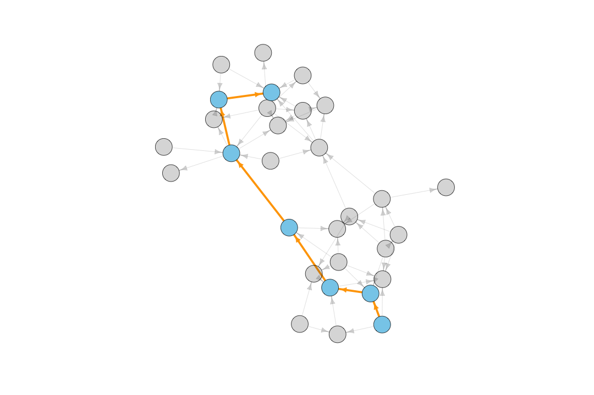

Exploring Graphs
========================================================
author: Benjamin Ortiz Ulloa
date: 
autosize: true
transition: fade

What's a Graph?
========================================================

What's a Graph?
========================================================

What's a Graph?
========================================================

What's a Graph?
============

What's a Graph?
============

What's a Graph?
============

Relationships can have direction
============

Multiple relationships are possible
============

Everything can have attributes
============

Attributes can be visualized
============

Node attributes can also be nodes
======

Connections can be projected
========

These projections enrich our data
==========

Practical Application: Recommendations
======

** <h2>35% of what consumers buy on Amazon and 75% of what users watch on Netflix come from product recommendations</h2>**

Content Based Recommendations
========================================================

Content Based Recommendations
========================================================

Content Based Recommendations
========================================================

Content Based Recommendations
========================================================

Content Based Recommendations 
========================================================

Collaborative Filtering 
========================================================

Collaborative Filtering 
========================================================

Collaborative Filtering 
========================================================

Collaborative Filtering 
========================================================

What nodes are important?
=====

Diameter and Shortest Paths
===

Degree
=======

Betweenness
=======

Closeness
=======

Hub Score
=======

Authority Score
=======

PageRank
====

Practical Application: Keyphrases
=========

**<h5>When people think of graphs, they often think about mapping out social media connections. While graphs are indeed useful for mapping out social networks, they have many other practical applications. Data in the real world resemble vertices and edges more than they resemble rows and columns. This allows researchers to intuitively grasp the data modeled and stored within a graph. Graph exploration -- also known as graph traversal -- is traditionally done with a traversal language such as Gremlin or Cypher. The functionality of these traversal languages can be duplicated by combining the igraph and magrittr packages. Traversing a graph in R gives useRs access to a myriad of simple, but powerful algorithms to explore their data sets. This talk will show why data should be explored as a graph as well as show how a graph can be traversed in R. I will do this by going through a survey of different graph traversal techniques and by showing the code patterns necessary for each of those techniques.</h5>**

Proximity as a connection
=====

Text Rank: Benjamin Ortiz Ulloa
=====

TextRank: Miguel Gonzalez-Fierro
=====

TextRank: Amy Stringer
====

TextRank: Snehalata Huzurbazar
======

