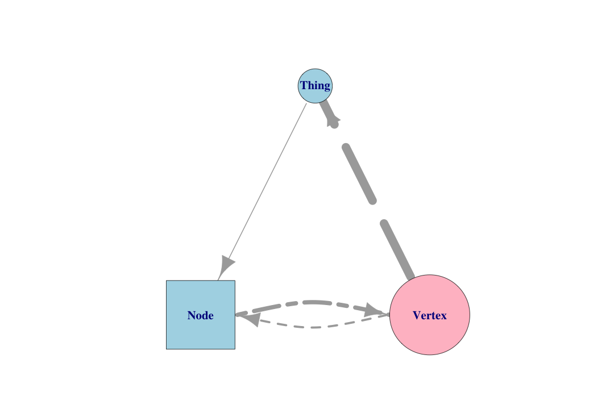

Exploring Graphs
========================================================
author: Benjamin Ortiz Ulloa
date: 
autosize: true
transition: fade

What's a Graph?
========================================================

What's a Graph?
========================================================

What's a Graph?
========================================================

What's a Graph?
============

What's a Graph?
============

What's a Graph?
============

Relationships can have direction
============

Multiple relationships are possible
============

Everything can have attributes
============

Attributes can be visualized
============

Node attributes can also be nodes
======

Content Based Recommendations
========================================================

Content Based Recommendations
========================================================

Content Based Recommendations
========================================================

Content Based Recommendations
========================================================

Content Based Recommendations 
========================================================

Collaborative Filtering 
========================================================

Collaborative Filtering 
========================================================

Collaborative Filtering 
========================================================

Collaborative Filtering 
========================================================

