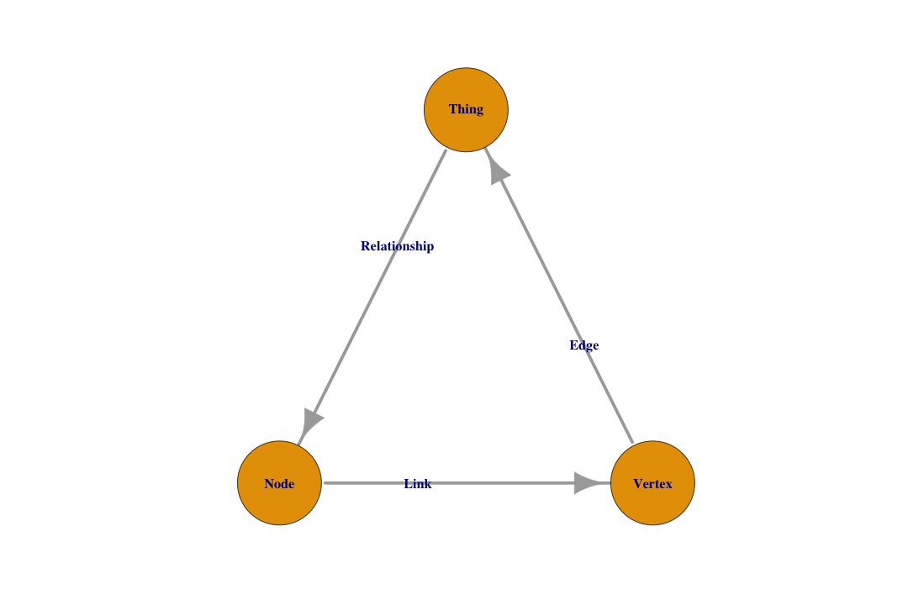
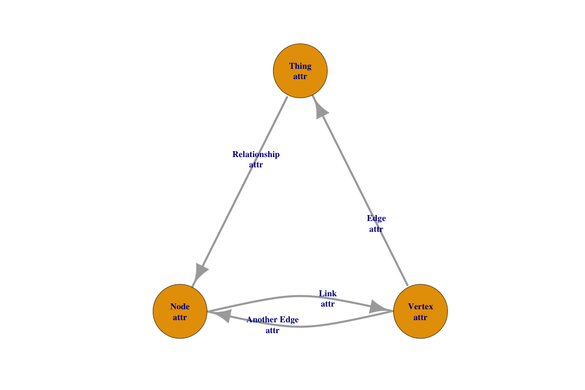
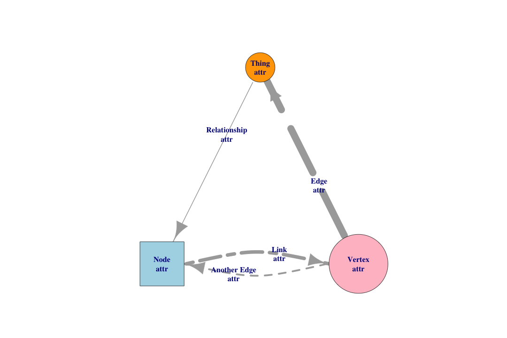
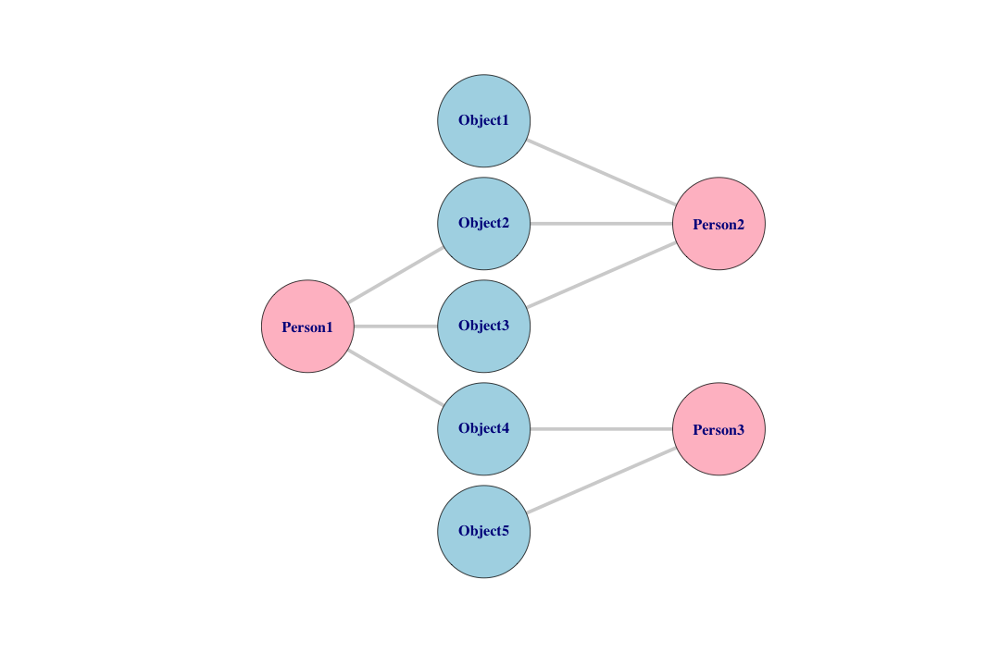

2013 PEW LGBTQ Survey...but as a graph
========================================================
author: Benjamin Ortiz Ulloa
date: 
autosize: true

What's a Graph?
========================================================


What's a Graph?
========================================================


What's a Graph?
========================================================


What's a Graph?
============


What's a Graph?
============


What's a Graph?
============


What's a Graph?
============


What's a Graph?
============


What's a Graph?
============


What's a Graph?
============


Why graph? Social Network Analysis
=========


Why graph? Maps, paths, and supply chains
========


Why graph? Recommendation Systems
==========


Why graph? Recommendation Systems
============


Why graph? Recommendation Systems
============


Data
======
Online survey of self-identified lesbian, gay, bisexual and transgender adults in the U.S., ages 18 or older. 

Sample sizes:
+  Full sample =1,197
+  Gay men n=398
+  Lesbians n=277
+  Bisexuals n=479
+  Transgender adults n=43

[http://www.pewsocialtrends.org/2014/09/18/2013-survey-of-lgbt-adults/]()

Data
==== 
It's a `.sav`  file (SPSS), but luckily the **foreign** package in **R** can import it painlessly. 


```r
survey <- foreign::read.spss('pew2013lgbtpublicdatarelease.sav') %>%
  as.tibble()
```

```
# A tibble: 1,197 x 181
   NEWCASEID Q1     Q2     Q3_A  Q3_B  Q3_C  Q3_D  Q4    Q5    Q6_A  Q6_B 
       <dbl> <fct>  <fct>  <fct> <fct> <fct> <fct> <fct> <fct> <fct> <fct>
 1        1. Prett… Wrong… Most… Most… Very… Most… A bi… Most… Some  Some 
 2        2. Prett… Right… Very… Most… Very… Most… A bi… Most… Some  Some 
 3        3. Not t… Right… Very… Most… Very… Most… A bi… Some… A lot A lot
 4        4. Prett… Right… Most… Most… Most… Most… A sm… Most… Some  Some 
 5        5. Prett… Right… Very… Most… Very… Most… A bi… Most… Some  A lot
 6        6. Prett… Wrong… Most… Most… Most… Most… A sm… Only… Some  Some 
 7        7. Prett… Wrong… Very… Most… Most… Most… A sm… Only… Some  A lot
 8        8. Prett… Right… Most… Most… Very… Most… A bi… Most… Some  Some 
 9        9. Prett… Right… Very… Most… Very… Most… A bi… Most… Some  Some 
10       10. Very … Right… Very… Most… Very… Very… A bi… Most… Only… Only…
# ... with 1,187 more rows, and 170 more variables: Q6_C <fct>,
#   Q6_D <fct>, Q6_E <fct>, Q8 <fct>, Q9A <fct>, Q9B <fct>, Q9C <fct>,
#   Q10 <fct>, Q11 <fct>, Q12 <fct>, OFTVOTE <fct>, SNS <fct>,
#   PARTY <fct>, PARTYLN <fct>, IDEO <fct>, SEX <fct>, MARITAL <fct>,
#   Q16 <fct>, Q17_A <fct>, Q17_B <fct>, Q17_C <fct>, Q17_D <fct>,
#   Q17_E <fct>, Q17_F <fct>, Q17_G <fct>, Q24 <fct>, Q25 <fct>,
#   QR2 <fct>, LGBT <fct>, Q27 <fct>, Q31 <fct>, Q32 <fct>,
#   Q32A_Codes <fct>, Q32A_posOE1 <fct>, Q32A_posOE2 <fct>,
#   Q32A_posOE3 <fct>, Q32A_posOE4 <fct>, Q32A_negOE1 <fct>,
#   Q32A_negOE2 <fct>, Q32A_negOE3 <fct>, Q33_A <fct>, Q33_B <fct>,
#   Q33_C <fct>, Q33_D <fct>, Q39 <fct>, Q40 <fct>, Q41 <fct>, Q42 <fct>,
#   Q44 <fct>, Q44new_OE1 <fct>, Q44new_OE2 <fct>, Q44new_OE3 <fct>,
#   q44aNEW <fct>, q44compNEW <fct>, Q44B <fct>, Q44C <fct>, Q45 <fct>,
#   Q45new_OE1 <fct>, Q45new_OE2 <fct>, Q45new_OE3 <fct>, q45aNEW <fct>,
#   q45compNEW <fct>, Q45B <fct>, Q45C <fct>, Q46 <fct>, q46aNEW <fct>,
#   q46compNEW <fct>, Q47 <fct>, q47aNEW <fct>, q47compNEW <fct>,
#   Q48 <fct>, Q49 <fct>, q52oe_1 <fct>, q52oe_2 <fct>, q52oe_3 <fct>,
#   Q53 <fct>, Q54 <fct>, Q55 <fct>, Q56_A <fct>, Q56_B <fct>,
#   Q56_C <fct>, Q56_D <fct>, Q56_E <fct>, Q56_F <fct>, Q56_G <fct>,
#   Q63_A <fct>, Q63_B <fct>, Q63_C <fct>, Q63_D <fct>, Q63_E <fct>,
#   Q63_F <fct>, Q64_OE1 <fct>, Q64_OE2 <fct>, Q64_OE3 <fct>, Q65_A <fct>,
#   Q65_B <fct>, Q65_C <fct>, Q65_D <fct>, Q65_E <fct>, Q66_A <fct>, …
```

1.  R Core Team (2017). foreign: Read Data Stored by 'Minitab', 'S', 'SAS',
  'SPSS', 'Stata', 'Systat', 'Weka', 'dBase', .... R package version 0.8-69.
  https://CRAN.R-project.org/package=foreign
  
Converting to Graph Data - Overview
========
**Main Task:** Create 2 Data Frames

1. Node List:
    - First Column must be the names or id of the nodes
        - node names and ids must be unique
    - Every subsequent column is a node attribute
    - Only required if the graph has node attributes
2. Edge List:
    - First column must be the name or id of the source node (the tail of the edge)
    - Second column must be the name or id of the target node (the head of the edge)
    - Every subsequent column is an edge attribute
    
Converting to Graph Data - Edge List
=====

```r
links <- survey %>%
  mutate(NEWCASEID = str_c("ID_", NEWCASEID)) %>%
  gather(question, answer, -NEWCASEID) %>%
  unite(answer, question, answer, sep = '::') %>%
  mutate(type = "person_answer")
links
```

```
# A tibble: 215,460 x 3
   NEWCASEID answer            type         
   <chr>     <chr>             <chr>        
 1 ID_1      Q1::Pretty happy  person_answer
 2 ID_2      Q1::Pretty happy  person_answer
 3 ID_3      Q1::Not too happy person_answer
 4 ID_4      Q1::Pretty happy  person_answer
 5 ID_5      Q1::Pretty happy  person_answer
 6 ID_6      Q1::Pretty happy  person_answer
 7 ID_7      Q1::Pretty happy  person_answer
 8 ID_8      Q1::Pretty happy  person_answer
 9 ID_9      Q1::Pretty happy  person_answer
10 ID_10     Q1::Very happy    person_answer
# ... with 215,450 more rows
```
    
Converting to Graph Data - Node List
=====

```r
nodes <- rbind(
  tibble(
    name = links$NEWCASEID %>% unique,
    type = 'person'
  ),
  tibble(
    name = links$answer %>% unique,
    type = 'answer'
  )
)

nodes
```

```
# A tibble: 3,533 x 2
   name  type  
   <chr> <chr> 
 1 ID_1  person
 2 ID_2  person
 3 ID_3  person
 4 ID_4  person
 5 ID_5  person
 6 ID_6  person
 7 ID_7  person
 8 ID_8  person
 9 ID_9  person
10 ID_10 person
# ... with 3,523 more rows
```

Converting to Graph Data - The Graph!!
=====

```r
g <- graph_from_data_frame(d = links, directed = F, vertices = nodes)
g
```

```
IGRAPH 382c690 UN-B 3533 215460 -- 
+ attr: name (v/c), type (v/c), type (e/c)
+ edges from 382c690 (vertex names):
 [1] ID_1 --Q1::Pretty happy  ID_2 --Q1::Pretty happy 
 [3] ID_3 --Q1::Not too happy ID_4 --Q1::Pretty happy 
 [5] ID_5 --Q1::Pretty happy  ID_6 --Q1::Pretty happy 
 [7] ID_7 --Q1::Pretty happy  ID_8 --Q1::Pretty happy 
 [9] ID_9 --Q1::Pretty happy  ID_10--Q1::Very happy   
[11] ID_11--Q1::Very happy    ID_12--Q1::Pretty happy 
[13] ID_13--Q1::Very happy    ID_14--Q1::Pretty happy 
[15] ID_15--Q1::Pretty happy  ID_16--Q1::Very happy   
+ ... omitted several edges
```

Subgraph - Just Gay Males
========


Subgraph - Question 102
=====

**102(a|b|c|d): Which Statement comes closer to your own views - even if neither is exatly right?**

<table>
<tr>
  <th>
    Q.
  </th>
  <th>
    A1.
  </th>
  <th>
    A2
  </th>
</tr>
<tr>
  <td>
    A
  </td>
  <td>
    The push for same-sex marriage has taken too much focus away from other issues important to LGBT people
  </td>
  <td>
    Same-sex marriage should be the top priority for LGBT people right now, even if this means some other issues do not get much attention
  </td>
</tr>
<tr>
  <td>
    B
  </td>
  <td>
    The best way to achieve equality is for LGBT people to be a part of mainstream culture and institutions like marriage
  </td>
  <td>
    LGBT people should be able to achieve equality while still maintaining their own distinct culture and way of life 
  </td>
</tr>
<tr>
  <td>
    C
  </td>
  <td>
    I dont want to be seen as different because of my (sexual orientation)/(gender identity)
  </td>
  <td>
    My (sexual orientation)/(gender identity) makes me different from other people, and I am comfortable with that.
  </td>
</tr>
<tr>
  <td>
    D
  </td>
  <td>
    It is important to maintain places like LGBT neighborhoods and gay and lesbian bars
  </td>
  <td>
    These types of places will not be important as LGBT people are more accepted into society
  </td>
</tr>
</table>

Subgraph - Question 102
=====


Subgraph - Question 102
=======


Subgraph - Question 102
=======


Summary of Vertices - Q102
=====


PageRank Summary
=====

```r
g %>%
  set_vertex_attr('type', 
                  value = sapply(V(.)$type, function(x){x == 'answer'})) %>%
  set_vertex_attr('nPeople',
                  value = degree(.)) %>%
  set_vertex_attr('percPeople',
                  value = V(.)$nPeople/length(V(.)[str_detect(name, '^ID_')])) %>%
  bipartite_projection() %>% 
  .[[2]] %>% 
  {
    fullA <<- .
    .
  } %>%
  page_rank() %>% 
  .$vector %>%
  .[!str_detect(names(.), 'NA$')] %>%
  sort(T) %>% 
  {
    prFullA <<- tibble(
      name = names(.),
      page_rank = .
    ) %>%
      left_join(
        tibble(
          name = V(fullA)$name,
          nPeople = V(fullA)$nPeople,
          percPeople = V(fullA)$percPeople
        )
      ) %>%
      separate(name, c('question', 'answer'), '::')
  }
```

fun summary
====


```r
prFullA %>% 
  filter(answer != 'Refused') %>%
  count(question, sort = T) %>% 
  filter(n < 10, n > 2)  %>%
  .$question %>%
  {filter(prFullA, question %in% .)} %>%
  head(20)
```

```
# A tibble: 20 x 5
   question answer                            page_rank nPeople percPeople
   <chr>    <chr>                                 <dbl>   <dbl>      <dbl>
 1 Q66_D    Unfriendly                          0.00424   1062.      0.887
 2 Q66_E    Unfriendly                          0.00413   1035.      0.865
 3 Q17_C    Very important reason               0.00409   1024.      0.855
 4 REG      I am absolutely certain that I a…   0.00405   1012.      0.845
 5 Q66_B    Unfriendly                          0.00392    980.      0.819
 6 Q56_B    Unfriendly                          0.00386    965.      0.806
 7 Q11      Strongly favor                      0.00374    935.      0.781
 8 Q12      Strongly favor                      0.00369    923.      0.771
 9 Q82_E    Never happened                      0.00368    921.      0.769
10 Q66_A    Unfriendly                          0.00367    918.      0.767
11 Q63_A    Helps a lot                         0.00367    918.      0.767
12 Q56_D    Friendly                            0.00367    915.      0.764
13 PPETHM   White, Non-Hispanic                 0.00361    901.      0.753
14 Q82_C    Never happened                      0.00350    873.      0.729
15 Q63_C    Helps a lot                         0.00345    862.      0.720
16 Q63_E    Helps a lot                         0.00344    859.      0.718
17 Q17_E    Very important reason               0.00342    854.      0.713
18 Q17_B    Very important reason               0.00338    842.      0.703
19 Q82_D    Never happened                      0.00332    829.      0.693
20 Q82_A    Never happened                      0.00330    823.      0.688
```

split by cat
======

```r
get_sub <- function(g, str_filt, cutoff, type){
  noi <- V(g)[str_detect(name, str_filt)]

  g %>%
    {. - E(.)[!V(.) %--% noi]} %>%
    {. - V(.)[degree(.) == 0]} %>%
    {
      poi <- V(.)[str_detect(name, '^ID_')]$name
      g - E(g)[!poi %--% V(g)]
    }  %>%
    {. - V(.)[degree(.) == 0]} %>%
    set_vertex_attr('type', 
                    value = sapply(V(.)$type, function(x){x == 'answer'})) %>%
    set_vertex_attr('nPeople',
                    value = degree(.)) %>%
    set_vertex_attr('percPeople',
                    value = V(.)$nPeople/length(V(.)[str_detect(name, '^ID_')])) %>%
    {
      totP <<- V(.)[str_detect(name, '^ID_')] %>%
        length
      .
    } %>%
    bipartite_projection() %>% 
    .[[2]] %>%
    {. - V(.)[percPeople < cutoff]} %>%
    {. - E(.)[!noi$name %--% V(.)]} %>%
    {. - V(.)[degree(.) == 0]} %>%
    set_edge_attr('percTot',
                  value = E(.)$weight/totP) %>%
    set_edge_attr('type',
                  value = type) %>%
    as_data_frame()
}

trans <- get_sub(g, 'LGBT::transgender', .7, 'transgender')
gay <- get_sub(g, 'LGBT::gay', .7, 'gay')
bisexual <- get_sub(g, 'LGBT::bisexual', .7, 'bisexual')
lesbian <- get_sub(g, 'LGBT::lesbian', .7, 'lesbian')

lgbt <- list(trans, gay, bisexual, lesbian) %>%
  bind_rows()

g_lgbt_70 <- graph_from_data_frame(lgbt, F)
```

disimilar 
=====

```r
remove_common <- g_lgbt_70 %>%
  {. - V(.)[str_detect(name, "::NA$")]} %>%
  set_vertex_attr('degree', 
                  value = degree(.)) %>%
  {. - V(.)[str_detect(name, '^LGBT')]} %>%
  {. - V(.)[degree > 2]} %>%
  {V(.)$name} %>% 
  c(V(g_lgbt_70)[str_detect(name, '^LGBT')]$name)

g_lgbt_70 %>%
  {. - V(.)[!name %in% (remove_common)]} %>%
  plot()
```


```r
g_lgbt_70_dis <- g_lgbt_70 %>% 
  {. - V(.)[!name %in% remove_common]} 

type_df <- tibble(
  name = names(degree(g_lgbt_70_dis)),
  degree = degree(g_lgbt_70_dis),
  type = map2_chr(name, degree, function(x,y){
    if(str_detect(x, '^LGBT')){
      'LGBT'
    } else if(y > 1) {
      'right'
    } else {
      'left'
    }

  })
)

g_lgbt_70_dis <- g_lgbt_70_dis %>%
  set_vertex_attr('type', 
                  value = type_df$type)

totN <- vcount(g_lgbt_70_dis)
totLGBT <- V(g_lgbt_70_dis)[str_detect(name, '^LGBT')] %>% length + 1
totRight <- V(g_lgbt_70_dis)[!str_detect(name, '^LGBT')][type == 'right'] %>% length + 1
totLeft <- V(g_lgbt_70_dis)[!str_detect(name, '^LGBT')][type == 'left'] %>% length + 1
countLGBT <- 0
countRight <- 0
countLeft <- 0

layout <- lapply(V(g_lgbt_70_dis)$type, function(x){
  if(x == 'LGBT'){
    countLGBT <<- countLGBT + 1
    matrix(c(totN/2, countLGBT * totN/totLGBT), ncol = 2)
  } else if(x == 'left'){
    countLeft <<- countLeft + 1
    matrix(c(0, countLeft * totN/totLeft), ncol = 2)
  } else {
    countRight <<- countRight + 1
    matrix(c(totN, countRight * totN/totRight), ncol = 2)
  }
}) %>%
  do.call(rbind, .)

plot(g_lgbt_70_dis,
     layout = layout,
     vertex.size = 0)
```


