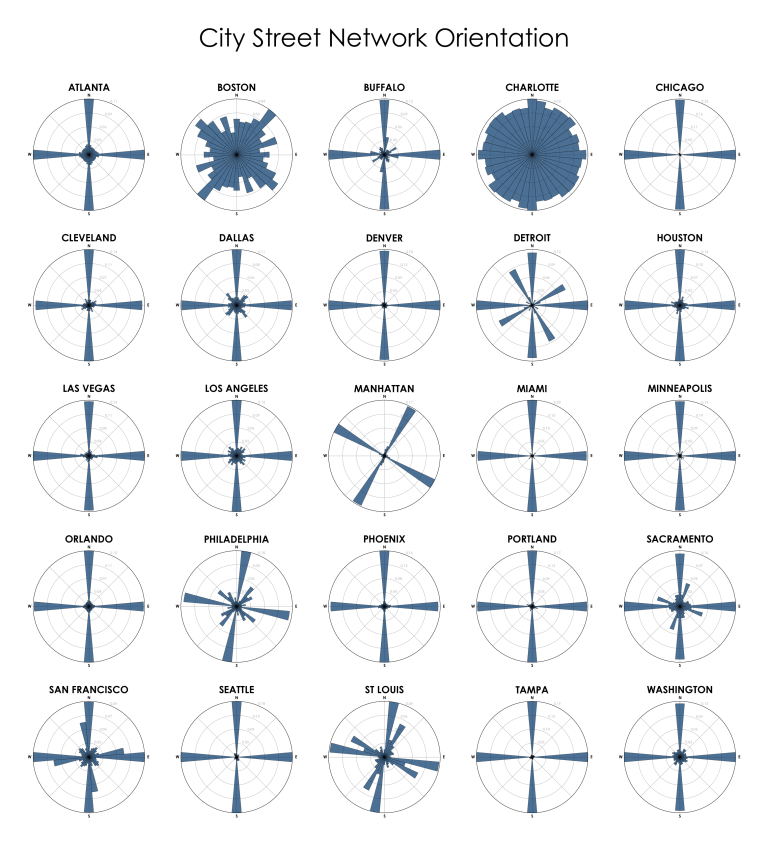

class: center, middle

```{r setup, include=FALSE}
options(htmltools.dir.version = FALSE)
packages <- c('tidyverse',
              'sf',
              'osmdata',
              'tmap', 
              'stplanr',
              'igraph')

lapply(packages, library, character.only = T)

#If we store node information in the edges
#Then we can calculate slope and angles
#g is a graph we want to get angle information for
#lout is either a layout function or a layout matrix
customize_graph <- function(g, lout){
  #we can provide either a layout function or a layout matrix
  if(is.matrix(lout)){
    l <- lout
  } else {
    set.seed(4321)
    l <- lout(g)
  }
  
  
  g %>%
    set_graph_attr(., 'layout', l)%>%
    set_vertex_attr('size', value = 5) %>%
    set_vertex_attr('label', value = '') %>%
    set_vertex_attr('x', value = .$layout[,1]) %>%
    set_vertex_attr('y', value = .$layout[,2]) %>%
    set_edge_attr('head_x', value = head_of(., E(.))$x) %>%
    set_edge_attr('tail_x', value = tail_of(., E(.))$x) %>%
    set_edge_attr('head_y', value = head_of(., E(.))$y) %>%
    set_edge_attr('tail_y', value = tail_of(., E(.))$y) %>%
    
    # Slope is calculated as (y2 - y1)/(x2-x1)
    set_edge_attr('slope', value = map_dbl(E(.), function(e){
      slope = (e$tail_y - e$head_y)/(e$tail_x - e$head_x)
      if(is.infinite(slope)) return(Inf)
      return(slope)
    })) %>%
    set_edge_attr('color', value = map_chr(E(.)$slope, function(e){
      if(e < 0) return('red')
      return('blue')
    })) %>%
    
    #Tangent = Opposite/Adjacent
    #Tangent = (y2-y1)/(x2-x1)
    #Tangent = Slope
    #ArcTan(Slope) = The angle we are looking for
    set_edge_attr('angle', value = map_dbl(E(.)$slope, function(e){
      atan(e) * 180 / pi
    })) %>%
    set_edge_attr('width', value = 1.5)
}


#this creates the data for the compass
#g must be a graph from the customize_graph function
#intervals are the bin intervals between +90 degrees and -90 degrees
graph_orientation <- function(g, intervals = 10){
  break_points <- seq(90, -90, -intervals) #%>% .[2:(length(.) - 1)]
  
  #North-South Orientation is essentially angles with +-90 degrees
  #East West Orientation is essentially angles with 0 degrees
  cut(E(g)$angle, 
#      c(Inf, break_points, -Inf)) %>%
    break_points, include.lowest = T) %>%
    factor(levels = rev(levels(.))) %>%
    {
      tmp <- table(.)
      tibble(direction = names(tmp),
             count = as.numeric(tmp))
    } %>%
    
    #We only calculated the right side of the compass
    #We go off the assumption that any road that
    #orients east also orients west
    #orients North East also orients South West
    #orients Southe East also orients North West
    {
      rbind(
        .,
        mutate(.,
               direction = paste0('-', direction))
      ) %>%
        mutate(direction = factor(direction, direction))
    }
}

#plot the 
plot_entropy <- function(x, title){
  ggplot(x) +
    geom_col(aes(x = direction, y = count)) +
    coord_polar() + 
    # # let's nudge the coordinates a bit so that north is pointing straight up
    # # coord_polar(start = -2 * pi / nrow(x) / 2) +
    theme_bw() +
    labs(title = title)
}

get_city_graph <- function(city, road_types){
  city_bbox <- getbb(city)
  
  city_roads <- road_types %>%
    setNames(., .) %>%
    map(function(x){
      opq(bbox = city_bbox) %>%
        add_osm_feature(key = 'highway', value = x) %>%
        osmdata_sf() 
    }) %>%
    do.call(c, .) %>%
    .$osm_lines %>%
    select(geometry, highway)
  
  city_g <- city_roads %>%
    as('Spatial') %>%
    SpatialLinesNetwork() %>%
    .@g %>%
    set_vertex_attr('x', value = .$x) %>%
    set_vertex_attr('y', value = .$y)
}
```

<h1><a href='https://geoffboeing.com/2018/07/comparing-city-street-orientations/'>Geoff Boeing made something cool</a></h1>

---
class: center, middle

```{r, echo = F, message = F, warning = F, out.width= '500px'}


```

---
class: center, middle
# [OSMnx](https://geoffboeing.com/2016/11/osmnx-python-street-networks/) is a Python package for easily downloading and analyzing street networks anywhere in the world. Among other analyses, we can use it to explore street network orientation. That is, what are the bearings and spatial orientations of the streets in the network? 


---
class: center, middle


<h2>Geoff made something cool </h2>

--

<h2><a href="https://github.com/gboeing/osmnx-examples/blob/master/notebooks/17-street-network-orientations.ipynb">But did it in Python</a> &#x1f40d;</h2>

--

<h2>And that makes me sad  	&#x1F622; </h2>


---
class: center, middle

<h2>So let's do this with</h2>

```{r, echo = F, out.width= '300px'}
knitr::include_graphics("./R_logo.png" )
```

---
<h2>What do we need to make these in R?</h2>

--

* Grab city street data with **osmdata**

--

* Create a street network graph with **stplanr** and **igraph**

--

* Use trigonmetry functions from **base**

--

* Use handwavy magic from **ggplot2**

---
#First things first

We need to make sure we have all the important packages installed/loaded

```{r, eval = F}
packages <- c('tidyverse',
              'sf',
              'osmdata',
              'tmap', 
              'stplanr',
              'igraph')

lapply(packages, library, character.only = T)
```

---
class:  middle, center

# Grab city street data with **osmdata**

---

# osmdata::getbb

Before we pull out any kind of map data, we need to define the *boundng box* of the region we want. 

```{r eval=F}
dc_bb <- getbb('Washington, DC')
```

and this will provide us with a matrix of the maximum and minimum values for the region's longitudal (x) and latitudal (y) borders

```{r, echo = F}
dc_bb <- readRDS('dc_bb.rds')
knitr::kable(dc_bb, format='html')
```

---

# ::opq | ::add_osm_feature | ::osmdata_sf

Once we define the region we care about, we can pull data from **OpenStreetMap** by building an *Overpass Query*. Since we're only interested in building a street network, we will only pull the *highway features*. Once we tell OSM the features we want, we can extract the *linestring* geometry as a **Simple Feature**.

```{r eval=F}

road_types <- c('trunk', 'primary', 'secondary', 'tertiary')
dc_roads <- lapply(road_types, function(rt){
  opq(bbox = dc_bb) %>%
    add_osm_feature(key = 'highway', value = rt) %>%
    osmdata_sf() 
}) %>%
  do.call(c, .) %>%
  .$osm_lines %>%
  select(geometry, highway)
```

---

# ::opq | ::add_osm_feature | ::osmdata_sf
What we get is  a *simple feature data frame*. That is, a data frame that can contain map geometries and data associated with those geometries.

```{r, echo = F}
set.seed(4321)
dc_roads <- readRDS('dc_roads.rds')
knitr::kable(dc_roads %>% dplyr::sample_n(5), format='html')
```

---

## We can plot what we already have with **tmap**

The goal is to analyze maps as graphs, not as spatial plots, but it's still worth showing how to plot a map. 

```{r, eval = F}
tm_shape(filter(dc_roads, highway == 'trunk')) +
  tm_lines('grey40', .5) +
  tm_shape(filter(dc_roads, highway == 'primary')) +
  tm_lines('grey30', .5) +
  tm_shape(filter(dc_roads, highway == 'secondary')) +
  tm_lines('grey15', .5) +
  tm_shape(filter(dc_roads, highway == 'tertiary')) +
  tm_lines('grey10', .5)
```

```{r, echo = F, message = F, out.height='250px'}
tm_shape(filter(dc_roads, highway == 'trunk')) +
  tm_lines('grey40', .5) +
  tm_shape(filter(dc_roads, highway == 'primary')) +
  tm_lines('grey30', .5) +
  tm_shape(filter(dc_roads, highway == 'secondary')) +
  tm_lines('grey15', .5) +
  tm_shape(filter(dc_roads, highway == 'tertiary')) +
  tm_lines('grey10', .5)
```


---
class: middle, center

# Create a street network graph with **stplanr** and **igraph**

---
#sf::as | stplanr::SpatialLinesNetwork

We need to convert the *simple feature* data frame into a *spatial lines* data frame before we convert the geometric features into a street network graph.

```{r, eval = F}
dc_g <- dc_roads %>%
    as('Spatial') %>%
    SpatialLinesNetwork() %>%
    .@g 
```

What we get is a cool *igraph* style graph with the logtitude (x) and latitude (y) coordinates of the intersections (nodes) stored as graph attributes. We also have an edge attribute called "weight." This is the relative length of the road an edge represents. A longer road will have a larger weight.

```{r, echo = F}
dc_g <- readRDS('dc_g.rds')
dc_g %>%
  remove.vertex.attribute('x') %>%
  remove.vertex.attribute('y') %>%
  summary()
```

---
#igraph::set_vertex_attr

For data manipulation purposes we want to store the x/y coordinates in the nodes themselves. 

```{r, eval = F}
dc_g <- dc_g %>%
    set_vertex_attr('x', value = .$x) %>%
    set_vertex_attr('y', value = .$y)
```

```{r, echo = F}
dc_g %>%
  summary()
```

---
#::plot

Again, the point of ths presentation isn't to show standard plots. But it's worth noting that once the x/y coordinates are set as *vertex attributes*, they are automatically represented on the plot.

.pull-left[
<br>
<br>
```{r, eval = F}
plot(dc_g,
     vertex.size = .1,
     vertex.label = '')
```
]

.pull-right[
```{r, echo = F}
plot(dc_g,
     vertex.size = .1,
     vertex.label = '')
```
]

---
class: middle, center

# Use trigonmetry functions from **base**


---
class: middle, center

```{r, echo = F, out.width='500px'}

```

--
$$Tangent(\theta)=\frac{Opposite}{Adjacent}$$

--
$$\theta=Tangent^{-1} (\frac{Opposite}{Adjacent})$$

--
$$\theta=Tangent^{-1} (Slope)$$
---
class: middle, center

## Street Graphs Use Cartesian Coordinates

```{r, echo = F}
nodes <- tibble(x = c(1, 0, 1, -1, -1),
                y = c(1, 0, -1, 1, -1),
                text = str_glue("({x},{y})"))

links <- tibble(x = c(0, 1, 0, 1, 0, -1, 0, -1),
                y = c(0, 1, 0, -1, 0, -1, 0, 1),
                group = c(1, 1, 2, 2, 3, 3, 4, 4),
                color = c('blue', 'blue', 'red', 'red', 'blue', 'blue', 'red', 'red'))
  
arctans <- tibble(x = c(.5, .5, -.5, -.5),
                  y = c(.2, -.2, .2, -.2),
                  text = c('atan(1/1)', 'atan(-1/1)', "atan(1/-1)", "atan(-1/-1)"))

ggplot() +
  # geom_line(aes(x, y, group = group, color = color), links) +
  geom_line(aes(x, y, group = group), links) +
  geom_hline(yintercept = 0, linetype = 'dashed', color = 'grey10') +
  geom_vline(xintercept = 0, linetype = 'dashed', color = 'grey10') +
  # geom_label(aes(x,y, label = text), arctans, size = 5) +
  geom_point(aes(x, y), nodes, shape = 21, size = 11, fill='skyblue') +
  geom_text(aes(x, y, label = text), nodes, size = 3) +
  scale_color_manual(values = c('blue' = 'blue', 'red' = 'red')) +
  theme_bw() +
  coord_equal() +
  theme(plot.margin = margin(2,2,2,2, 'cm'), legend.position = 'none' ) +
  xlim(c(-1.25, 1.25)) +
  ylim(c(-1.25, 1.25))
```

---
class: middle, center

## Calculate $\theta$ w/ ArcTan

```{r, echo = F}
ggplot() +
  # geom_line(aes(x, y, group = group, color = color), links) +
  geom_line(aes(x, y, group = group), links) +
  geom_hline(yintercept = 0, linetype = 'dashed', color = 'grey10') +
  geom_vline(xintercept = 0, linetype = 'dashed', color = 'grey10') +
  geom_text(aes(x,y, label = text), arctans, size = 5) +
  geom_point(aes(x, y), nodes, shape = 21, size = 11, fill='skyblue') +
  geom_text(aes(x, y, label = text), nodes, size = 3) +
  scale_color_manual(values = c('blue' = 'blue', 'red' = 'red')) +
  theme_bw() +
  coord_equal() +
  theme(plot.margin = margin(2,2,2,2, 'cm'), legend.position = 'none' ) +
  xlim(c(-1.25, 1.25)) +
  ylim(c(-1.25, 1.25))
```

---
class: middle, center

## For maps, NE roads also point SW

```{r, echo = F}
ggplot() +
  geom_line(aes(x, y, group = group, color = color), links) +
  # geom_line(aes(x, y, group = group), links) +
  geom_hline(yintercept = 0, linetype = 'dashed', color = 'grey10') +
  geom_vline(xintercept = 0, linetype = 'dashed', color = 'grey10') +
  # geom_label(aes(x,y, label = text), arctans, size = 5) +
  geom_point(aes(x, y), nodes, shape = 21, size = 11, fill='skyblue') +
  geom_text(aes(x, y, label = text), nodes, size = 3) +
  scale_color_manual(values = c('blue' = 'blue', 'red' = 'red')) +
  theme_bw() +
  coord_equal() +
  theme(plot.margin = margin(2,2,2,2, 'cm'), legend.position = 'none' ) +
  xlim(c(-1.25, 1.25)) +
  ylim(c(-1.25, 1.25))
```


---
#::set_edge_attr | ::head_of | ::tail_of

Sometimes it's easier to do these calculations if we store the data in one place. Let's move the adjacent node data into the edges.

```{r, eval = F}
dc_g <- dc_g %>%
    set_edge_attr('head_x', value = head_of(., E(.))$x) %>%
    set_edge_attr('tail_x', value = tail_of(., E(.))$x) %>%
    set_edge_attr('head_y', value = head_of(., E(.))$y) %>%
    set_edge_attr('tail_y', value = tail_of(., E(.))$y) 
```


```{r, echo = F}
dc_g <- readRDS('dc_g_full.rds')
dc_g %>%
  as_data_frame() %>%
  select(weight, head_x, head_y, tail_x, tail_y) %>%
  head(5) %>%
  knitr::kable(format = 'html') 
```

---
#::set_edge_attr | purr::map 

We can iterate over the edge list and derive important information. We can calculate the *slope* and we can even color the edges to do a quick spot check.

```{r, eval = F}
dc_g <- dc_g %>%
  set_edge_attr('slope', value = map_dbl(E(.), function(e){
    slope = (e$tail_y - e$head_y)/(e$tail_x - e$head_x)
    if(is.infinite(slope)) return(Inf)
    return(slope)
  })) %>%
  set_edge_attr('color', value = map_chr(E(.)$slope, function(e){
    if(e < 0) return('red')
    return('blue')
  }))
```

```{r, echo = F}
dc_g %>%
  as_data_frame() %>%
  select(weight, head_x, head_y, tail_x, tail_y, slope = slope_vector, color) %>%
  head(5) %>%
  knitr::kable(format = 'html') 
```

---
class: middle, center

#Spot Check: Do the slopes look correct?

```{r}
plot(dc_g, vertex.label = '', vertex.size = .1)
```

---

#base::atan

Now that we have the *slope* all we need to do is plug-and-chug that information into the `atan` or ArcTan function. 

Here we convert the result of `atan` from radians to degrees

```{r, eval = F}
dc_g <- dc_g %>%
  set_edge_attr('angle', value = map_dbl(E(.)$slope, function(e){
    {{atan(e) * 180 / pi}}
  }))
```

```{r, echo = F}
dc_g %>%
  as_data_frame() %>%
  select(weight, head_x, head_y, tail_x, tail_y, slope = slope_vector, color, angle) %>%
  head(5) %>%
  knitr::kable(format = 'html') 
```


---
class: middle, center

# Use handwavy magic from **ggplot2**

---

## The end result is a *Polar Histogram*. 

--

### This is an easy enough task now that we've done most of the data cleaning. We should be able to make a *Polar Histogram* in 3 steps:

--

1 Create reasonable bins for the angles

--

2 Duplicate the bins to represent the opposite coordinates

--

3 Plug everything into **ggplot**

---

# Create Reasonable Bins

The angles we have range from -90 $^\circ$ to 90 $^\circ$. Maybe reasonable bin breaks points would be every 10 degrees.

```{r, results="hidden"}
break_points <- seq(90, -90, -10)

angle_bins <- cut(E(dc_g)$angle, 
                  break_points,
                  include.lowest = T) %>%
    factor(levels = rev(levels(.)))

dc_hist_data <- tibble(angle_bin = angle_bins, 
                       length = E(dc_g)$weight) %>%
  count(angle_bin, wt = length)
```

```{r, echo = F}
dc_hist_data %>%
  head(5) %>%
  knitr::kable(format='html')
```

---

# Duplicate Bins

Right now we only have information for the North East and South East road orientations. However, if we go off the assumption that roads going North East also go South West, then all we need to do is rename the bins and add them to our data set.

```{r, results='hidden'}
inverse_hist_data <- dc_hist_data %>%
  mutate(angle_bin = str_c('-', angle_bin))
```

```{r, echo = F}
inverse_hist_data %>%
  head(5) %>%
  knitr::kable(format='html')
```

```{r, results='hidden'}
dc_hist_data <- rbind(dc_hist_data,
                      inverse_hist_data)
```

---

# **ggplot** magic

```{r, out.width="400px"}
ggplot(dc_hist_data) +
  geom_col(aes(x = angle_bin, y = n)) +
  coord_polar() +
  theme_bw()
```

---
# Washington, DC

.pull-left[
```{r, echo = F}
knitr::include_graphics("./Washington,_DC_graph.pdf" )
```
]

.pull-right[
```{r, echo = F}
knitr::include_graphics("./Washington,_DC_entropy.pdf" )
```
]

---
# Philadelphia, PA

.pull-left[
```{r, echo = F}
knitr::include_graphics("./Philadelphia,_PA_graph.pdf" )
```
]

.pull-right[
```{r, echo = F}
knitr::include_graphics("./Philadelphia,_PA_entropy.pdf" )
```
]


---
# New Haven, CT

.pull-left[
```{r, echo = F}
knitr::include_graphics("./New_Haven,_CT_graph.pdf" )
```
]

.pull-right[
```{r, echo = F}
knitr::include_graphics("./New_Haven,_CT_entropy.pdf" )
```
]

---
# Santiago, Chile

.pull-left[
```{r, echo = F}
knitr::include_graphics("./Santiago,_Chile_graph.pdf" )
```
]

.pull-right[
```{r, echo = F}
knitr::include_graphics("./Santiago,_Chile_entropy.pdf" )
```
]

---
# New York, New York

.pull-left[
```{r, echo = F}
knitr::include_graphics("./New_York,_New_York_graph.pdf" )
```
]

.pull-right[
```{r, echo = F}
knitr::include_graphics("./New_York,_New_York_entropy.pdf" )
```
]

---
# Boston, MA

.pull-left[
```{r, echo = F}
knitr::include_graphics("./Boston,_MA_graph.pdf" )
```
]

.pull-right[
```{r, echo = F}
knitr::include_graphics("./Boston,_MA_entropy.pdf" )
```
]

---
class: middle, center

# Let's look at traditional graphs

---

#Force Directed Graph

.pull-left[
```{r echo = F}
g_random <- erdos.renyi.game(100, 1/50) %>%
  customize_graph(layout_nicely)

orientation_random <- graph_orientation(g_random)

plot(g_random)
```
]

.pull-right[
```{r, echo = F}
plot_entropy(orientation_random, 'Force-Directed Layout')
```
]

---

# Lattice

.pull-left[
```{r, echo = F}

g_lattice <- make_lattice(c(15, 15)) %>%
  customize_graph(layout_on_grid)

orientation_lattice <- graph_orientation(g_lattice)
plot(g_lattice)
```
]

.pull-right[
```{r echo = F}
plot_entropy(orientation_lattice, 'Lattice Layouts')
```
]

---

#Circles - 25 Nodes & Edges Within 1

.pull-left[
```{r echo = F}
g_circle <- sample_smallworld(1, 25, nei = 1, 0) %>%
  customize_graph(layout_in_circle)

orientation_circle <- graph_orientation(g_circle)

plot(g_circle)
```
]

.pull-right[
```{r, echo = F}
plot_entropy(orientation_circle, 'Circle Layouts')
```
]

---

# Circles - 25 Nodes & Edges Within 2

.pull-left[
```{r echo = F}
g_circle <- sample_smallworld(1, 25, nei = 2, 0) %>%
  customize_graph(layout_in_circle)

orientation_circle <- graph_orientation(g_circle)

plot(g_circle)
```

]

.pull-right[
```{r, echo = F}
plot_entropy(orientation_circle, 'Circle Layouts')
```
]

---

# Circles - 50 Nodes & Edges Within 2

.pull-left[
```{r echo = F}
g_circle <- sample_smallworld(1, 50, nei = 2, 0) %>%
  customize_graph(layout_in_circle)

orientation_circle <- graph_orientation(g_circle)

plot(g_circle)
```
]

.pull-right[
```{r, echo = F}
plot_entropy(orientation_circle, 'Circle Layouts')
```
]

---

#Circles - 120 Nodes & Edges Within 2

.pull-left[
```{r echo = F}
g_circle <- sample_smallworld(1, 120, nei = 2, 0) %>%
  customize_graph(layout_in_circle)

orientation_circle <- graph_orientation(g_circle)

plot(g_circle)
```
]

.pull-right[
```{r, echo = F}
plot_entropy(orientation_circle, 'Circle Layouts')
```
]

---

# Trees - 25 Nodes & 2 Branches

.pull-left[
```{r echo = F}
g_tree1 <- make_tree(25, 2) %>%
  customize_graph(layout_as_tree)

orientation_tree1 <- graph_orientation(g_tree1)

plot(g_tree1)
```
]

.pull-right[
```{r, echo = F}
plot_entropy(orientation_tree1, 'Tree Layouts')
```
]

---

# Trees - 100 Nodes & 2 Branches

.pull-left[
```{r echo = F}
g_tree2 <- make_tree(100, 2) %>%
  customize_graph(layout_as_tree)

orientation_tree2 <- graph_orientation(g_tree2)

plot(g_tree2)
```
]

.pull-right[
```{r, echo = F}
plot_entropy(orientation_tree2, 'Tree Layouts')
```
]

---

# Trees - 100 Nodes & 4 Branches

.pull-left[
```{r echo = F}
g_tree <- make_tree(100, 4) %>%
  customize_graph(layout_as_tree)

orientation_tree <- graph_orientation(g_tree)

plot(g_tree, asp = 0, vertex.size = 3)
```
]

.pull-right[
```{r, echo = F}
plot_entropy(orientation_tree, 'Tree Layouts')
```
]

---
# Trees - 200 Nodes & 6 Branches

.pull-left[
```{r echo = F}
g_tree <- make_tree(200, 6) %>%
  customize_graph(layout_as_tree)

orientation_tree <- graph_orientation(g_tree)

plot(g_tree, asp = 0, vertex.size = 3)
```
]

.pull-right[
```{r, echo = F}
plot_entropy(orientation_tree, 'Tree Layouts')
```
]

---

# The trees' orientations look off...

.pull-left[
```{r echo = F}
edge_show <- g_tree2 %>%
  as_data_frame() %>%
  select(head_x, tail_x, head_y, tail_y, color) %>%
  mutate(id = 1:nrow(.)) %>%
  unite(head, head_x, head_y) %>%
  unite(tail, tail_x, tail_y) %>%
  gather(side, coords, -color, -id) %>%
  separate(coords, c('x','y'), sep = '_') %>%
  mutate(x = as.numeric(x),
         y = as.numeric(y))

ggplot() +
  geom_path(aes(x, y, group = id, color = color), edge_show) +
  labs(title = "Default display of layout") +
  scale_color_manual(values = c('blue' = 'blue', 'red' = 'red')) +
  theme_bw() +
  theme(legend.position = 'none') 
```
]

.pull-right[
```{r, echo = F}
plot_entropy(orientation_tree2, 'Tree Layouts')
```
]

---

# Tree Layout w/ Equal Coords
.pull-left[
```{r echo = F}
ggplot() +
  geom_path(aes(x, y, group = id, color = color), edge_show) +
  coord_equal() +
  labs(title = "Display layout on equal grid") +
  scale_color_manual(values = c('blue' = 'blue', 'red' = 'red')) +
  theme_bw() +
  theme(legend.position = 'none')
```
]

.pull-right[
```{r, echo = F}
plot_entropy(orientation_tree2, 'Tree Layouts')
```
]

---
class: center, middle

# Notes & Acknowledgements

---

# Notes

There are a handful of differences between my results and Geoff's. This could be due to:

--

- How the graph was created. I believe Geoff used road intersections to create the graph. That is, the nodes are the intersections. I'm not a 100% sure, but `SpatalLinesNetwork` could create the nodes at any road's change of direction.This would mean more edges to calculate.

--

- I binned at every 10 $^\circ$ starting at 90 $^\circ$ and ending at -90 $^\circ$. This means I have 18 bins. At a glance, it looks like Geoff binned at every 12 $^\circ$ with 15 bins. 

--

- I only extracted 4 road types: Trunks, Primary, Secondary, and Tertiary roads. I'm not sure what roads Geoff extracted for the analysis.

--

- I haven't actually looked at Geoff's source code so this is not a direct port. I just did some guess work. I hope to have some time to actually look over his code and make a true port.

---

#Acknowledgments

True to form, the R community provded me with all the tools to play around and attempt this. In particular, thank you to

--

- [Edzer Pebesma](https://twitter.com/edzerpebesma) for spear-heading the awesome [**sf** package](https://github.com/r-spatial/sf). This package makes it easy to store and extract data from geometries.

--

- [Mark Padgham](https://twitter.com/bikesRdata) for leading the charge with [**osmdata**](https://github.com/ropensci/osmdata). This makes it easy to access the wealth of data stored in the community driven [OpenStreetMap project](https://www.openstreetmap.org/#map=4/38.01/-95.84).

--

- [Robin Lovelace](https://twitter.com/robinlovelace), [Jakub Nowosad](https://twitter.com/jakub_nowosad), and [Jannes Muenchow](http://www.geographie.uni-jena.de/en/Muenchow.html) for writing the amazing textbook [Geocomputation with R](https://geocompr.robinlovelace.net). This book is an deep dive into R's spatial capabilites, but is also very accessible and easy to follow.

--

- [Hadley Wickham](https://twitter.com/hadleywickham), [Lionel Henry](https://twitter.com/_lionelhenry) and the other amazing folks at [RStudio](https://twitter.com/rstudio) for making amazing tools like **ggplot2** and **purrr** that make data viz and data cleaning a breeze.

--

- [Gábor Csárdi](https://twitter.com/GaborCsardi) for making the massive, but awesome [**igraph** api](https://igraph.org/r/). Graph everything you can, it's so much fun.

--

- [Stefan Milton Bache](https://twitter.com/stefanbache?lang=en) for the awesome [magrittr package](https://cran.r-project.org/web/packages/magrittr/vignettes/magrittr.html). Pipe all the things!


---
class: center, middle

# If you want to see the entropy of your own city, then check out [this gist](https://gist.github.com/beemyfriend/df42ca5d7040edd7d1dcb6eab6ed69f6) with utility functions to create them. 

---
class: center, middle

# Thank You!
